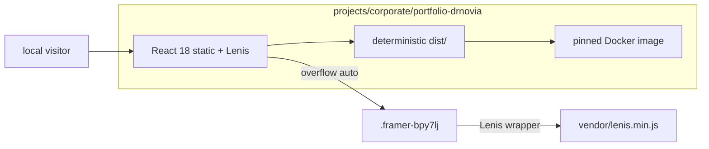

# Portfolio Dr. Novia — Capsule Agent Router

## Operator & Jev

- Address the human owner as **Gaffer** (or **Doc**); chat in Bahasa Indonesia mixed with English (~70:30).
- Inside the Sentra monorepo, the root `AGENTS.md` also applies and wins on conflict.
- Jev: if the `jev_route` tool is available, call it before the first web search, spawning a subagent, retrying a failed approach, any approval-needing action, or choosing between materially different routes, and state `Jev: <action> (<reason>)`. If it is not available, continue normally. Jev is never a build, test, or runtime dependency.

Read `.agents/HANDOFF.md` first, then `.agents/CONTEXT.md`.

This file is the machine README for the NOVIA STUDIO project. Humans start at
[README.md](README.md). It is sufficient after this directory is extracted. When nested in a
governed repository, enclosing contribution controls still apply, but no lifecycle command or
standalone proof depends on them.

## Always

- Stay inside this project directory unless Gaffer explicitly expands scope.
- Treat this capsule as a fully standalone project that may be copied into its own repository.
- Preserve the Framer visual composition (layout, CSS, class names, assets). Copy and image swaps only when Gaffer asks.
- Attach Lenis to `.framer-bpy7lj` (Content-Wrapper). Never bind Lenis to
  `window` while that nested element is the real scroller.
- State CURRENT vs TARGET. Do not claim a hosted production URL, a pnpm
  workspace package, or a Vite/Next rewrite.
- Use the capsule-owned Node scripts and static server. This dependency-free project intentionally
  has no lockfile, Turbo, or Biome config.
- Link SSOT instead of copying architecture, security, or SAFRS prose.

## Ask First

- Shared-package, lockfile, CI, or root-rule edits (R2).
- Replacing Framer markup with a component rewrite.
- Adding npm dependencies or joining the pnpm workspace.
- Production deploy, DNS, or any R3 execution.

## Never

- Add packages, a lockfile, Turbo, or Biome without a separately approved architecture change.
- Redesign colors, type, spacing, or section order of the Novia site.
- Intercept wheel/touch on `window` while `.framer-bpy7lj` owns overflow.
- Weaken tests or an enclosing repository's contribution gates to make a slice pass.
- Invent auth, CMS, analytics pixels, or production URLs.
- Commit unless Gaffer asks.

## Owned scope

- Project: Sentra portfolio sites (Dr. Novia Anggraini). Human owner: **Gaffer**. Default risk: **R1**.
- Capsule: `projects/corporate/portfolio-drnovia/**`.
- CURRENT runnable site: React 18 + vendored Lenis at root.
- Consumed, not owned: none of the `@safrs/*` runtime packages.
- Durable local decisions: [docs/decisions.md](docs/decisions.md).

## Exact commands

Run from this project directory:

```bash
node scripts/install.mjs
node --test tests/capsule-paths.test.mjs tests/lenis-contract.test.mjs tests/standalone-contract.test.mjs
node scripts/build.mjs
node scripts/deploy-dry-run.mjs
node server.js
```

CURRENT: Node.js 24, static React 18 + vendored Lenis 1.3.26 on
`http://127.0.0.1:4173`. Lint and typecheck are explicitly not applicable in
`project.contract.json`; install, test, build, run, and deploy dry-run are real capsule-owned
commands.

## Capsule topology



## Read by task

| Task | Read |
| --- | --- |
| Any change | [README.md](README.md), this file |
| Docs map | [docs/README.md](docs/README.md) |
| Runtime shape | [docs/architecture.md](docs/architecture.md) |
| Data / PII | [docs/data.md](docs/data.md) |
| Tests | [docs/testing.md](docs/testing.md) |
| Run today | [docs/quickstart.md](docs/quickstart.md) |
| Product | [docs/overview.md](docs/overview.md) |
| Security | [SECURITY.md](SECURITY.md), [docs/security.md](docs/security.md) |

## Risk

Default **R1** inside this capsule. Escalate: dependencies, lockfile, CI, shared packages, or
changes to an enclosing repository's governance → **R2**. Hosted production, credentials, DNS → **R3**,
prepare only until Gaffer authorizes.
