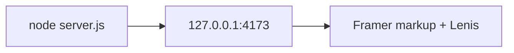

# Quickstart

This is an honest how-to for **what exists on disk today**. It is not a
hosted-production tutorial.

Canonical machine commands: [../AGENTS.md](../AGENTS.md).

## CURRENT — you can do this now

Need Node.js 24.x. No package manager, enclosing workspace, shared local infrastructure, or
network install is required.

From the project directory:

```bash
node scripts/install.mjs
node --test tests/capsule-paths.test.mjs tests/lenis-contract.test.mjs tests/standalone-contract.test.mjs
node scripts/build.mjs
node scripts/deploy-dry-run.mjs
node server.js
```

Open:

```text
http://127.0.0.1:4173
```

Override bind with `HOST` and `PORT` if needed.



## What you should feel

Wheel and trackpad on the page body should ease to rest (Lenis `lerp: 0.06`
on `.framer-bpy7lj`). Hash links (`#about`, `#project`, …) should animate
inside that scroller. `prefers-reduced-motion: reduce` disables smoothing.

## Deployment artifact

`node scripts/build.mjs` creates `dist/` with a deterministic SHA-256 manifest. The deployment
dry-run validates that artifact and the pinned, non-root `Dockerfile` without building, pushing, or
deploying anything. A separately authorized operator can build the container from this project
directory with ordinary Docker tooling; no monorepo path is part of the image.

## What this does not start

The local lifecycle starts no Docker daemon, Postgres, pnpm workspace, Vite, external write, or
production deployment.

If Lenis fails to load, native overflow on the Content-Wrapper still works.
