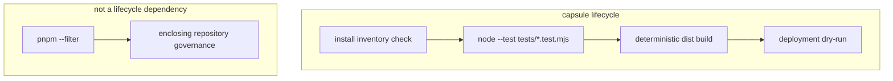

# Testing

Verification is capsule-owned and runs without pnpm, Turbo, an enclosing workspace, or another
project. Commands: [../AGENTS.md](../AGENTS.md).

## Commands that exist

From the project directory:

```bash
node scripts/install.mjs
node --test tests/capsule-paths.test.mjs tests/lenis-contract.test.mjs tests/standalone-contract.test.mjs
node scripts/build.mjs
node scripts/deploy-dry-run.mjs
node server.js
```

`lint` and `typecheck` are explicitly not applicable because this preserved, dependency-free
JavaScript surface has no capsule-local lint/type toolchain. Build and deployment dry-run are real;
do not claim `pnpm --filter` coverage.



## What the tests cover

- Capsule required paths (`AGENTS.md`, `docs/*`, `src`, `tests`).
- Lenis is vendored at 1.3.26 and referenced from `index.html`.
- `src/app.js` binds Lenis to `.framer-bpy7lj`, not `window`.
- `server.js` keeps resolved files under the site root.
- The standalone contract, capsule-owned commands, pinned Dockerfile, deterministic build
  manifest, and tamper-detecting deployment dry-run.

## What they do not cover

Browser momentum or visual pixel diffs. HTTP smoke is exercised by the extraction verifier; visual
behavior still needs a human look at `http://127.0.0.1:4173` until Chief asks for Playwright.

## Isolated resources

Tests and lifecycle scripts use local files and loopback only. No database, credentials, production
write, or monorepo-owned infrastructure is required.
