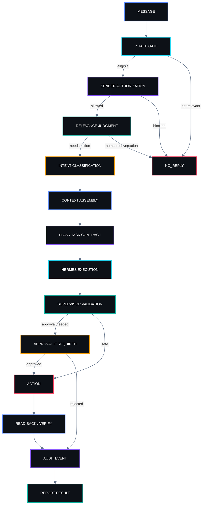
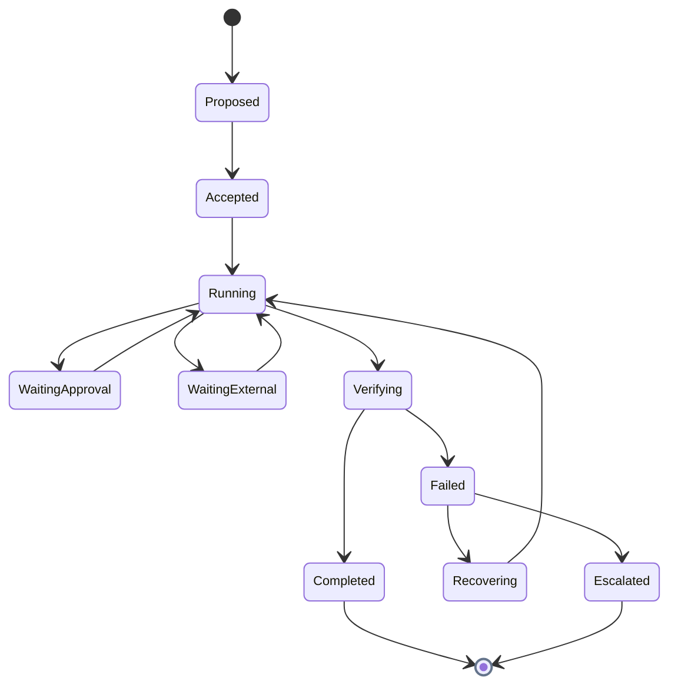
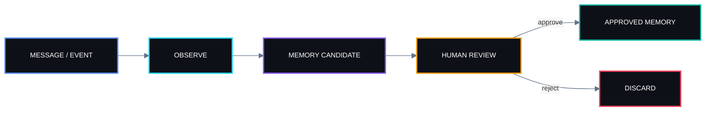
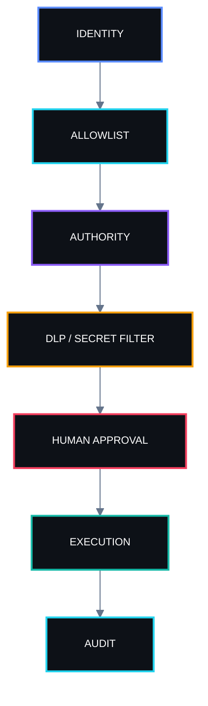
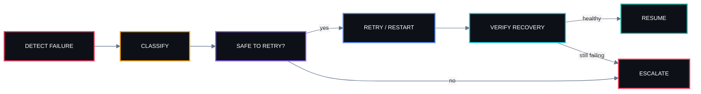

<!--
SENTRA README VISUAL SYSTEM
Diagram palette:
  Blue   #5B8CFF
  Cyan   #22D3EE
  Violet #8B5CF6
  Teal   #14B8A6
  Amber  #F59E0B
  Red    #F43F5E
  Base   #0D1117
  Slate  #64748B

Rules:
- Mermaid diagrams: dark nodes + multi-color semantic strokes.
- Table body text: compact using <sub>.
- Tables: add restrained multi-color accents; keep headers readable.
- Preserve technical clarity over decoration.
-->

<div align="center">

<br />

### Autonomous Virtual Executive Resource for Your-team

<a href="https://sentrahai.com/">
  
</a>

<p>
  
  
  
  
  
</p>

<p>
  <strong>One agent. One channel. One governing boundary: human authority.</strong>
</p>

<sub><code>MESSAGE → GATEWAY → ORCHESTRATOR → HERMES → SUPERVISOR → VERIFIED ACTION</code></sub>

</div>

> **Documentation (SPDS 1.0):** start at [`docs/spds/read_first.md`](docs/spds/read_first.md). Genome: [`PROJECT_GENOME.yaml`](PROJECT_GENOME.yaml).

---

## `00 / SYSTEM IDENTITY`

**AVERY** — *Autonomous Virtual Executive Resource for Your-team* — is the executive AI agent of **Sentra Artificial Intelligence**, designed to operate where teams already work: **inside WhatsApp**.

AVERY is not built to win conversations. She is built to **produce verified outcomes**.

Her role is to reduce operational friction across modern, dynamic teams by turning messages into bounded tasks, structured memory, auditable decisions, scheduled follow-up, and real-world execution—without forcing the team into a separate productivity surface.

AVERY is intentionally quiet. She reads context, judges relevance, acts when authorized, and remains silent when no intervention is required.

> [!IMPORTANT]
> **An executive agent is successful only when work is completed, verified, and traceable.**
>
> Intelligence without execution is unfinished work.

---

## `01 / POSITIONING`

### What AVERY is

AVERY is a **WhatsApp-native executive agent** that combines:

- conversational understanding;
- task execution;
- structured memory;
- scheduling;
- controlled outbound communication;
- operational research;
- browser and tool use;
- team-aware participation;
- auditability;
- explicit human approval boundaries.

### What AVERY is not

AVERY is **not**:

- a general-purpose chatbot;
- a replacement for human judgment;
- an always-on group participant;
- an unrestricted autonomous actor;
- a memory system that silently stores everything;
- a hidden automation layer that performs high-impact actions without trace;
- a personality-first experiment detached from operational outcomes.

AVERY exists to help the team **finish work**, not merely discuss it.

---

## `02 / EXECUTIVE DOCTRINE`

<table width="100%">
<tr>
<td width="50%" valign="top">


<sub>AVERY does not treat an answer as completion.<br/><br/>
Multi-step work becomes a task. Actions produce traceable events. Results are verified before they are reported.<br/><br/>
<b>Work that leaves no trace did not happen.</b></sub>

</td>
<td width="50%" valign="top">


<sub>AVERY may assist, prepare, structure, retrieve, and execute within delegated boundaries.<br/><br/>
Sensitive memory writes, high-impact actions, and outbound communication remain governed by explicit human authority.<br/><br/>
<b>Capability never implies permission.</b></sub>

</td>
</tr>
<tr>
<td width="50%" valign="top">


<sub>In group conversations, AVERY does not compete with humans for attention.<br/><br/>
Greetings, acknowledgements, casual human-to-human discussion, and low-value chatter can resolve to <code>NO_REPLY</code>.<br/><br/>
Silence is a valid executive behavior.</sub>

</td>
<td width="50%" valign="top">


<sub>A missing direct tool is not automatically a missing outcome.<br/><br/>
AVERY should identify the real constraint, inspect indirect routes, test the available path, and report what actually worked.<br/><br/>
<b>Diagnose first. Refuse only when the boundary is real.</b></sub>

</td>
</tr>
<tr>
<td width="50%" valign="top">


<sub>A send operation, write call, or scheduled event is not success by itself.<br/><br/>
The result should be read back, checked, or otherwise verified before AVERY reports completion.</sub>

</td>
<td width="50%" valign="top">


<sub>Every important automation should have a failure path, recovery path, and clear escalation condition.<br/><br/>
Operational confidence without recovery is fragility.</sub>

</td>
</tr>
</table>

---

## `03 / WHY AVERY EXISTS`

WhatsApp is one of the most effective coordination surfaces in Indonesia—and one of the easiest places for work to disappear.

Important decisions become buried in conversation.  
Tasks lose ownership.  
Follow-up depends on memory.  
Context fragments across groups.  
AI assistants often add more noise than leverage.

AVERY is designed to invert that pattern.

| 🔴 <sub>WITHOUT AVERY</sub> | 🟢 <sub>WITH AVERY</sub> |
|---|---|
| <sub>Messages accumulate</sub> | <sub>Relevant intent becomes structured work</sub> |
| <sub>Decisions disappear in chat history</sub> | <sub>Approved knowledge becomes durable memory</sub> |
| <sub>Follow-up depends on individuals</sub> | <sub>Tasks can be scheduled, tracked, and verified</sub> |
| <sub>AI answers everything</sub> | <sub>AVERY responds only when useful or explicitly called</sub> |
| <sub>Automation creates hidden risk</sub> | <sub>Execution is bounded by authority, policy, and audit</sub> |
| <sub>Important context is re-explained repeatedly</sub> | <sub>Approved context can become reusable memory</sub> |
| <sub>Group chat becomes noisy</sub> | <sub>Relevance gating preserves human conversation</sub> |
| <sub>“Done” means “sent”</sub> | <sub>“Done” means “verified outcome”</sub> |

---

## `04 / DESIGN OBJECTIVES`

AVERY is optimized for six outcomes:

1. **Low-noise collaboration**  
   Participate only when useful.

2. **Verified execution**  
   Prefer completed, checked work over plausible claims.

3. **Bounded autonomy**  
   Delegate execution without delegating final human authority.

4. **Durable organizational memory**  
   Preserve approved context without silently converting chat into permanent truth.

5. **Operational continuity**  
   Support reminders, recurring checks, task state, and follow-up.

6. **Simple deployment and maintenance**  
   Keep profile/configuration portable across laptop, VPS, and containerized environments.

---

## `05 / SCOPE & NON-SCOPE`

### In scope

AVERY is intended to support:

- executive assistance;
- team coordination;
- task decomposition;
- follow-up;
- reminders;
- recurring schedules;
- knowledge retrieval;
- document summarization;
- web research;
- browser-assisted workflows;
- decision capture;
- memory candidates;
- role-aware group participation;
- controlled outbound messages;
- status reporting;
- operational audits.

### Out of scope unless explicitly delegated and approved

- unrestricted outbound messaging;
- autonomous financial transactions;
- silent changes to critical configuration;
- storing private personal information without approval;
- impersonating a human team member;
- bypassing allowlists or approval gates;
- treating inferred facts as approved organizational memory;
- claiming work succeeded without verification.

---

## `06 / SYSTEM CONSTELLATION`

<p align="center">
  
  
  
  
  
</p>

<details open>
<summary><b><code>TARGET TOPOLOGY // MAESTRO CONTROL PLANE</code></b></summary>


</details>

The target architecture separates four responsibilities:

1. **Who may speak** — identity, mention, group, allowlist, and rate policy.
2. **How far the request may go** — authority, context, approval, and execution budget.
3. **How work is performed** — reasoning, tools, research, browser, skills, and subagents.
4. **Whether the result may leave** — validation, DLP, audit, approval, and rollback.

That separation is the foundation for moving AVERY from a capable conversational agent toward a dependable executive operating system.

---

## `07 / CURRENT RUNTIME`

The current source architecture uses **Hermes Agent** and **Hermes Studio** as the reasoning and execution runtime.

| <sub>LAYER</sub> | <sub>CURRENT COMPONENT</sub> | <sub>ROLE</sub> |
|---|---|---|
| 🔵 <sub>Runtime</sub> | <sub>Hermes Agent 0.20.4</sub> | <sub>agent reasoning and tool execution</sub> |
| 🟣 <sub>Studio</sub> | <sub>Hermes Studio 0.6.46</sub> | <sub>runtime management surface</sub> |
| 🟦 <sub>Model</sub> | <sub><code>google/gemini-2.5-flash</code> via OpenRouter</sub> | <sub>model endpoint</sub> |
| 🟢 <sub>Transport</sub> | <sub>Baileys bridge</sub> | <sub>WhatsApp connectivity</sub> |
| 🟡 <sub>Task state</sub> | <sub>Kanban on SQLite</sub> | <sub>run-ID based task trace</sub> |
| 🔴 <sub>Scheduler</sub> | <sub>Hermes cron</sub> | <sub>recurring execution</sub> |
| 🔵 <sub>Knowledge</sub> | <sub>local skill + Kediri knowledge packs</sub> | <sub>reusable operational context</sub> |

> [!NOTE]
> The README source reports that free-tier model SKUs were not operationally reliable because of shared-pool `429` rate limits.

---

## `08 / REQUEST LIFECYCLE`

Every incoming message should move through explicit gates.



The lifecycle is deliberately explicit because most agent failures happen in the invisible transitions between “understood,” “attempted,” and “actually completed.”

---

## `09 / INTAKE GATING`

Two independent gates determine whether a message should even reach the agent runtime.

### Gate A — processing eligibility

The WhatsApp bridge decides whether the message belongs to:

- a registered work group;
- an explicitly allowed DM;
- a group where AVERY was mentioned;
- a context that policy permits.

### Gate B — sender authorization

Even if the message is eligible for processing, the sender must still be authorized for the requested action.

These gates must remain separate.

A message can be:

- visible but not actionable;
- actionable but approval-gated;
- relevant but not authorized;
- authorized but irrelevant;
- neither relevant nor authorized.

---

## `10 / GROUP BEHAVIOR`

AVERY is designed for low-noise participation.

### Default behavior

In group conversations:

- read broadly;
- speak narrowly;
- respond to direct mentions;
- respond when a registered work-group policy allows;
- remain silent when humans are already handling the exchange;
- avoid acknowledgement spam.

### Valid silent outcome

```text
NO_REPLY
```

The gateway should interpret `NO_REPLY` as an intentional decision, not an error.

### Why this matters

A group agent that answers every message creates:

- attention tax;
- social friction;
- false urgency;
- reduced trust;
- lower signal-to-noise.

Executive usefulness depends as much on restraint as intelligence.

---

## `11 / EXECUTION CONTRACT`

Every meaningful AVERY task should be explainable through a compact contract:

```text
INTENT
  what outcome is requested?

AUTHORITY
  who is allowed to request it?

SCOPE
  what may AVERY touch?

CONTEXT
  what information is required?

PLAN
  what steps will be executed?

TOOLS
  what capabilities are needed?

EVIDENCE
  what proves the work happened?

APPROVAL
  does anything require a human decision?

RECOVERY
  what happens if execution fails?

RESULT
  what verified outcome was produced?
```

This contract is the difference between **agentic behavior** and improvisation.

---

## `12 / TASK LIFECYCLE`

Multi-step work should become visible state.



A task record should preserve enough information to reconstruct:

- who requested the work;
- when it started;
- what plan was chosen;
- which tools were used;
- which intermediate events occurred;
- whether approval was required;
- what the final result was;
- how completion was verified.

---

## `13 / TASK STORE & AUDIT TRAIL`

The current source reports a **Kanban task store on SQLite** with run-ID based auditability.

The intended behavior is:

1. open a task for multi-step work;
2. assign a run ID;
3. append execution events;
4. record approval waits;
5. record tool outcomes;
6. close only after verification;
7. read back the stored result;
8. report what was verified—not what was merely attempted.

### Minimum task record

| <sub>FIELD</sub> | <sub>PURPOSE</sub> |
|---|---|
| 🔵 <sub><code>run_id</code></sub> | <sub>stable execution identity</sub> |
| 🟣 <sub><code>requester</code></sub> | <sub>who initiated the task</sub> |
| 🟦 <sub><code>intent</code></sub> | <sub>requested outcome</sub> |
| 🟢 <sub><code>status</code></sub> | <sub>current lifecycle state</sub> |
| 🟡 <sub><code>started_at</code></sub> | <sub>start timestamp</sub> |
| 🔴 <sub><code>updated_at</code></sub> | <sub>latest activity</sub> |
| 🟣 <sub><code>approval_state</code></sub> | <sub>pending / approved / rejected / not required</sub> |
| 🟦 <sub><code>events</code></sub> | <sub>traceable execution history</sub> |
| 🟢 <sub><code>result</code></sub> | <sub>final structured outcome</sub> |
| 🟡 <sub><code>verification</code></sub> | <sub>proof of completion</sub> |
| 🔴 <sub><code>error</code></sub> | <sub>failure detail when applicable</sub> |

---

## `14 / EXECUTIVE CAPABILITY SURFACES`

AVERY is designed around modular capabilities rather than one monolithic prompt.

<table width="100%">
<tr>
<td width="33%" valign="top">

<br/>
<sub>Task decomposition<br/>Follow-up<br/>Reminders<br/>Scheduling<br/>Briefings<br/>Decision capture<br/>Action tracking</sub>

</td>
<td width="33%" valign="top">

<br/>
<sub>Document retrieval<br/>Local knowledge packs<br/>Research<br/>Structured recall<br/>Contextual memory<br/>Source-aware summaries</sub>

</td>
<td width="33%" valign="top">

<br/>
<sub>Browser workflows<br/>Messaging workflows<br/>Recurring jobs<br/>Multi-step execution<br/>Verification<br/>Audit trail</sub>

</td>
</tr>
<tr>
<td width="33%" valign="top">

<br/>
<sub>Group relevance<br/>Mention routing<br/>Delegated requests<br/>Role-aware behavior<br/>Low-noise participation</sub>

</td>
<td width="33%" valign="top">

<br/>
<sub>Outbound allowlists<br/>Approval gates<br/>DLP checks<br/>Secret redaction<br/>Runtime isolation<br/>Rollback-oriented operations</sub>

</td>
<td width="33%" valign="top">

<br/>
<sub>Candidate extraction<br/>Approval queue<br/>Durable context<br/>Controlled writes<br/>Provenance<br/>Human review</sub>

</td>
</tr>
</table>

---

## `15 / SKILLS`

The source material contains two different skill counts:

- the positioning copy describes **33+ modular skills**;
- the current operational inventory reports **107 skills**.

This README therefore does **not** collapse those numbers into one claim.

A safe interpretation is:

- **33+** describes the product positioning / modular capability concept;
- **107** is the current local skill inventory reported by the runtime documentation.

Until the inventory model is formally normalized, both should remain explicitly labeled rather than treated as interchangeable.

### Skill design principles

Each skill should ideally define:

- purpose;
- trigger conditions;
- required inputs;
- allowed tools;
- expected output;
- authority boundary;
- verification method;
- failure mode;
- escalation rule.

---

## `16 / TOOLS & INDIRECT CAPABILITY`

AVERY should not confuse **tool visibility** with **system capability**.

The source gives a concrete example: the direct `send_message` tool may not be agent-callable, while the same underlying send capability can still be reachable through the scheduler.

Therefore, before concluding that an outcome is impossible:

1. identify the actual capability required;
2. inspect alternate execution routes;
3. test the safest available path;
4. verify the result;
5. record what route succeeded or failed.

This is not permission to bypass policy.

Indirect routes must still obey:

- authorization;
- allowlists;
- approval;
- DLP;
- audit;
- human authority.

---

## `17 / MEMORY ARCHITECTURE`

AVERY does not treat every message as permanent knowledge.

Memory is **earned through relevance and approval**.



This prevents two dangerous memory failures:

1. remembering things that were never meant to become durable;
2. silently converting inference into fact.

---

## `18 / MEMORY APPROVAL POLICY`

Sensitive or durable memory writes should queue for human approval.

### Good memory candidates

- explicit decisions;
- stable role assignments;
- approved preferences;
- repeated operational facts;
- documented procedures;
- confirmed project status;
- durable contact or organizational context when explicitly approved.

### Poor memory candidates

- casual speculation;
- temporary emotions;
- inferred relationships;
- unverified claims;
- secrets;
- credentials;
- personal information that has not been approved for retention.

### Memory record should preserve

- source;
- timestamp;
- confidence;
- who approved it;
- what scope it applies to;
- whether it supersedes an older memory.

---

## `19 / KNOWLEDGE PACKS`

The current source reports a **Kediri Raya knowledge pack** with **24 verified records with sources**.

Knowledge packs are different from personal memory.

### Knowledge pack

Structured external or project knowledge intended to be reusable.

### Personal / organizational memory

Durable context about people, roles, preferences, decisions, or relationships—approval-gated.

That separation matters because “knowledge” and “memory” have different governance requirements.

---

## `20 / SCHEDULER`

The current source reports **Hermes cron** in active use, including a **new-member watch every 2 hours**.

Scheduler use cases include:

- recurring checks;
- reminders;
- delayed follow-up;
- status summaries;
- periodic audits;
- membership checks;
- routine housekeeping.

### Scheduler rule

A scheduled job must still obey the same authority and data boundaries as an interactive request.

Time-based execution is not a privilege escalation mechanism.

---

## `21 / OUTBOUND COMMUNICATION`

Outbound communication is a high-impact capability.

AVERY should only message:

- contacts explicitly authorized;
- groups explicitly allowed;
- destinations permitted by policy.

For messages involving family, partners, clients, or other sensitive recipients, the source specifies a conservative approach:

**draft first, show the human, send only after approval.**

### Outbound message checklist

Before send:

- correct recipient?
- authorized sender?
- approved content?
- no sensitive data leakage?
- appropriate tone?
- correct channel?
- explicit approval if required?

After send:

- read back or confirm delivery state;
- append audit event;
- report verified result.

---

## `22 / DLP & SECRET REDACTION`

Before any result leaves the runtime, the supervisor layer should inspect for:

- API keys;
- tokens;
- credentials;
- WhatsApp session secrets;
- phone numbers where disallowed;
- JIDs;
- private memory;
- runtime paths;
- internal configuration;
- sensitive operational data.

The repository sync script described in the source uses filename, directory, and content scanning to refuse unsafe files rather than silently copying them.

This principle should apply beyond Git sync.

**Unsafe content should be held and named—not leaked quietly.**

---

## `23 / DATA BOUNDARY`

> [!IMPORTANT]
> **Configuration is versioned. State is not.**

### Never commit

- WhatsApp `auth.json`;
- WhatsApp session directories;
- `creds.json`;
- model-provider credentials;
- populated `.env` files;
- `state.db`;
- `kanban.db`;
- runtime databases;
- `memories/` containing notes about real people;
- installed Hermes Studio binaries;
- generated runtime state.

### Belongs in the repository

- persona;
- approved skills;
- example configuration without real values;
- deploy files;
- operational scripts;
- architecture documentation;
- governance rules;
- incident documentation;
- test fixtures that contain no real secrets.

---

## `24 / SECURITY MODEL`

AVERY's security posture is based on layered constraints rather than one prompt.



### Security principles

- deny by default when policy is ambiguous;
- separate intake from authority;
- never commit runtime secrets;
- do not infer authorization from conversational familiarity;
- protect personal memory;
- prefer explicit allowlists;
- preserve auditability;
- make rollback possible;
- keep the human in the terminal decision path for sensitive operations.

---

## `25 / APPROVAL MODEL`

Approval is not one binary switch.

Different actions may require different levels of confirmation.

### No approval usually required

- read-only retrieval;
- summarization;
- research;
- low-risk internal task organization;
- non-sensitive analysis.

### Approval recommended or required

- memory writes;
- outbound messages to sensitive recipients;
- destructive changes;
- irreversible actions;
- policy changes;
- credential changes;
- external publication;
- high-impact automation.

### Approval record

For audited tasks, record:

```text
requested_action
requested_by
approval_required
approver
decision
timestamp
scope
reason
```

---

## `26 / SUPERVISOR`

The target MAESTRO supervisor is responsible for deciding whether an agent result is safe to release.

Responsibilities include:

- output validation;
- approval detection;
- DLP;
- memory candidate extraction;
- audit event creation;
- result classification;
- rollback routing;
- escalation.

The supervisor should not duplicate Hermes reasoning.

Its job is to **govern the boundary between internal work and external consequence**.

---

## `27 / OBSERVABILITY`

A useful executive agent must answer:

- what is AVERY doing now?
- what task is running?
- what step failed?
- what approval is pending?
- what message was sent?
- what schedule fired?
- what memory was proposed?
- why did AVERY stay silent?
- what result was verified?

### Minimum observability surfaces

- gateway status;
- WhatsApp bridge status;
- active run IDs;
- task state;
- schedule state;
- approval queue;
- recent errors;
- recent outbound actions;
- memory candidate queue;
- restart history.

---

## `28 / FAILURE MODES`

AVERY should be designed around known failure classes.

### Communication failure

- bridge disconnected;
- port conflict;
- orphaned process;
- stale session;
- invalid group policy;
- mention pattern not matching.

### Execution failure

- tool unavailable;
- model rate limit;
- browser failure;
- task timeout;
- external dependency unavailable.

### Governance failure

- unauthorized sender;
- missing approval;
- wrong recipient;
- sensitive data in output;
- memory candidate not reviewed.

### Verification failure

- action sent but not confirmed;
- task closed before read-back;
- schedule created but not persisted;
- result reported from attempted action instead of observed state.

---

## `29 / RECOVERY MODEL`

The source explicitly warns that a gateway does **not** automatically respawn a bridge that dies under it.

Therefore recovery must be operationally explicit.



### Known recovery rule

Use the dedicated restart script.

The source specifically warns against relying on `gateway run --replace`, because it can leave an orphaned bridge holding port `3000`.

---

## `30 / CONFIGURATION PRECEDENCE`

The source documents three silent configuration traps that have already caused real failures.

### Trap 1 — precedence

The top-level:

```yaml
whatsapp:
```

block overrides:

```yaml
gateway:
  platforms:
    whatsapp:
      extra:
```

for bridgeable keys.

Exceptions noted in the source:

- `group_allowed_chats`
- `free_response_chats`

These work only inside `extra`.

### Trap 2 — regex quoting

`mention_patterns` must be **single-quoted YAML**.

Double quoting can escape the backslash twice, causing a pattern that never matches.

### Trap 3 — invalid policy value

An unrecognized `group_policy` can fall through to reject-everything behavior.

The source notes that even the template value `none` caused silent rejection.

---

## `31 / SILENT FAILURE STANDARD`

Silent failures are especially dangerous because they look like absence of demand instead of system malfunction.

Examples:

- no reply because mention regex failed;
- no reply because sender authorization blocked;
- no reply because group policy rejected;
- bridge dead while gateway appears alive;
- scheduler route succeeded but message did not actually leave;
- task record exists but result was not verified.

Therefore:

> **No critical policy decision should be invisible in observability.**

Where possible, rejection should produce internal diagnostic events even when the user receives no visible response.

---

## `32 / DEPLOYMENT MODEL`

Hermes reads runtime state from a single `HERMES_HOME`.

### Windows

```text
%LOCALAPPDATA%\hermes
```

The source notes a junction to:

```text
%USERPROFILE%\.hermes
```

### Linux / container

```text
~/.hermes
```

### Design objective

Moving AVERY between environments should be configuration deployment—not a migration project.

The desired workflow is conceptually:

```text
git pull
docker compose up
```

with runtime credentials/session state restored separately and never committed.

---

## `33 / PROFILE PROVISIONING`

A clean profile provisioning flow:

1. copy `ai/profiles/avery/SOUL.md`;
2. copy `ai/profiles/avery/skills/`;
3. copy `config.example.yaml` to runtime `config.yaml`;
4. fill every required placeholder;
5. copy `deploy/.env.example` to `.env`;
6. insert secrets locally;
7. start the gateway;
8. pair WhatsApp once via QR;
9. verify connection;
10. run a controlled smoke test.

WhatsApp pairing state stays inside `HERMES_HOME`.

It never enters the repository.

---

## `34 / REPOSITORY LAYOUT`

```text
/
├── ai/
│   └── profiles/
│       └── avery/
│           ├── SOUL.md
│           ├── config.example.yaml
│           └── skills/
│
├── deploy/
│   ├── Dockerfile
│   ├── docker-compose.yml
│   └── .env.example
│
├── docs/
│   ├── maestro-architecture.md
│   ├── gate-0-reality-audit.md
│   ├── whatsapp-group-fix.md
│   └── ...
│
├── scripts/
│   ├── restart-gateway.bat
│   ├── restart-gateway.sh
│   ├── check-unregistered-groups.ps1
│   ├── verify-runtime-junctions.ps1
│   └── sync-profile-to-repo.ps1
│
└── runtime/
    └── local only — never tracked
```

### Repository responsibility

The repository holds:

- persona;
- skills;
- example configuration;
- deploy logic;
- scripts;
- governance;
- docs.

The runtime holds:

- real sessions;
- secrets;
- databases;
- memory state;
- live binaries.

---

## `35 / DAILY OPERATIONS`

| <sub>SCRIPT</sub> | <sub>PURPOSE</sub> |
|---|---|
| 🔵 <sub><code>restart-gateway.bat</code> / <code>.sh</code></sub> | <sub>canonical gateway restart</sub> |
| 🟣 <sub><code>check-unregistered-groups.ps1</code></sub> | <sub>find groups known by the session but missing from config</sub> |
| 🟢 <sub><code>verify-runtime-junctions.ps1 -Fix</code></sub> | <sub>repair runtime junctions after Hermes Studio updates</sub> |
| 🟡 <sub><code>sync-profile-to-repo.ps1</code></sub> | <sub>sync approved profile content back to repo while refusing sensitive data</sub> |

### Restart standard

A restart is complete only when:

1. old bridge process is stopped;
2. orphaned process is removed;
3. expected port is free;
4. gateway restarts;
5. bridge reconnects;
6. connection state is verified.

---

## `36 / PROFILE SYNC SAFETY`

The source describes `sync-profile-to-repo.ps1` as deliberately refusing risky content.

The sync path should reject:

- credential filenames;
- runtime databases;
- memory directories;
- phone numbers where inappropriate;
- WhatsApp JIDs;
- API-key patterns.

A rejected file should be **named explicitly**.

Security should fail closed, not fail quietly.

---

## `37 / TESTING STRATEGY`

AVERY should be tested by behavior, not by persona quality.

### Gate tests

- mention recognized;
- mention ignored when not intended;
- unauthorized sender blocked;
- registered group works;
- unregistered group follows policy;
- `NO_REPLY` produces silence.

### Execution tests

- task opens;
- run ID persists;
- event sequence is recorded;
- tool call succeeds;
- result is read back;
- task closes only after verification.

### Approval tests

- memory candidate waits;
- outbound sensitive message waits;
- rejection prevents action;
- approval releases correct action only.

### Recovery tests

- bridge crash detected;
- restart script recovers;
- orphan process removed;
- stale port recovered.

### DLP tests

- API key blocked;
- WhatsApp JID blocked;
- credential file blocked;
- memory file blocked.

---

## `38 / ACCEPTANCE CRITERIA`

A capability should not be marked “working” because the agent described it correctly.

It is accepted only when:

1. the trigger is reproducible;
2. the action executes;
3. the result is externally observable;
4. the state is recorded;
5. failure behavior is understood;
6. recovery is documented;
7. permission boundaries are enforced.

---

## `39 / GATE-BASED MATURITY`

AVERY should advance through explicit maturity gates.

### Gate 0 — Reality audit

Inventory what truly exists.

No inferred capability.

### Gate 1 — Reliable conversational layer

- WhatsApp connectivity stable;
- group relevance correct;
- authorization correct;
- silence behavior correct.

### Gate 2 — Traceable task execution

- tasks open automatically;
- run IDs persist;
- events recorded;
- completion verified.

### Gate 3 — Approval-governed actions

- memory approval;
- outbound approval;
- high-impact action gates.

### Gate 4 — MAESTRO control plane

- gateway separation;
- orchestrator;
- supervisor;
- policy enforcement;
- audit.

### Gate 5 — Bounded executive autonomy

- multi-step work;
- recurring monitoring;
- recoverable execution;
- delegated authority;
- explicit escalation.

---

## `40 / STATE OF PLAY`

> [!CAUTION]
> AVERY's target architecture is more advanced than the currently proven runtime.
>
> This README intentionally distinguishes **design intent** from **verified operational capability**.

The current source reports that AVERY today is primarily a **conversational agent** with important foundations already working.

### Proven foundations reported in the source

- WhatsApp interaction;
- five groups plus one DM;
- group relevance filtering;
- authorization boundaries;
- local knowledge;
- Kanban task infrastructure;
- run-ID audit trail;
- scheduler operation;
- restart and repair scripts.

### Not yet fully proven end-to-end

The source explicitly states that no real multi-step executive work had yet been run fully end-to-end through AVERY at the time of that audit.

Therefore the project should not describe AVERY as fully autonomous until that capability is objectively demonstrated.

---

## `41 / MATURITY PATH`


The objective is not unlimited autonomy.

The objective is **useful autonomy inside explicit human-governed boundaries**.

---

## `42 / MEASUREMENT`

AVERY should be measured as an operational system.

### Reliability metrics

- gateway uptime;
- bridge uptime;
- successful reconnect rate;
- schedule success rate;
- task completion rate;
- task verification rate.

### Governance metrics

- unauthorized action blocks;
- approval compliance;
- DLP catches;
- unapproved memory writes;
- wrong-recipient incidents.

### Productivity metrics

- tasks completed;
- follow-ups closed;
- reminders executed;
- time saved;
- message-to-task conversion rate.

### Quality metrics

- false-positive replies;
- missed relevant mentions;
- unnecessary group interruptions;
- incomplete verification;
- escalation accuracy.

---

## `43 / EXECUTIVE BRIEFING MODE`

A mature AVERY should be able to produce concise briefings such as:

```text
TODAY

3 decisions pending
2 scheduled follow-ups due
1 unresolved task
0 security alerts

NEEDS YOUR APPROVAL
- Draft message to partner
- Memory candidate: new team responsibility

COMPLETED
- Group audit verified
- Knowledge pack refresh completed

WATCH
- Gateway reconnect count increased
```

A briefing should compress operational state—not reproduce chat history.

---

## `44 / EXAMPLE TASK: RESEARCH`

```text
USER:
Avery, compare three vendor options and recommend one.

AVERY:
1. opens task
2. records requester + scope
3. researches sources
4. compares criteria
5. produces recommendation
6. verifies citations / links
7. closes task
8. reports result
```

The result is not “I searched.”

The result is the verified comparison.

---

## `45 / EXAMPLE TASK: FOLLOW-UP`

```text
USER:
Remind the team tomorrow morning if the document is still missing.

AVERY:
1. creates conditional task
2. records trigger
3. schedules check
4. checks document state tomorrow
5. if missing → drafts/sends according to authority
6. records action
7. reports only if meaningful
```

The important part is the **condition**, not the timer.

---

## `46 / EXAMPLE TASK: OUTBOUND MESSAGE`

```text
USER:
Tell our partner that we approved the proposal.

AVERY:
1. confirms recipient identity
2. confirms user authority
3. drafts message
4. shows draft when approval policy requires
5. sends after approval
6. verifies send result
7. records audit event
```

---

## `47 / EXAMPLE TASK: MEMORY`

```text
USER:
Remember that Karel owns the weekly partner update.

AVERY:
1. extracts memory candidate
2. identifies scope
3. presents candidate
4. waits for approval
5. writes approved memory
6. records provenance
```

AVERY should never silently promote inferred responsibilities into durable fact.

---

## `48 / INCIDENT LEARNING`

The current source includes real operational lessons:

- a dead bridge can leave the gateway apparently running;
- `gateway run --replace` can leave an orphan process on port `3000`;
- top-level WhatsApp configuration can override nested config;
- regex quoting can silently break mention detection;
- invalid `group_policy` can silently reject group traffic;
- free-tier model capacity can be operationally unreliable.

These are not footnotes.

They should shape architecture, testing, and observability.

---

## `49 / OPERATING PRINCIPLES`

> **No hidden success.**  
> **No unbounded action.**  
> **No memory by accident.**  
> **No sensitive data in Git.**  
> **No autonomy without recovery.**  
> **No group noise without value.**  
> **No completion without verification.**

---

## `50 / RELATED DOCUMENTS`

The current source references several supporting documents.

| <sub>DOCUMENT</sub> | <sub>PURPOSE</sub> |
|---|---|
| 🔵 <sub><code>docs/maestro-architecture.md</code></sub> | <sub>target MAESTRO control-plane architecture</sub> |
| 🟣 <sub><code>docs/gate-0-reality-audit.md</code></sub> | <sub>evidence-based capability inventory</sub> |
| 🔴 <sub><code>docs/whatsapp-group-fix.md</code></sub> | <sub>incident account for WhatsApp group failures</sub> |
| 🟦 <sub><code>ai/profiles/avery/SOUL.md</code></sub> | <sub>persona / behavioral profile</sub> |
| 🟢 <sub><code>ai/profiles/avery/config.example.yaml</code></sub> | <sub>example runtime configuration</sub> |
| 🟡 <sub><code>deploy/.env.example</code></sub> | <sub>environment-variable template</sub> |

These should remain the deeper source of truth where detailed procedures exceed README scope.

---

## `51 / OPERATING PHILOSOPHY`

> **The best executive system is almost invisible.**
>
> It notices what matters.  
> Remembers what is approved.  
> Executes what is authorized.  
> Verifies what it changes.  
> Escalates what requires judgment.  
> Recovers when systems fail.  
> And stays quiet when humans are already doing fine.

---

## `52 / SENTRA`

AVERY is developed within the **Sentra Artificial Intelligence** ecosystem.

<p>
  <a href="https://sentrahai.com/"></a>
  <a href="https://github.com/Sentra-Artificial-Intelligence"></a>
  <a href="https://ferdiiskandar.com"></a>
</p>

<sub><code>SENTRA ARTIFICIAL INTELLIGENCE · KEDIRI, INDONESIA · HUMAN AUTHORITY IS THE BOUNDARY</code></sub>

---

<div align="center">


</div>
