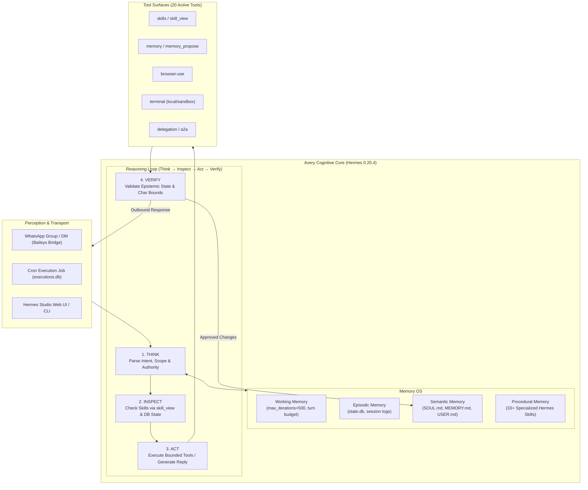
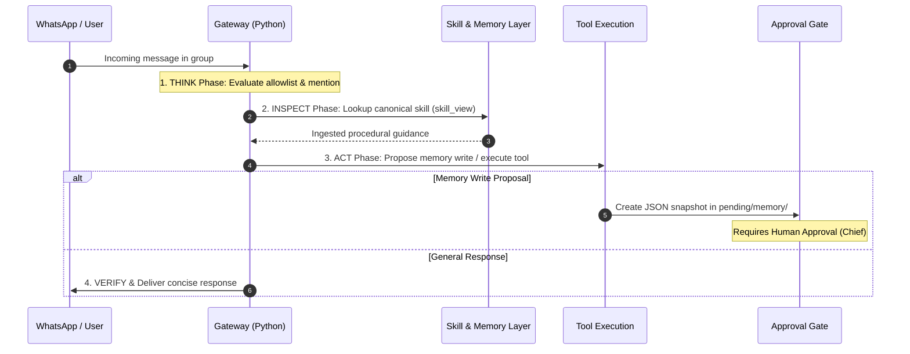

# Cognitive Architecture (Avery / Hermes Agent)

This document formalizes the cognitive architecture and operational mental model of **Avery**, the persistent Home Agent of Sentra Artificial Intelligence operating on the **Hermes Agent** runtime.

---

## 1. Memory OS Specification

Avery's memory architecture is strictly segmented into four tiers to prevent context pollution and memory drift:

### A. Working Memory (Turn Scratchpad)
- **Scope**: Ephemeral, valid during a single reasoning cycle.
- **Budget**: Configured with `max_iterations=500` per turn.
- **Execution Model**: `google/gemini-2.5-flash` via OpenRouter (with `free_only: false` to avoid rate-limit drops).

### B. Episodic Memory (Conversation Logs & Sessions)
- **Scope**: Persistent conversational history stored in `state.db` and raw run traces in `logs/gateway.log`.
- **Deduplication**: Features `recentlySentIds` on the bridge to prevent message echo loops.
- **Batching**: Incoming messages are grouped using a `text_batch_delay_seconds: 5` buffer.

### C. Semantic Memory (Institutional Knowledge & Fact States)
- **Persona Blueprint**: Stored in `ai/profiles/avery/SOUL.md`. Defines character (warm, concise, quiet by default, preserving human authority).
- **Persistent Memory Files**:
  - `MEMORY.md`: General facts, bounded by `memory_char_limit: 2200`.
  - `USER.md`: User profiles, bounded by `user_char_limit: 2200`.
- **Epistemic Discipline**: Facts are cataloged into four states:
  1. `CONFIRMED`: Verified institutional fact from canonical sources.
  2. `IN REVIEW`: Proposed change currently pending evaluation.
  3. `WORKING ASSUMPTION`: Operational assumption requiring explicit verification.
  4. `GAP`: Known missing knowledge that must not be hallucinated.

### D. Procedural Memory (Hermes Skill Ecosystem)
- **Structure**: 33+ modular skill folders under `ai/profiles/avery/skills/`.
- **Dynamic Loading**: Avery loads skills dynamically using `skills_list` and reads full instructions via `skill_view` before executing institutional tasks.
- **Core Skills**: `sentra-home`, `sentra-knowledge`, `sentra-people`, `community-steward`, `member-onboarding`, `collaboration-orchestrator`, `decisions-actions`, `founder-briefing`, `meeting-prep-followup`, and `knowledge-governance`.

---

## 2. Reasoning Loop (Think → Inspect → Act → Verify)

### Cognitive Principles:
1. **Quiet by Default**: In group environments, Avery only speaks when explicitly addressed, delegated a task, or when material risks/decisions emerge.
2. **Preservation of Human Authority**: Coordination $\neq$ authority; recommendation $\neq$ decision. Avery never makes financial, clinical, legal, or pricing commitments on Sentra's behalf without explicit human authorization.
3. **Evidence-Based Recall**: If a required skill or document is missing from the runtime, Avery states that the profile is incomplete rather than fabricating an answer.

---

## 3. WhatsApp Transport & Group Policy

Avery connects to WhatsApp via a local Node.js bridge using Baileys in dedicated **bot mode**:

- **DM Policy**: `pairing` mode; unknown DMs are ignored (`unauthorized_dm_behavior: ignore`).
- **Group Policy**: `allowlist` mode; only registered group JIDs are processed.
- **Mention Gate**: Unregistered groups are ignored; registered working groups are granted response autonomy via `free_response_chats`.
- **Regex Mention Matching**: Must be defined in single quotes (`mention_patterns: ['...']`) within `config.yaml` to prevent double-escaping backslashes.
