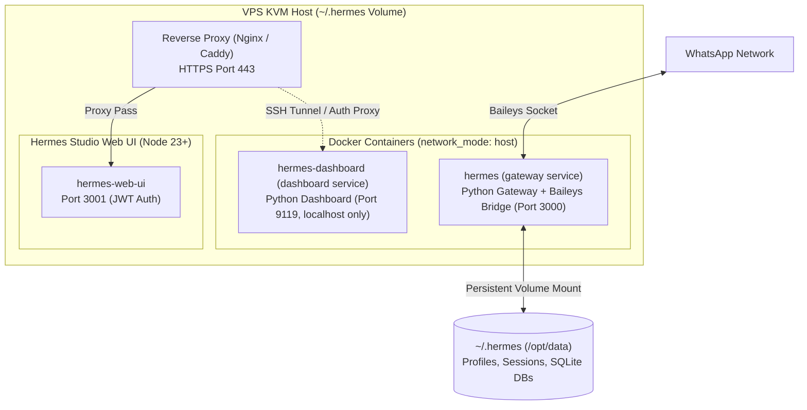

# Self-Hosting & Deployment Guide (Docker / VPS)

This guide details how to deploy and operate the **Medisync / Avery** Hermes Agent stack on private Linux servers (KVM VPS such as Hostinger, DigitalOcean, or AWS) using Docker Compose.

---

## 1. Hosting Requirements & Sizing

Hermes requires a **KVM VPS** with persistent storage, dedicated ports, and background service execution. Shared hosting is **unsupported**.

### Recommended Specifications:
- **CPU**: 2 vCPU minimum.
- **RAM**: 8 GB RAM minimum (accommodates Python gateway, Node.js web UI, Baileys bridge, and headless Chromium for `browser-use`).
- **Disk**: 20 GB SSD/NVMe.
- **OS**: Ubuntu 24.04 LTS or Debian 12.

---

## 2. Docker Compose Topology

The deployment blueprint is defined in `deploy/docker-compose.yml`:



### Key Deployment Characteristics:
1. **Host Network Mode**: Both services run with `network_mode: host` to facilitate low-latency loopback communication between the Python gateway, Node.js bridge, and dashboard.
2. **SQLite 3.53.4 Custom Build**: `deploy/Dockerfile` builds SQLite 3.53.4 from source, eliminating the WAL-reset bug found in SQLite 3.50.4.
3. **Dual Authentication Boundaries**:
   - **Python Dashboard (Port 9119)**: Binds to `127.0.0.1` and bypasses authentication for loopback traffic. Remote access must use SSH tunneling (`ssh -L 9119:localhost:9119`).
   - **Node Web UI**: Enforces strict JWT authentication against `~/.hermes-web-ui/hermes-web-ui.db` with a 10-attempt lock policy.

---

## 3. Step-by-Step Deployment Instructions

### 1. Build the Hermes Agent Container Image
Build the container image on the server using the Hermes source checkout:
```bash
docker build -t hermes-agent -f deploy/Dockerfile .
```

### 2. Prepare Profile & Secrets on VPS
Create the required directory structure under `~/.hermes/profiles/avery/`:
```bash
mkdir -p ~/.hermes/profiles/avery/skills
mkdir -p ~/.hermes/profiles/avery/platforms/whatsapp/session
```
Copy the following files to the server:
- `ai/profiles/avery/SOUL.md` ➔ `~/.hermes/profiles/avery/SOUL.md`
- `ai/profiles/avery/skills/` ➔ `~/.hermes/profiles/avery/skills/`
- Configure `config.yaml` (from `config.example.yaml`) with your WhatsApp allowlisted groups.
- Populate `.env` with your `OPENROUTER_API_KEY`.

### 3. Launch Services
```bash
HERMES_UID=$(id -u) HERMES_GID=$(id -g) docker compose -f deploy/docker-compose.yml up -d
```

### 4. One-Time WhatsApp QR Pairing
Inspect container logs and scan the generated QR code once from your WhatsApp mobile client:
```bash
docker logs -f hermes
```
The authenticated session will be saved in `~/.hermes/profiles/avery/platforms/whatsapp/session/creds.json`.

---

## 4. Backup & Disaster Recovery

### What to Back Up:
- Persona & Skills: `~/.hermes/profiles/avery/SOUL.md` and `skills/` (also version-controlled in this repository).
- Configuration: `config.yaml` and `.env`.
- WhatsApp Session: `platforms/whatsapp/session/creds.json`.
- State Databases: `state.db` and `kanban.db`.

### Daily Backup Script:
```bash
#!/usr/bin/env bash
BACKUP_DIR="/var/backups/hermes"
TIMESTAMP=$(date +"%Y%m%d_%H%M%S")
mkdir -p "$BACKUP_DIR"

# Create compressed tarball excluding temporary locks and WAL files
tar --exclude='*.db-wal' --exclude='*.lock' -czf \
  "$BACKUP_DIR/hermes_backup_$TIMESTAMP.tar.gz" -C ~/.hermes .

find "$BACKUP_DIR" -type f -mtime +14 -delete
echo "Hermes backup completed: $BACKUP_DIR/hermes_backup_$TIMESTAMP.tar.gz"
```
