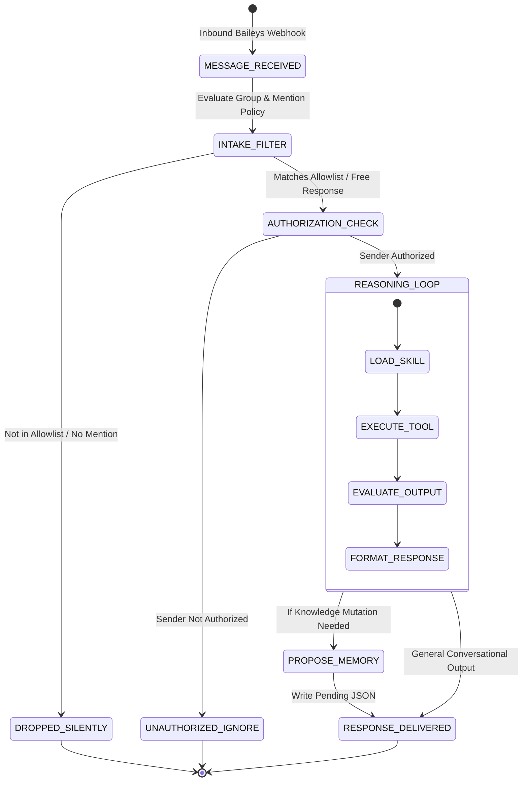
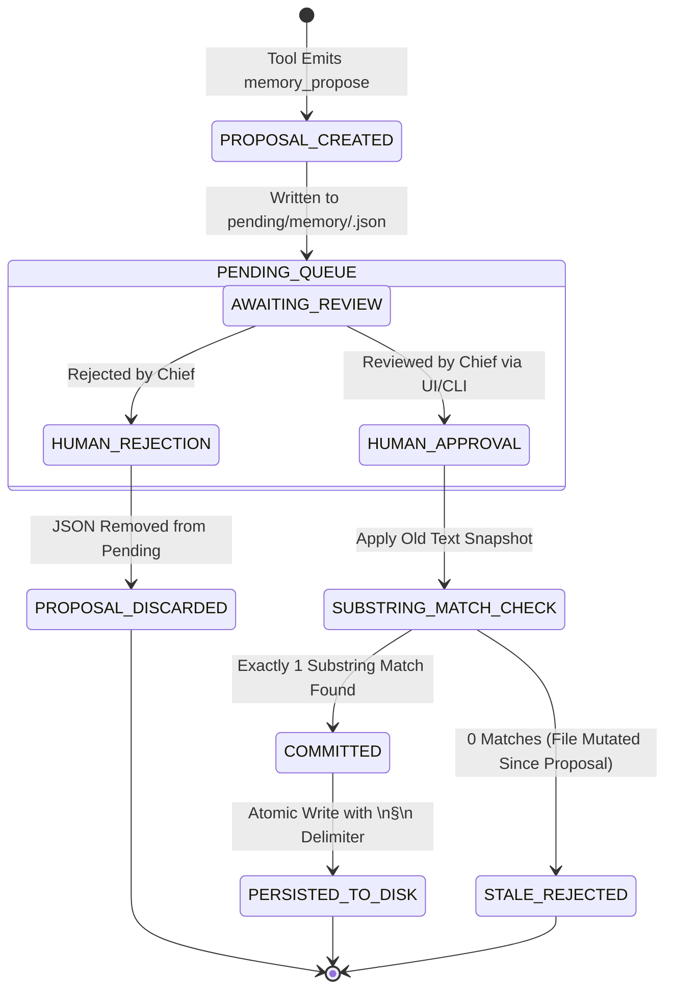
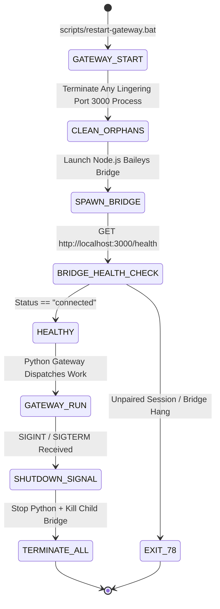

# State Machines & Invariant Specifications (Avery)

This document formalizes the runtime state transitions for message processing, memory proposals, and gateway lifecycles within the Medisync / Avery deployment.

---

## 1. Message Intake & Authorization Lifecycle

### Intake Invariants:
1. **Allowlist Invariant**:
   $$\text{Process}(\text{Msg}) \implies \text{ChatJID} \in \text{group\_allowed\_chats} \lor \text{Sender} \in \text{WHATSAPP\_ALLOWED\_USERS}$$
2. **Mention Invariant**:
   In non-free response groups, the message text must match the `mention_patterns` single-quoted regex. Messages that do not match are discarded without log pollution.

---

## 2. Memory Proposal Lifecycle (`pending/memory/`)

### Memory Invariants:
1. **Exact Substring Invariant (No Stale Overwrite)**:
   A memory replacement proposal is valid if and only if `old_text` matches exactly one substring in `MEMORY.md` or `USER.md` using `utf-8-sig` encoding. If 0 entries match, the proposal is deemed stale and rejected.
2. **Character Upper Bound**:
   $$\text{Length}(\text{MEMORY.md}) \le 2200 \land \text{Length}(\text{USER.md}) \le 2200$$

---

## 3. Gateway & Bridge Process Lifecycle

### Process Invariants:
- Port 3000 ownership must belong exclusively to the active gateway's child bridge.
- The gateway must never start if an orphan bridge holds the session directory locks.
