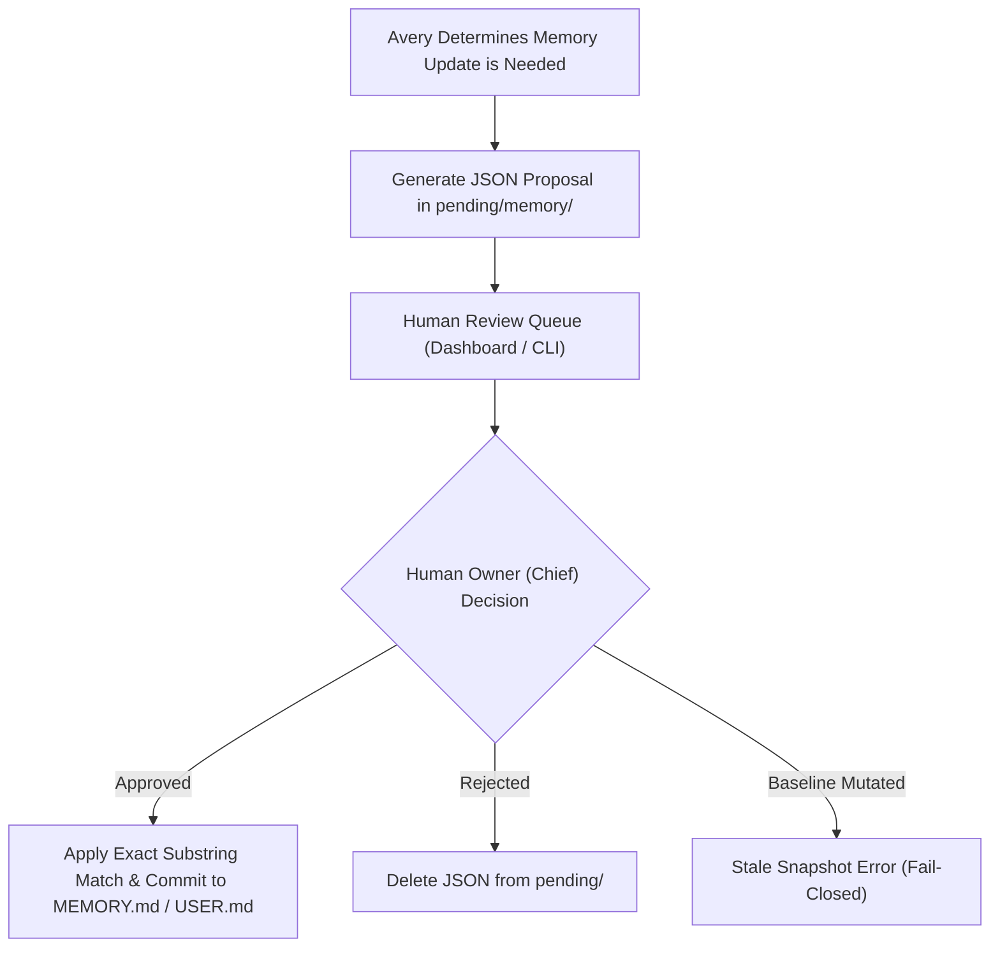

# Permission Broker & Clinical Boundary Specification

This document specifies the authorization gates, approval brokers, and clinical boundaries governing **Avery** within the Sentra Healthcare domain.

---

## 1. Human Approval Gates (`write_approval`)

To prevent unverified modification of permanent organizational knowledge, Avery enforces human approval gates on all memory and skill mutations:



### Configuration:
In `ai/profiles/avery/config.yaml`:
```yaml
memory:
  write_approval: true
  memory_char_limit: 2200
  user_char_limit: 2200

skills:
  write_approval: true
```

---

## 2. Healthcare & Institutional Authority Boundaries

Avery operates as an **institutional coordinator**, not a licensed medical authority:

| Domain | Prohibited Agent Action | Permitted Agent Action |
|---|---|---|
| **Clinical Diagnosis** | Diagnosing medical conditions, prescribing drugs, or evaluating individual lab results. | Providing general medical literature summaries and routing clinical queries to certified clinicians. |
| **Financial Commitments** | Quoting non-standard pricing, issuing contracts, or authorizing expenditure. | Gathering requirements and routing commercial proposals to the Founding Core. |
| **Legal Agreements** | Making binding legal statements or warranties on Sentra's behalf. | Organizing legal documentation and highlighting clause reviews for human counsel. |

### Core Rule:
> **Avery coordinates humans; Avery does not replace accountable human judgment.**

---

## 3. Fail-Closed Stale Snapshot Policy

When a memory replacement is approved by the user, the engine compares the `old_text` snapshot recorded in the proposal JSON against the target file on disk:

1. **Exact Match**: If `old_text` matches exactly one substring in `MEMORY.md`, the replacement is applied atomically.
2. **Stale Snapshot (Fail-Closed)**: If `MEMORY.md` was edited manually or by another approved proposal after this proposal was generated, 0 matches will be found. The operation fails immediately with `"No entry matched"`.
3. **No Blind Overwrites**: Proposals never overwrite entire files blindly.
