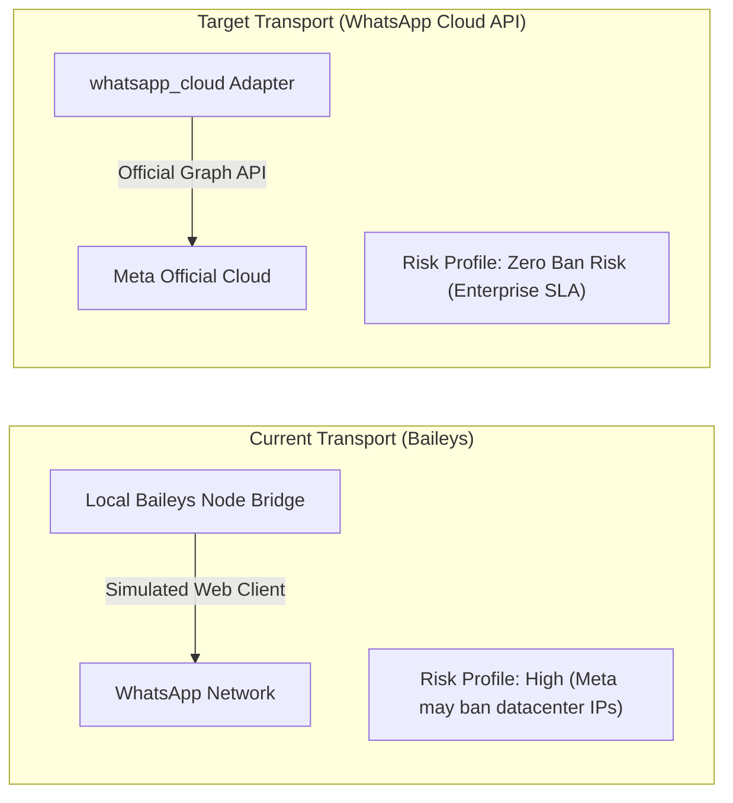

# Software Bill of Materials (Hermes Runtime & Provenance)

This document formalizes the runtime dependency manifest, upstream provenance, and supply chain risk posture for **Avery**.

---

## 1. Upstream Provenance & Baseline Pinning

Avery builds upon the open-source Hermes Agent runtime pinned to a verified upstream release commit:

| Component | Upstream Origin | Version / Pin | License |
|---|---|---|---|
| **Core Engine** | `NousResearch/hermes-agent` | v2026.8.3 (commit `3c27eb6`) | MIT License |
| **Desktop UI** | Hermes Studio (Electron) | v0.6.46 | MIT License |
| **Python Runtime** | CPython | 3.12.13 | PSF License |
| **Database Engine** | SQLite (built from source) | 3.53.4 | Public Domain |
| **WhatsApp Transport** | `@whiskeysockets/baileys` | v6.7.x | MIT License |
| **Foundation Model** | `google/gemini-2.5-flash` via OpenRouter | API Service | Commercial SLA |

---

## 2. Transport Risk Profile: Baileys vs Cloud API

The current WhatsApp transport utilizes **Baileys**, an open-source reverse-engineered protocol bridge:

### Risk Considerations:
1. **Account Suspension Risk**: Meta may flag accounts operating on non-residential (datacenter) IP addresses that use automated Web sockets.
2. **Migration Roadmap**: For enterprise clinical deployments, the stack is architected to transition from Baileys to the official Meta Cloud API adapter without altering the upstream cognitive skill definitions.

---

## 3. License Boundary Audit

- **Hermes Runtime & Core Libraries**: Permissive open-source licenses (MIT, Apache-2.0, Public Domain).
- **Sentra Skills & Personas (`SOUL.md`, `skills/sentra-*`)**: Proprietary to **Sentra Artificial Intelligence**. Modifying or distributing these assets outside Sentra requires explicit authorization from **Chief**.
