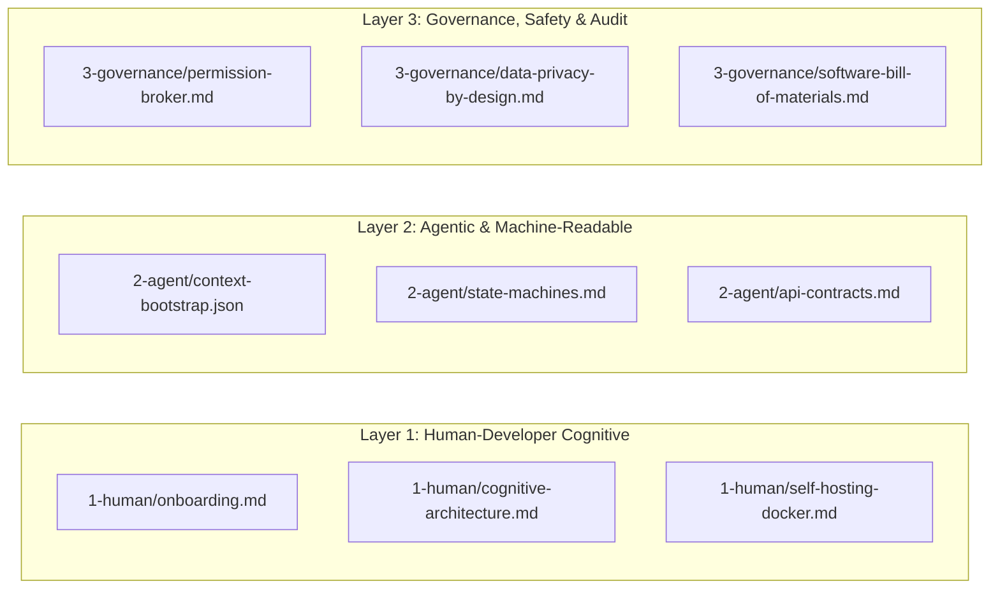

# Medisync Documentation Map

This directory contains the canonical architecture, operations, and governance documentation for **Medisync** (Avery / Hermes Agent).

---

## Layered Cognitive & Governance Documentation

| Layer | Document | Focus & Purpose |
|---|---|---|
| **Layer 1: Human-Developer** | [1-human/onboarding.md](1-human/onboarding.md) | Getting started guide, Hermes multi-process runtime, directory junctions, and safe restart procedures. |
| | [1-human/cognitive-architecture.md](1-human/cognitive-architecture.md) | Avery persona blueprint (`SOUL.md`), 4-tier Memory OS, reasoning loop, and WhatsApp transport behavior. |
| | [1-human/self-hosting-docker.md](1-human/self-hosting-docker.md) | VPS deployment blueprints (`docker-compose.yml`), custom SQLite 3.53.4 build, and backup procedures. |
| **Layer 2: Agentic & Machine** | [2-agent/context-bootstrap.json](2-agent/context-bootstrap.json) | Instant AI assistant bootstrap context, approved skill namespaces, and runtime constraints. |
| | [2-agent/state-machines.md](2-agent/state-machines.md) | Formal state transitions for message intake, memory proposal lifecycle (`pending/memory/`), and process supervision. |
| | [2-agent/api-contracts.md](2-agent/api-contracts.md) | Interface specifications for Baileys bridge (port 3000), Python dashboard (port 9119), Web UI JWT auth, and MCP server. |
| **Layer 3: Governance & Safety** | [3-governance/permission-broker.md](3-governance/permission-broker.md) | Memory write approval gates (`write_approval: true`), clinical non-diagnosis boundaries, and fail-closed policies. |
| | [3-governance/data-privacy-by-design.md](3-governance/data-privacy-by-design.md) | Healthcare data classification, session key (`creds.json`) protection, and automated PII sync regex scanners. |
| | [3-governance/software-bill-of-materials.md](3-governance/software-bill-of-materials.md) | Upstream engine provenance (`NousResearch/hermes-agent` commit `3c27eb6`), Baileys risk profile, and license audit. |

---

## Canonical Operational Documentation

| Document | Focus & Scope |
|---|---|
| [architecture.md](architecture.md) | High-level system architecture, multi-process topology, and memory character bounds. |
| [data.md](data.md) | Data classification and version control boundary rules. |
| [testing.md](testing.md) | Verification procedures and runtime log troubleshooting. |
| [deploy-hostinger.md](deploy-hostinger.md) | Hostinger KVM VPS deployment guide. |
| [whatsapp-group-fix.md](whatsapp-group-fix.md) | Deep-dive diagnostic postmortem of WhatsApp group routing and silent failure prevention. |
| [gate-0-reality-audit.md](gate-0-reality-audit.md) | Gate 0 evidence-based reality audit of Hermes 0.20.4 runtime capabilities and gaps. |
