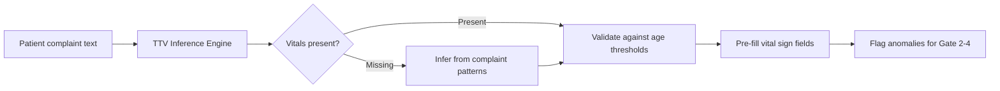
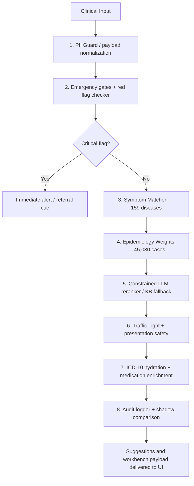
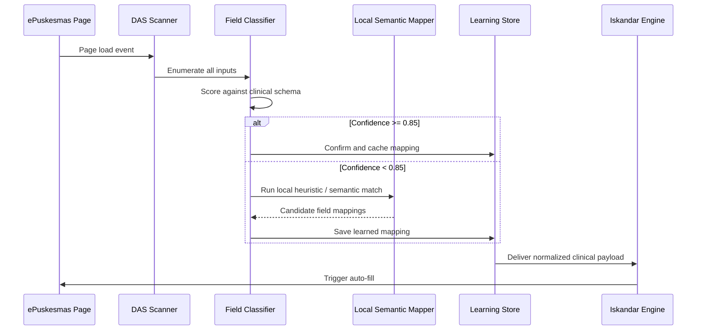
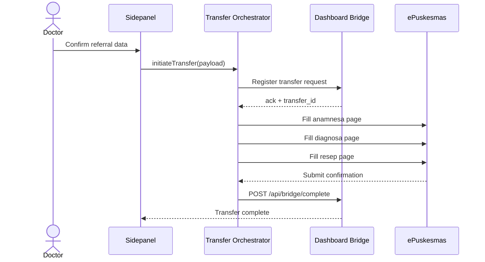
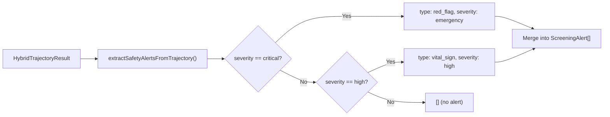

<div align="center">

# Med Assist

**The Intelligent Connector Between ePuskesmas and AI-Powered Clinical Decision Support**

</div>

## Overview

<table>
  <tr>
    <td width="30%" align="center" valign="middle">
      
      <br/><br/>
      <strong>SENTRA ASSIST</strong>
    </td>
    <td width="70%" valign="top">
      <p><strong>Med Assist</strong> is a browser extension that embeds triage, clinical reasoning, and RME transfer tooling directly inside the active ePuskesmas workflow. The current runtime centers on a physician-facing sidepanel, a background worker for orchestration, and content/main-world bridges for scraping and auto-fill.</p>
      <p>At its core, Med Assist is powered by the <strong>Iskandar Diagnosis Engine</strong>: a deterministic-first clinical pipeline that combines emergency gates, a 159-disease knowledge base, epidemiology weights from <strong>45,030 Indonesian clinical cases</strong>, a constrained OpenAI-model reranker when the physician enters a key in Settings, and escalation-first safety checks before suggestions are rendered.</p>
      <p>Patient data is surfaced from the active ePuskesmas session via <strong>DAS (Data Ascension System)</strong>, which currently uses adaptive DOM scanning, a local semantic mapper, learning-store caching, and targeted content-script reinjection/main-world bridging where the host page requires it.</p>
      <p>New features include <strong>SYMPHONY Safety Bridge</strong> (trajectory-to-alert mapping), <strong>Vital Guardrails</strong> (822-line input validation), and <strong>Feature Flags</strong> (env-var-driven module gating).</p>
    </td>
  </tr>
</table>

<div align="center">

<sub><i>Clinical sidepanel companion — embedded decision intelligence at the point of care</i></sub>

[](package.json)
[](LICENSE)
[](https://github.com/drferdi/Medassist/actions)
[](https://www.typescriptlang.org/)
[](https://wxt.dev/)
[](https://sentrahai.com)

_Designed and built by [Drferdi](https://github.com/drferdi) (dr. Ferdi Iskandar)_

> **"Diagnosis bukan tebakan — setiap keputusan klinis harus bisa dipertanggungjawabkan."** — dr. Ferdi Iskandar, Founder

</div>

---

## Why a Locally-Calibrated Decision Support Layer

A generic CDSS treats every patient as a global baseline. Med Assist treats every patient as a member of a specific Indonesian primary healthcare population — with the disease priors, drug availability, and clinical context that actually exists at the puskesmas level.

| Dimension                  | Generic CDSS                   | Med Assist                                                                                           |
| -------------------------- | ------------------------------ | ---------------------------------------------------------------------------------------------------- |
| **Disease priors**         | Foreign textbook static values | Bayesian weights from 45,030 real Indonesian cases                                                   |
| **Emergency detection**    | Single threshold rules         | 4-gate protocol: TTV inference → HTN crisis → Glucose crisis → Occult shock                          |
| **Drug interaction check** | Limited or cloud-only          | 173,071+ DDI entries (DDInter 2.0), runs offline                                                     |
| **Form automation**        | None                           | DAS adaptive extraction + local semantic mapping + page-specific auto-fill                           |
| **RME integration**        | Manual double-entry            | Transfer orchestrator + dashboard bridge poller + session-backed sync                                |
| **Safety architecture**    | Soft warnings                  | Traffic Light + presentation safety + emergency-first escalation                                     |
| **AI reasoning**           | Single model                   | Optional OpenAI reranking (key entered in Settings) + dashboard canonical engines + KB-only fallback |
| **Trajectory safety**      | None                           | SYMPHONY bridge: trajectory analysis → CDSSAlert mapping                                             |
| **Input validation**       | Basic range checks             | Vital Guardrails: hard stops, soft flags, code-red cues, auto-correction                             |
| **Module control**         | All-or-nothing                 | Feature flags: env-var-driven gating per module                                                      |

---

## Executive Summary

**Med Assist** is a browser extension built for Indonesian primary healthcare clinicians working inside ePuskesmas. It delivers four core capabilities in a single non-intrusive sidepanel: emergency detection, AI diagnosis support, drug safety, and documentation automation — without replacing the existing EMR workflow.

**Target Users:**

| Persona                | Role                            | Pain Point Solved                                          |
| ---------------------- | ------------------------------- | ---------------------------------------------------------- |
| General Practitioner   | Patient encounters, diagnosis   | Diagnostic uncertainty, ICD-10 coding, prescription safety |
| Nurse / Perawat        | Vital sign recording, anamnesis | Form double-entry, TTV completeness                        |
| Clinical Administrator | Referral coordination           | RME transfer errors, incomplete referral data              |

---

## Table of Contents

- [Features Overview](#features-overview)
- [Quickstart](#quickstart)
- [Detailed Features](#detailed-features)
- [Architecture](#architecture)
- [Testing and Quality Gates](#testing-and-quality-gates)
- [Deployment](#deployment)
- [Troubleshooting](#troubleshooting)
- [License](#license)

---

## Features Overview

### Emergency Detection

| #   | Feature                                | Status  | Primary User  |
| --- | -------------------------------------- | ------- | ------------- |
| 1   | TTV Inference — Gate 1                 | ✅ Live | Doctor, Nurse |
| 2   | Hypertension Crisis Triage — Gate 2    | ✅ Live | Doctor        |
| 3   | Glucose Crisis Management — Gate 3     | ✅ Live | Doctor        |
| 4   | Occult Shock Detector — Gate 4         | ✅ Live | Doctor        |
| 5   | Hypoglycemia 15-15 Interactive Timer   | ✅ Live | Doctor, Nurse |
| 6   | Vital Guardrails (822-line validation) | ✅ Live | System        |

### Iskandar Diagnosis Engine

| #   | Feature                                                           | Status  | Primary User |
| --- | ----------------------------------------------------------------- | ------- | ------------ |
| 7   | Red Flag Checker (sepsis, ACS, stroke, preeclampsia, anaphylaxis) | ✅ Live | Doctor       |
| 8   | Symptom Matcher — 159-disease knowledge base                      | ✅ Live | Doctor       |
| 9   | Epidemiology Weights — 45,030 Indonesian cases                    | ✅ Live | Doctor       |
| 10  | Constrained LLM Reranker — OpenAI key in Settings + KB fallback   | ✅ Live | Doctor       |
| 11  | Traffic Light + Presentation Safety                               | ✅ Live | Doctor       |
| 12  | ICD-10 RAG Search                                                 | ✅ Live | Doctor       |
| 13  | Diagnosis Confidence Meter                                        | ✅ Live | Doctor       |
| 14  | Clinical Differential + Workbench Review Surface                  | ✅ Live | Doctor       |
| 15  | Feature Flags — env-var-driven module gating                      | ✅ Live | System       |
| 16  | Diagnosis V2 Shadow Mode (optional)                               | 🔲 Beta | Doctor       |

### Clinical Safety

| #   | Feature                                             | Status  | Primary User |
| --- | --------------------------------------------------- | ------- | ------------ |
| 17  | SYMPHONY Safety Bridge — trajectory → alert mapping | ✅ Live | Doctor       |
| 18  | Patient Context Profile — age-band + consciousness  | ✅ Live | System       |
| 19  | Anamnesa Composer — template-based draft generation | ✅ Live | Doctor       |

### Drug Safety

| #   | Feature                                           | Status  | Primary User |
| --- | ------------------------------------------------- | ------- | ------------ |
| 20  | DDI Checker — 173,071+ interactions (DDInter 2.0) | ✅ Live | Doctor       |
| 21  | Pharmacotherapy Reasoner                          | ✅ Live | Doctor       |
| 22  | Dosage Calculator — Pediatric + Geriatric         | ✅ Live | Doctor       |
| 23  | Prescription Form Auto-fill (ResepForm)           | ✅ Live | Doctor       |

### Clinical Analytics

| #   | Feature                                        | Status  | Primary User  |
| --- | ---------------------------------------------- | ------- | ------------- |
| 24  | Clinical Trajectory Analyzer — 5-visit trend   | ✅ Live | Doctor        |
| 25  | Mortality / deterioration proxy visualization  | ✅ Live | Doctor        |
| 26  | Chronic Disease Classifier + context profiling | ✅ Live | Doctor        |
| 27  | Vital Sign Screening Profiles (age-stratified) | ✅ Live | Doctor, Nurse |

### DAS — Form Automation

| #   | Feature                                   | Status  | Primary User  |
| --- | ----------------------------------------- | ------- | ------------- |
| 28  | DAS Scanner — adaptive field discovery    | ✅ Live | System        |
| 29  | Local Semantic Mapper                     | ✅ Live | System        |
| 30  | Confidence-Scored Field Mapping           | ✅ Live | System        |
| 31  | Mapping Cache + Content-Script Self-Heal  | ✅ Live | System        |
| 32  | Learning Store — per-facility persistence | ✅ Live | System        |
| 33  | Anamnesa Page Auto-fill                   | ✅ Live | Doctor, Nurse |
| 34  | Diagnosa Page Auto-fill                   | ✅ Live | Doctor        |
| 35  | Resep Page Auto-fill                      | ✅ Live | Doctor        |

### Integration & Security

| #   | Feature                                               | Status  | Primary User |
| --- | ----------------------------------------------------- | ------- | ------------ |
| 36  | Dashboard Bridge — real-time polling                  | ✅ Live | System       |
| 37  | RME Transfer Orchestrator + Intelligent Tab Targeting | ✅ Live | Doctor       |
| 38  | Crew Dashboard Login — password, passkey, Mode Lokal  | ✅ Live | All          |
| 39  | PII Guard + SHA-256 patient hashing                   | ✅ Live | System       |
| 40  | Audit Trail + shadow logging                          | ✅ Live | System       |

---

## Quickstart

### Prerequisites

| Requirement              | Version | Notes                                               |
| ------------------------ | ------- | --------------------------------------------------- |
| Node.js                  | 24.x    | `engines` in `package.json` (`>=24 <25`)            |
| pnpm                     | 11.21.0 | Pinned; always run through `node scripts/pnpm.mjs`  |
| Sentra Dashboard Account | —       | Required for auth, bridge polling, and patient sync |
| Optional MedLens Harness | —       | Only for internal ECG dev/test flow                 |

### Installation

```bash
node scripts/pnpm.mjs install
cp .env.example .env.local
```

### Environment Variables

```env
VITE_SENTRA_API_URL=https://api.sentra.local
VITE_SENTRA_API_KEY=sk_dev_your_api_key_here
VITE_FACILITY_ID=PUSKESMAS_BALOWERTI
VITE_USE_MOCK=true
VITE_API_TIMEOUT=10000
VITE_FEATURE_DIAGNOSIS_AI=true
VITE_FEATURE_PRESCRIPTION_AI=true
VITE_FEATURE_DDI_CHECK=true
VITE_FEATURE_PEDIATRIC_DOSE=true
SENTRA_DIAGNOSIS_V2_SHADOW=false
SENTRA_OPENAI_MODEL=gpt-4o-mini
SENTRA_OPENAI_TIMEOUT_MS=30000
SENTRA_DISABLE_TRAJECTORY_BRIDGE=false
SENTRA_DISABLE_THERAPY=false
```

> See [.env.example](.env.example) for the full set of debug and timeout flags. Never commit `.env.local` or any file containing credentials, API keys, or patient data.

### Development

```bash
# Chrome (hot reload)
node scripts/pnpm.mjs run dev

# Firefox
node scripts/pnpm.mjs run dev:firefox
```

Load unpacked:

- **Chrome:** `chrome://extensions` → Enable Developer Mode → Load Unpacked → `.output/chrome-mv3-dev/`
- **Firefox:** `about:debugging` → Load Temporary Add-on → `.output/chrome-mv3-dev/manifest.json`

Every build, Firefox and production included, writes to the one `.output/chrome-mv3-dev/` folder
(`outDirTemplate` in `wxt.config.ts`).

### Production Build

```bash
node scripts/pnpm.mjs run build          # Chrome MV3
node scripts/pnpm.mjs run zip            # Chrome Web Store ZIP
node scripts/pnpm.mjs run build:firefox  # Firefox build
```

## Running From the Monorepo

This capsule is standalone: the root `pnpm-workspace.yaml` excludes `projects/healthcare/**`,
so `pnpm --filter` from the root does not reach it. Run every command from the capsule folder:

```bash
cd projects/healthcare/med-assist
node scripts/pnpm.mjs run typecheck
node scripts/pnpm.mjs run test
node scripts/pnpm.mjs run quality
```

---

## Detailed Features

### 1. TTV Inference — Gate 1

Infers unmeasured vital signs (pulse, respiratory rate, temperature ranges) from patient complaints using evidence-based pattern matching. The form is pre-filled before the doctor opens the encounter, reducing documentation time and ensuring vital sign completeness.

**Flow:**



---

### 2. Hypertension Crisis Triage — Gate 2

Classifies 8 HTN types per FKTP 2024 guidelines, detects Hypertensive Mediated Organ Damage (HMOD) red flags, and guides the Captopril SL protocol when HTN Emergency is confirmed.

**Classification Matrix:**

| Type           | Criteria                          | Action                            |
| -------------- | --------------------------------- | --------------------------------- |
| HTN Urgency    | SBP ≥180, no organ damage         | Oral antihypertensive, 1h recheck |
| HTN Emergency  | SBP ≥180 + organ damage signs     | Captopril SL, immediate referral  |
| Resistant HTN  | BP uncontrolled on 3+ drugs       | Specialist referral               |
| White-coat HTN | High in-clinic, normal ambulatory | Ambulatory monitoring             |
| Masked HTN     | Normal in-clinic, high ambulatory | 24h monitoring                    |

---

### 3. Glucose Crisis Management — Gate 3

Screens glucose values (GDS, GDP, 2JTTGO, HbA1c) against PERKENI 2024 thresholds. Identifies DKA/HHS red flags and activates the 15-15 interactive timer for active hypoglycemia management.

**API (internal):**

```typescript
glucoseClassifier.classify({
  gds: 42, // mg/dL
  symptoms: ['tremor', 'sweating', 'confusion'],
  weight: 65,
});
// → { crisis: 'HYPOGLYCEMIA', rule: '15-15', activateTimer: true }
```

---

### 4. Iskandar Diagnosis Engine — 8-Step Pipeline

The current repo runs a hybrid decision-support path: the extension executes deterministic and KB-backed reasoning locally, while authenticated Dashboard bridge endpoints can enrich the workbench with canonical clinical engine and differential outputs. No AI-assisted suggestion is meant to bypass the safety layers.



When bridge auth is available, the workbench can also call canonical Dashboard endpoints for clinical engine evaluation, differential review, and anamnesis extraction.

---

### 5. DAS — Data Ascension System

DAS surfaces clinical data from the active ePuskesmas session into the intelligence pipeline. Instead of relying only on brittle fixed selectors, DAS combines adaptive page scanning, a local semantic mapper, mapping caches, and host-page bridge helpers when ePuskesmas requires main-world execution.



**Auto-fill coverage:**

| Page     | Fields                                                                                              |
| -------- | --------------------------------------------------------------------------------------------------- |
| Anamnesa | Keluhan utama, keluhan tambahan, duration, TTV fields, physical exam checkboxes, skala nyeri slider |
| Diagnosa | ICD-10 primary + secondary, jenis kasus, kunjungan type                                             |
| Resep    | Medication name, dosage, aturan pakai, duration, signa (with autocomplete)                          |

---

### 6. RME Transfer Orchestrator

Manages multi-step referral data transfer to ePuskesmas: anamnesa → diagnosa → resep, with per-step retry logic, deduplication, and Dashboard bridge synchronization.



**Tab Targeting:** `lib/rme/transfer-targeting.ts` uses URL patterns, DOM hints, and encounter ID matching to intelligently select the correct RME tab for each transfer step.

---

### 7. SYMPHONY Safety Bridge

Bridges trajectory analysis results into the CDSS alert system. When trajectory analysis produces `high` or `critical` severity flags, SYMPHONY converts them into `CDSSAlert[]` objects that appear in the Emergency Dashboard.



**Config:** Controlled by `SENTRA_DISABLE_TRAJECTORY_BRIDGE` env var.

---

### 8. Vital Guardrails

822-line validation module that enforces clinical safety constraints on vital sign input before it reaches the engine stack.

| Feature             | Description                                                                    |
| ------------------- | ------------------------------------------------------------------------------ |
| **Normalizer**      | Converts commas to dots, auto-corrects 3-digit temps (250-450 → ÷10)           |
| **Hard Stops**      | Blocks input that is clinically invalid (e.g., SBP < 60, SpO2 < 50)            |
| **Soft Flags**      | Warns on marginal values (e.g., SBP 90-100, HR 100-120)                        |
| **Code Red Cues**   | Detects critical symptom phrases: nyeri dada, tidak sadar, kejang, sesak berat |
| **UI Locks**        | Context-aware field locking based on patient profile                           |
| **Patient Context** | Different behavior for infant, child, geriatric, reproductive female           |

**Config:** No env var needed — always active when imported.

---

### 9. Feature Flags

All optional modules are gated by `SENTRA_*` environment variables. Default: KB-only, no LLM dependency.

| Flag                               | Default       | Effect                       |
| ---------------------------------- | ------------- | ---------------------------- |
| `SENTRA_OPENAI_MODEL`              | `gpt-4o-mini` | Model for LLM reasoning      |
| `SENTRA_OPENAI_TIMEOUT_MS`         | `12000`       | LLM timeout in milliseconds  |
| `SENTRA_DISABLE_TRAJECTORY_BRIDGE` | `false`       | Disables SYMPHONY bridge     |
| `SENTRA_DISABLE_THERAPY`           | `false`       | Disables therapy module      |
| `SENTRA_DIAGNOSIS_V2_SHADOW`       | `false`       | Enables V2 shadow evaluation |

The OpenAI key is not an environment variable: the physician enters it in Settings and it stays in
`browser.storage.local` on that PC (`lib/iskandar-diagnosis-engine/openai-key-store.ts`).

**Safety:** `fallbackToKBOnly` is always `true`. If LLM is unavailable, diagnosis falls back to deterministic KB mode.

---

## Architecture

### Extension Layers

```
┌─────────────────────────────────────────────────────────────┐
│      Sidepanel UI (React + CSS/Tailwind utilities)          │
│ DashboardView · TTVInferenceUI · Workbench · MedLens        │
└──────────────────────────┬──────────────────────────────────┘
                           │
┌──────────────────────────▼──────────────────────────────────┐
│              Background Script (WXT MV3)                    │
│ Bridge polling · Auth/session · CDSS orchestration          │
└──────────┬────────────────┬───────────────┬─────────────────┘
           │                │               │
┌──────────▼─────────┐  ┌─────────▼──────────┐  ┌────▼──────────────────────┐
│ Dashboard / Crew   │  │ OpenAI API         │  │ Content + Main-World      │
│ Auth + Bridge +    │  │ (optional ranking) │  │ Bridge: scrape + auto-fill│
│ canonical engines  │  │                    │  │ for ePuskesmas            │
└────────────────────┘  └────────────────────┘  └───────────────────────────┘
```

### Project Structure

```
med-assist/
├── entrypoints/
│   ├── sidepanel/                 ← Main Assist UI + UI authority tests
│   │   ├── main.tsx               ← App shell entry
│   │   └── ApprovedSentraAssistApp.tsx ← Panel wiring
│   ├── login/                     ← Login/dashboard launcher entrypoint
│   ├── clinical-trajectory-preview/ ← Preview surface for trajectory UI
│   ├── background.ts              ← Messaging, auth, bridge, orchestration
│   ├── content.ts                 ← ePuskesmas DOM bridge + DAS runtime
│   └── inject.content.ts          ← Main-world helper injection entry
├── components/
│   ├── clinical/                  ← TTV, trajectory V2, MedLens, settings, tests
│   │   ├── TTVInferenceUI.tsx     ← Vital signs + triage (3300+ lines)
│   │   ├── OperationalSettingsConsole.tsx ← Settings UI
│   │   └── ClinicalTrajectory.tsx ← Trajectory dashboard
│   ├── sidepanel/                 ← Dashboard, header/footer, workbench, credits
│   ├── providers/                 ← ThemeProvider
│   └── ui/                        ← Shared presentation utilities
├── lib/
│   ├── iskandar-diagnosis-engine/ ← Diagnosis, trajectory, safety, workflow
│   │   ├── feature-flags.ts       ← SENTRA_* env var config
│   │   ├── trajectory-safety-bridge.ts ← SYMPHONY safety alerts
│   │   ├── llm-reasoner.ts        ← Constrained OpenAI reranker
│   │   └── diagnosis-v2.ts        ← Shadow differential ranking
│   ├── emergency-detector/        ← TTV, HTN, glucose, occult shock gates
│   ├── api/                       ← Auth, bridge, audit clients
│   │   ├── auth-client.ts         ← Crew login, passkey, Mode Lokal
│   │   └── bridge-client.ts       ← Dashboard bridge
│   ├── clinical/                  ← Vital guardrails, patient context, anamnesa
│   │   ├── vital-guardrails.ts    ← 822-line vital validation
│   │   ├── patient-context-profile.ts ← Age-band + consciousness
│   │   └── anamnesa-composer.ts   ← Anamnesa draft composer
│   ├── scraper/
│   │   └── adaptive/              ← DAS local mapper, caches, safety validator
│   ├── rag/                       ← ICD-10 search/load pipeline
│   ├── handlers/                  ← Page fill/scrape handlers
│   ├── rme/                       ← Transfer targeting, payload/prognosis mapping
│   └── filler/                    ← Content/main-world fill core
├── services/
│   └── medlens-local/             ← Internal ECG OCR/analyzer harness for dev/test
├── utils/                         ← Audio, logger, messaging, storage, types
├── data/                          ← DDI, field mappings, anamnesa templates
├── public/                        ← Extension assets and static JSON datasets
├── scripts/                       ← Docs/data/dev utilities
├── tests/                         ← Runtime, e2e, and local harness tests
└── types/                         ← Shared API and runtime types
```

---

## Testing and Quality Gates

### Running Tests

```bash
node scripts/pnpm.mjs run test          # Vitest suite
node scripts/pnpm.mjs run test:contract # Bridge API contract checks
node scripts/pnpm.mjs run test:e2e      # Playwright, on the installed Google Chrome
node scripts/pnpm.mjs run typecheck     # tsc --noEmit
node scripts/pnpm.mjs run lint          # ESLint
```

### Required Before Merge

Minimum gates before merge:

```
✅ node scripts/pnpm.mjs run typecheck
✅ node scripts/pnpm.mjs run lint
✅ node scripts/pnpm.mjs run test
✅ node scripts/pnpm.mjs run test:contract (when auth / bridge contracts change)
```

---

## Deployment

### Chrome Web Store

```bash
node scripts/pnpm.mjs run build
node scripts/pnpm.mjs run zip
# Upload ZIP to Chrome Web Store Developer Dashboard
```

### Firefox Add-ons

```bash
node scripts/pnpm.mjs run build:firefox
node scripts/pnpm.mjs run zip:firefox
# Upload to Firefox Add-on Developer Hub
```

---

## Troubleshooting

| Issue                             | Solution                                                                                                                |
| --------------------------------- | ----------------------------------------------------------------------------------------------------------------------- |
| Extension not loading             | Enable Developer Mode at `chrome://extensions/`, load unpacked from `.output/chrome-mv3-dev/`                           |
| Install fails                     | Verify Node.js 24 via `node -v`; install with `node scripts/pnpm.mjs install`, never plain `npm install`                |
| Dashboard / Bridge auth errors    | Check Crew/Dashboard base URL in Settings, valid login session, or automation token                                     |
| Sidepanel shows "Login required"  | Check Dashboard base URL in Settings — an empty base URL means Mode Lokal (device-local login)                          |
| Form not auto-filling             | DAS may need a re-scan or content reinjection — click **Inisialisasi** in the header                                    |
| Word / char limit error on submit | ePuskesmas rejects oversize keluhan — Sentra caps at **220 words** and **250 characters** (SSOT: `lib/rme/truncate.ts`) |
| MedLens local unavailable         | The local ECG harness is internal-only; start `node services/medlens-local/server.mjs` only for dev/test                |
| TypeScript errors                 | Run `node scripts/pnpm.mjs run typecheck` for full output                                                               |
| LLM reasoning not working         | Check an OpenAI key is entered in Settings; without it, the system falls back to KB-only deterministic mode             |
| SYMPHONY alerts not appearing     | Check `SENTRA_DISABLE_TRAJECTORY_BRIDGE=false`; ensure trajectory analysis has `high`/`critical` severity               |
| Vital guardrails not blocking     | Verify `vital-guardrails.ts` is imported in TTVInferenceUI; check field values are within hard-stop ranges              |

---

## License

Med Assist is dual-licensed. See [LICENSE](LICENSE) for full terms.

| Use Case                                    | License                     |
| ------------------------------------------- | --------------------------- |
| Individual clinician / researcher / student | Free — Apache 2.0           |
| Puskesmas / clinic / hospital deployment    | Enterprise license required |
| Vendor / integrator / government program    | Enterprise license required |

Commercial licensing: [sentrahai.com](https://sentrahai.com)

---

## 🤖 Self-Healing CI

This repo currently ships local repair commands for formatting and minor lint drift.
If CI or local verification fails due to style-level issues:

1. Run `node scripts/pnpm.mjs run format`.
2. Run `node scripts/pnpm.mjs run lint:fix`.
3. Re-run `node scripts/pnpm.mjs run lint` and `node scripts/pnpm.mjs run test`.
4. Review the diff before committing or opening a PR.

---

<div align="center">

Designed and built by **[Drferdi](https://github.com/drferdi)** (dr. Ferdi Iskandar)
Maintained by **Sentra Artificial Intelligence**

</div>

<!-- Test autofix: Thu Apr 16 12:50:45 SEAST 2026 -->
