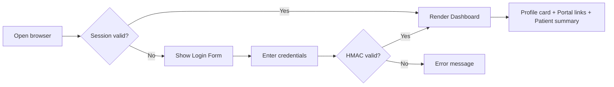
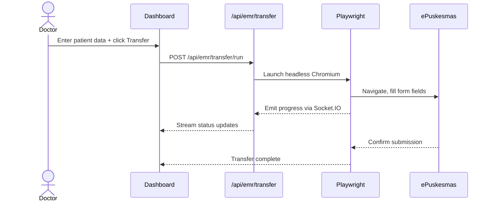
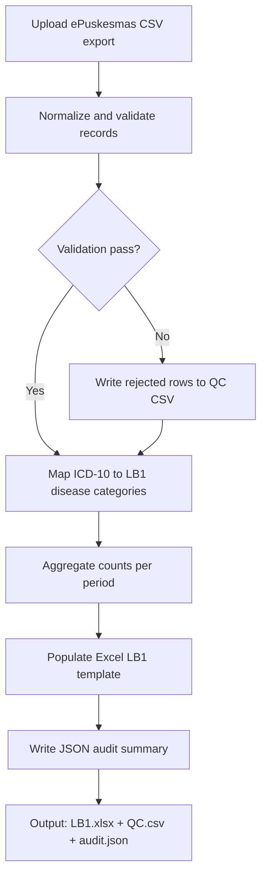
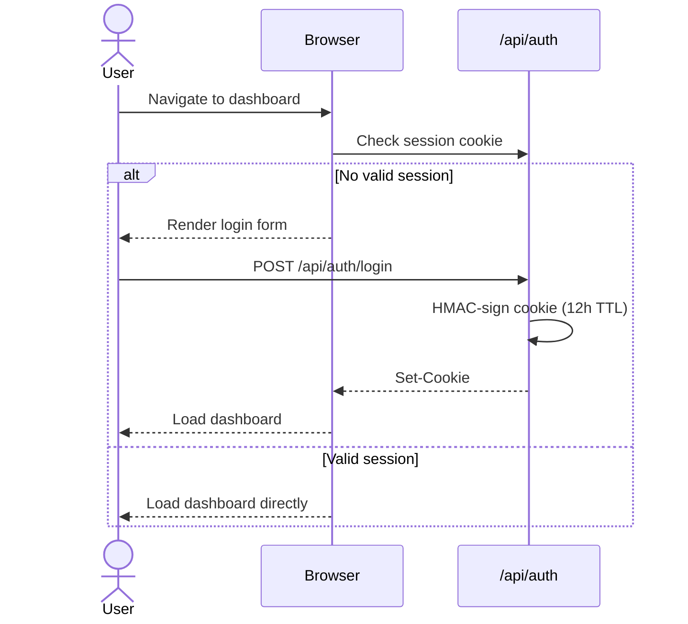
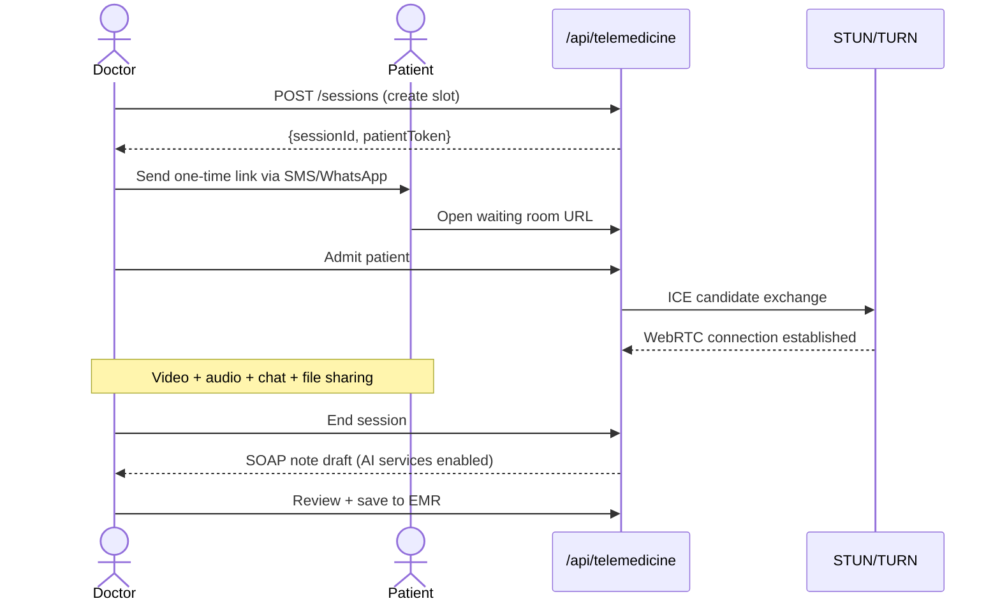

# MedBoard features

Detailed description of each MedBoard feature: what it does, who uses it and how the flow runs.
The [README](../README.md) gives the overview. Statuses and names reflect the code at the time of
writing; where a description and the code disagree, the code wins.

### 1. User Profile Dashboard

Home view with logged-in staff profile, one-click government portal links (Satu Sehat, SIPARWA, ePuskesmas, P-Care BPJS), and a live patient summary with vitals and ICD-X codes.

**User Stories:**
- As a doctor, I want one-click access to ePuskesmas and P-Care so I avoid navigating multiple logins
- As any staff, I want to see my role and session status so I know I'm authenticated correctly

**User Flow:**



---

### 2. EMR Auto-Fill Engine

Playwright RPA transfers structured clinical data (anamnesis, diagnosis, prescriptions) into ePuskesmas, streaming progress to the frontend via Socket.IO — eliminating double-entry.

**Sequence Diagram:**



**API Endpoints:**

| Method | Endpoint | Description | Status Codes |
|---|---|---|---|
| `POST` | `/api/emr/transfer/run` | Execute EMR auto-fill | 202, 409, 503 |
| `GET` | `/api/emr/transfer/status` | Engine status | 200 |
| `GET` | `/api/emr/transfer/history` | Run history | 200 |

**Database Schema:**

```sql
CREATE TABLE emr_transfer_runs (
  id            UUID PRIMARY KEY DEFAULT gen_random_uuid(),
  patient_mrn   VARCHAR(32) NOT NULL,
  initiated_by  VARCHAR(64) NOT NULL,
  status        VARCHAR(16) NOT NULL,   -- pending | running | success | failed
  payload       JSONB NOT NULL,
  error_message TEXT,
  started_at    TIMESTAMPTZ DEFAULT now(),
  completed_at  TIMESTAMPTZ,
  duration_ms   INTEGER
);
```

**Security:** EMR credentials are runtime-only (env vars), never logged or client-exposed. Audit log records actor + timestamp without exposing patient PHI in log lines.

---

### 3. ICD-X Finder

Multi-version ICD-10 lookup (2010, 2016, 2019) with fuzzy search, dynamic filtering, and legacy code translation.

**API:** `GET /api/icdx/lookup?q=headache&version=2019&limit=10`

```json
{
  "ok": true,
  "version": 2019,
  "results": [
    { "code": "R51", "description": "Headache", "isBillable": true },
    { "code": "G44.3", "description": "Post-traumatic headache", "isBillable": true }
  ]
}
```

**Database Schema:**

```sql
CREATE TABLE icd10_codes (
  id          SERIAL PRIMARY KEY,
  code        VARCHAR(8) NOT NULL,
  version     SMALLINT NOT NULL,        -- 2010 | 2016 | 2019
  description TEXT NOT NULL,
  category    VARCHAR(3),
  is_billable BOOLEAN DEFAULT true,
  UNIQUE(code, version)
);
CREATE INDEX idx_icd_fts ON icd10_codes
  USING gin(to_tsvector('indonesian', description));
```

---

### 4. LB1 Report Automation

End-to-end pipeline: ingest ePuskesmas export → validate → map ICD-10 to LB1 categories → populate Excel template → output `.xlsx`, QC `.csv`, and audit `.json`.

**Pipeline Flow:**



**API Endpoints:**

| Method | Endpoint | Description |
|---|---|---|
| `GET` | `/api/report/automation/preflight` | Pre-run validation |
| `POST` | `/api/report/automation/run` | Execute pipeline |
| `GET` | `/api/report/automation/status` | Pipeline status |
| `GET` | `/api/report/automation/history` | Run history |
| `GET` | `/api/report/files/download` | Download output file |

---

### 5. Audrey — Clinical AI Assistant

Voice surface ini sedang **dinonaktifkan sementara** selama exit Google total. Endpoint voice tetap dipertahankan untuk compatibility, tetapi saat ini mengembalikan `503` sampai stack pengganti ditetapkan.

> ⚠️ **Clinical Disclaimer:** Audrey provides AI-assisted suggestions only. All clinical decisions must be made by a licensed healthcare professional.

**API:** `POST /api/voice/chat`

```json
// Response saat ini
{
  "ok": false,
  "error": "Voice chat sementara dinonaktifkan selama exit Google total."
}
```

---

### 6. ACARS — Internal Chat

Socket.IO-backed team messaging with room-based conversations, typing indicators, and online presence tracking.

**Real-Time Socket.IO Events:**

| Event | Direction | Payload |
|---|---|---|
| `acars:message` | Server → Client | `{roomId, sender, text, timestamp}` |
| `acars:typing` | Client → Server | `{roomId, username}` |
| `acars:presence` | Server → Client | `{username, status}` |

---

### 7. CDSS — Clinical Decision Support

Combines a local knowledge base (159 diseases, 45,030 encounter records) with DeepSeek reasoning and deterministic local fallback to deliver ranked differential diagnoses, treatment plans, and referral criteria.

**API:** `POST /api/cdss/diagnose`

```json
// Request
{
  "symptoms": ["headache", "fever", "neck stiffness"],
  "patientAge": 25,
  "patientSex": "female",
  "vitals": { "temp": 38.5, "bp": "120/80" }
}

// Response
{
  "ok": true,
  "differentials": [
    {
      "rank": 1,
      "diagnosis": "Bacterial Meningitis",
      "icdCode": "G00.9",
      "urgency": "emergency",
      "referralRequired": true,
      "immediateActions": ["Urgent hospital referral", "Do not delay for LP"]
    }
  ],
  "disclaimer": "AI-generated. Clinical judgment required."
}
```

---

### 8. Crew Access Portal

Authentication gate using HMAC-SHA256 signed session cookies. Credentials resolved in priority order: `env vars > runtime JSON > compiled defaults`.

**Auth Flow:**



**Security Properties:**

| Property | Value |
|---|---|
| Cookie flags | `HttpOnly`, `Secure`, `SameSite=Strict` |
| HMAC algorithm | SHA-256 |
| Session TTL | 12 hours |
| Rate limiting | 5 login attempts / 15 min (recommended) |

---

### 9. Telemedicine — Virtual Consultation

Real-time video consultations via **WebRTC** peer-to-peer with Socket.IO signaling, STUN/TURN fallback, in-call chat, file sharing, consent-gated recording, and AI-generated post-session SOAP notes.

**Consultation Workflow:**



**API Endpoints:**

| Method | Endpoint | Description |
|---|---|---|
| `POST` | `/api/telemedicine/sessions` | Create session |
| `GET` | `/api/telemedicine/sessions` | List sessions |
| `PATCH` | `/api/telemedicine/sessions/:id` | Update status |
| `POST` | `/api/telemedicine/signal` | WebRTC signaling |
| `POST` | `/api/telemedicine/recording/start` | Start recording |
| `POST` | `/api/telemedicine/recording/stop` | Stop & save |
| `GET/POST` | `/api/telemedicine/schedule` | Slot management |

**Database Schema:**

```sql
CREATE TABLE telemedicine_sessions (
  id              UUID PRIMARY KEY DEFAULT gen_random_uuid(),
  doctor_id       VARCHAR(64) NOT NULL,
  patient_token   VARCHAR(128) UNIQUE NOT NULL,
  patient_name    VARCHAR(128),
  status          VARCHAR(16) DEFAULT 'scheduled',
  scheduled_at    TIMESTAMPTZ,
  started_at      TIMESTAMPTZ,
  ended_at        TIMESTAMPTZ,
  recording_path  TEXT,
  soap_note       TEXT,
  emr_saved       BOOLEAN DEFAULT false,
  created_at      TIMESTAMPTZ DEFAULT now()
);
```

> ⚠️ Recordings contain PHI. Store encrypted (AES-256) at rest. Restrict access to authorized clinical staff only.

---

### 10. Vital Signs Monitoring & Instant Red Alerts

Unified vital signs interface that ingests multi-source readings (manual entry, EMR bridge, device feed) and evaluates them in real time against physiological thresholds. Triggers instant red alerts with severity classification without waiting for CDSS inference.

**Key Capabilities:**
- Composite deterioration detection across 6+ vital parameters simultaneously
- Instant alert generation: SpO₂ < 90%, MAP < 65 mmHg, GCS < 8, etc.
- Velocity (rate-of-change) calculation per vital — detects rapid deterioration
- AVPU ↔ GCS mapping for consciousness level normalization
- Baseline deviation tracking per individual patient

**API:** `GET /api/vitals/history?patientId=&limit=50`

---

### 11. Clinical Trajectory Analysis

Longitudinal engine that tracks patient health vectors across time — combining vital trends, diagnosis history, and encounter outcomes into a clinical trajectory with forward momentum projection.

**Key Capabilities:**
- `TrajectoryIntelligencePanel` — consolidated view of all trajectory signals
- `MomentumScoreCard` — single composite score summarizing clinical direction
- `VitalTrendChart` & `VitalVelocityList` — graphical and tabular trend views
- `AcuteAttackRiskGrid` / `AcuteAttackRiskRadar` — multi-axis acute decompensation risk
- `ClinicalUrgencyMatrix` — classifies urgency from trajectory data

**API:** `GET /api/patients/[id]/trajectory`

---

### 12. Momentum & Deterioration Scoring Engine

Server-side engine (`lib/clinical/momentum-engine.ts`) that calculates a single normalized momentum score per patient encounter, representing the net clinical direction (improving / stable / deteriorating).

**Score Interpretation:**

| Score Range | Clinical State |
|---|---|
| > +0.6 | Improving |
| -0.2 to +0.6 | Stable |
| < -0.2 | Deteriorating |
| < -0.6 | Critical — immediate action |

**Inputs:** vital velocity, baseline deviation, CDSS urgency grade, diagnosis acuity weight.

---

### 13. Time-to-Critical Prediction

`lib/clinical/prediction-engine.ts` extrapolates current vital velocity vectors to estimate time-to-critical threshold breach. Used in `TimeToCriticalTimeline` component and `MortalityRiskIndicator`.

**Key Capabilities:**
- Per-vital time-to-threshold calculation (SpO₂, MAP, GCS, temperature)
- Mortality risk percentile based on convergence pattern score
- Acute attack window estimation for chronic disease exacerbations
- Forward projection horizon: configurable (default 4h, max 24h)

---

### 14. Convergence Pattern Detection

`lib/clinical/convergence-detector.ts` detects when multiple vital parameters deteriorate in the same time window — a known predictor of rapid decompensation — even before any single vital crosses its threshold.

**Pattern Types:**

| Pattern | Description |
|---|---|
| `vital-convergence` | 3+ vitals deteriorating within 30 min |
| `tachycardia-hypotension` | HR ↑ + BP ↓ together |
| `hypoxia-tachypnea` | SpO₂ ↓ + RR ↑ together |
| `altered-consciousness` | GCS drop ≥ 2 in < 1h |

**Components:** `ConvergenceHeatmap`, `ConvergencePatternAlert`, `BaselineDeviationGauge`.

---

### 15. NEWS2 Early Warning Score

Full National Early Warning Score 2 implementation (`lib/cdss/news2.ts`) — aggregates 7 physiological parameters into a composite score driving escalation decisions.

**Scoring Parameters:** Respiration rate · SpO₂ · Supplemental O₂ · Temperature · Systolic BP · Heart rate · Consciousness (ACVPU)

**Escalation Thresholds:**

| NEWS2 Score | Response |
|---|---|
| 0–4 | Routine monitoring |
| 5–6 or any single ≥ 3 | Urgent medical review |
| ≥ 7 | Emergency — continuous monitoring, senior clinician |

---

### 16. Disease Classifiers

Three standalone inference modules for common primary healthcare conditions:

| Module | File | Input | Output |
|---|---|---|---|
| Glucose Classifier | `lib/glucose-classifier.ts` | Fasting/PP glucose + HbA1c | Normal / Prediabetes / DM Type 2 |
| Hypertension Classifier | `lib/htn-classifier.ts` | Systolic + diastolic BP | Grade 1/2/3, Isolated Systolic |
| Occult Shock Detector | `lib/occult-shock-detector.ts` | HR, BP, SpO₂, GCS, skin signs | Alert / No alert |

Used by CDSS engine and Trajectory Analyzer as pre-filter inputs.

---

### 17. Sentrapedia — Clinical Reference

Clinical reference for 144 conditions seen in Puskesmas (`/sentrapedia`): definition, symptoms,
diagnosis, therapy and referral criteria per disease, grouped in 14 categories and searchable by
name, ICD-10 code or symptom. `/critical-mind` redirects here.

**Contributions:** staff propose new text for one section of a disease at
`/sentrapedia/kontribusi` with a source. An AI review (DeepSeek, `DEEPSEEK_API_KEY`) checks
each proposal, and an administrator approves or rejects it in Admin → Kontribusi Sentrapedia.
Approved text replaces the original section.

---

### 18. Medical Calculators

18 validated clinical calculators accessible at `/calculator/[slug]` with input forms, computed results, and clinical interpretation.

**Available Calculators:**

| Slug | Calculator | Clinical Use |
|---|---|---|
| `bmi-calculator` | Body Mass Index | Nutritional screening |
| `map-calculation` | Mean Arterial Pressure | Perfusion assessment |
| `basal-metabolic-rate` | Basal Metabolic Rate | Caloric needs estimation |
| `egfr-ckd-epi` | eGFR (CKD-EPI) | CKD staging |
| `creatinine-clearance` | Cockcroft-Gault | Drug dose adjustment |
| `due-date-lmp` | Estimated Due Date | Obstetric estimation |
| `qsofa-score` | qSOFA | Sepsis triage |
| `glasgow-coma-scale` | Glasgow Coma Scale | Neurological severity |
| `curb-65` | CURB-65 | CAP severity (hospital vs home) |
| `cha2ds2-vasc` | CHA₂DS₂-VASc | AF stroke risk, anticoagulation |
| `hasbled` | HAS-BLED | Bleeding risk in anticoagulation |
| `timi-ua-nstemi` | TIMI UA/NSTEMI | Chest pain stratification |
| `wells-dvt` | Wells DVT | DVT pre-test probability |
| `wells-pe` | Wells PE | PE pre-test probability |
| `centor-score` | Centor Modified | Group A Strep, antibiotic decision |
| `phq-9` | PHQ-9 | Depression screening |
| `pediatric-weight` | Ideal Pediatric Weight | Pediatric dosing |
| `corrected-sodium` | Corrected Sodium | Hyperglycemia sodium correction |

---

### 19. Consultation Request & EMR Transfer Flow

Structured workflow for inbound consultation requests (via telemedicine or direct referral), managing accept/reject decisions and one-click transfer of consultation outcomes to the EMR bridge.

**API Endpoints:**

| Method | Endpoint | Description |
|---|---|---|
| `GET` | `/api/consult/pending` | List pending consultations |
| `POST` | `/api/consult/accept` | Accept consultation |
| `POST` | `/api/consult/reject` | Reject with reason |
| `POST` | `/api/consult/transfer-to-emr` | Push outcome to EMR bridge |

**State Machine:** `pending` → `accepted` / `rejected` → `transferred` / `closed`

---

### 20. Clinical Report Generator

Generates structured clinical PDF reports from encounter and CDSS data, stored server-side and downloadable on demand.

**API Endpoints:**

| Method | Endpoint | Description |
|---|---|---|
| `GET/POST` | `/api/report/clinical` | List / create report |
| `GET` | `/api/report/clinical/[id]/pdf` | Generate + download PDF |

---

### 21. AI Insights & Clinical Narrative Generator

`lib/intelligence/ai-insights.ts` + `lib/narrative-generator.ts` — produces human-readable clinical summaries from structured encounter data. Used to populate SOAP note drafts after telemedicine sessions and generate shift handoff summaries.

**Capabilities:**
- SOAP note generation (Subjective / Objective / Assessment / Plan)
- Shift handoff narrative from encounter queue
- Trajectory summary paragraph for patient charts
- Powered by DeepSeek reasoning with deterministic local safeguards

---

### 22. Anamnesis Extractor

`lib/clinical/anamnesis-extractor.ts` — NLP pipeline that parses free-text clinical notes (Indonesian or English) into structured EMR fields: chief complaint, duration, associated symptoms, pertinent negatives, past medical history.

**API:** `POST /api/clinical/anamnesis/extract`

```json
// Request
{ "text": "Pasien datang dengan keluhan demam 3 hari, batuk berdahak, sesak napas..." }

// Response
{
  "chiefComplaint": "demam",
  "duration": "3 hari",
  "associatedSymptoms": ["batuk berdahak", "sesak napas"],
  "pertinentNegatives": []
}
```

---

### 23. Hub — Crew Directory & Profiles

Staff directory at `/hub` with individual crew profiles, role cards, and lab result linkage. Supports multi-institution view for facility administrators.

**API Endpoints:**

| Method | Endpoint | Description |
|---|---|---|
| `GET` | `/api/hub/roster` | Full crew roster |
| `GET` | `/api/hub/roster/[username]` | Individual crew profile |
| `GET` | `/api/crew/[username]` | Crew access metadata |
| `GET` | `/api/hub/lab/[username]` | Lab results for crew member |

---

### 24. Admin Console

Full administrative back-office at `/admin` for managing users, institutions, and registration approvals, with overview metrics and dev-update publishing.

**API Endpoints:**

| Method | Endpoint | Description |
|---|---|---|
| `GET` | `/api/admin/overview` | Dashboard metrics |
| `CRUD` | `/api/admin/users` | User management |
| `POST` | `/api/admin/users/[u]/reset-password` | Password reset |
| `POST` | `/api/admin/users/[u]/deactivate` | Deactivate account |
| `CRUD` | `/api/admin/institutions` | Institution CRUD |
| `POST` | `/api/admin/registrations/[id]/approve` | Approve pending registration |
| `CRUD` | `/api/admin/dev-updates` | Publish dev updates to staff |
| `CRUD` | `/api/admin/notam` | Manage NOTAMs |

---

### 25. NOTAM — Operational Notices System

Aviation-inspired Notice-to-All-Members system for broadcasting operational updates (system maintenance, protocol changes, emergencies) to all authenticated staff in real time via Socket.IO.

**API Endpoints:**

| Method | Endpoint | Description |
|---|---|---|
| `GET` | `/api/notam/active` | Active NOTAMs for current staff |
| `CRUD` | `/api/admin/notam` | Admin NOTAM management |

**Real-time:** `notam:broadcast` Socket.IO event pushes new NOTAMs to all connected clients instantly.

---

### 26. Staff Geographic Map

`components/map/StaffMap.tsx` — visualizes staff locations and active duty coverage geographically. Used by administrators to monitor field deployment of clinical staff across service areas.

---

### 27. Online Status Tracker

`lib/server/online-today-tracker.ts` + `GET /api/doctors/online` — tracks and exposes real-time online presence of clinical staff. Used by telemedicine scheduler to show doctor availability and by ACARS for presence indicators.

---

### 28. Security Audit Log

`lib/server/security-audit.ts` — append-only structured log of all security-relevant events: authentication attempts, CDSS access, admin actions. PHI-safe by design: user identifiers are SHA-256 hashed before storage.

**Log Entry Schema:**

```json
{
  "timestamp": "2026-04-15T13:21:00.000Z",
  "endpoint": "/api/cdss/diagnose",
  "action": "cdss_diagnose",
  "result": "success",
  "userId": "sha256:a3f2...",
  "role": "doctor",
  "ip": "10.0.0.1",
  "metadata": { "suggestionCount": 3, "redFlagCount": 1 }
}
```

> Patient identifiers, names, and clinical content are **never** written to the audit log.

---

### 29. Screening Audit Logbook

`lib/audit/screening-audit-service.ts` + `lib/audit/screening-immutable-hash.ts` — immutable audit chain for clinical screening events. Each entry is hash-chained to the previous, making retroactive tampering detectable.

**Routes:** `GET/POST /api/v1/logs/screening` · `GET /api/v1/logs/screening/[eventId]` · `POST /api/v1/logs/screening/[eventId]/ack`

---

### 30. Role-Based Access Control (RBAC)

Role enforcement at API route and component level. Roles: `doctor` · `midwife` · `nurse` · `admin` · `patient`.

| Resource | doctor | midwife | nurse | admin |
|---|---|---|---|---|
| CDSS diagnose | ✅ | ✅ | ❌ | ❌ |
| EMR transfer | ✅ | ✅ | ✅ | ❌ |
| Admin console | ❌ | ❌ | ❌ | ✅ |
| Telemedicine host | ✅ | ✅ | ❌ | ❌ |
| Screening logbook | ✅ | ✅ | ✅ | ✅ |

Implemented in `lib/telemedicine/rbac.ts` and API route guards via `getCrewAccessConfigStatus()`.

---

### 31. Intelligence Dashboard (Socket.io Live Feeds)

`/dashboard/intelligence` — real-time operational overview streaming live encounter queue, active alerts, vital sign updates, and CDSS activity via Socket.IO. Zero polling — push-only from server.

**Socket Events:**

| Event | Direction | Description |
|---|---|---|
| `intelligence:encounter-update` | Server → Client | New/updated encounter in queue |
| `intelligence:alert` | Server → Client | New red alert or CDSS escalation |
| `intelligence:metrics` | Server → Client | Operational KPI snapshot |
| `intelligence:override` | Client → Server | Manual flag override by clinician |

**API:** `GET /api/dashboard/intelligence/metrics` · `GET /api/dashboard/intelligence/observability`

---

### 32. Multi-Bridge Real-time Architecture

Three independent Socket.IO namespaces bridge server-side events to the frontend without REST polling:

| Bridge | File | Namespace | Feeds |
|---|---|---|---|
| Intelligence | `lib/intelligence/socket-bridge.ts` | `/intelligence` | Encounter queue, alerts, metrics |
| EMR | `lib/emr/socket-bridge.ts` | `/emr` | Transfer progress, sync status |
| Telemedicine | `lib/telemedicine/socket-bridge.ts` | `/telemedicine` | Call state, consultation events |
| NOTAM | `lib/notam/socket-bridge.ts` | `/notam` | Broadcast operational notices |

All bridges authenticate via the same HMAC session cookie before accepting connections (`lib/server/crew-access-auth.ts`).

---

### 33. Langfuse Artificial Intelligence Observability

`lib/intelligence/langfuse.config.ts` — traces active AI inference paths (CDSS, narrative generation, intelligence pipelines) through Langfuse for latency monitoring, token usage, prompt versioning, and quality scoring.

**Captured per AI call:** model name · prompt version · input tokens · output tokens · latency ms · user role · session ID (hashed)

> Patient data is never sent to Langfuse. Only structural metadata is traced.

---

### 34. Sentry Error Tracking (PHI-Scrubbed)

`lib/intelligence/sentry.config.ts` — Sentry integration with a mandatory `beforeSend` hook that scrubs PHI from every event before transmission.

**Scrubbed field patterns:** `patientId` · `patientName` · `fullName` · `medicalRecordNumber` · `mrn` · `nik`

**Value scrubbing:** 16-digit NIK → `[REDACTED-NIK]` · MRN patterns → `[REDACTED-MRN]`

**Disabled by policy:** `replaysSessionSampleRate = 0` · `replaysOnErrorSampleRate = 0` (no session recording)

---

### 35. Health Check API

`GET /api/health` — structured health check endpoint used by Railway, uptime monitors, and CI/CD pipelines. Returns per-dependency status with HTTP 200 (healthy/degraded) or 503 (critical failure).

**Response Schema:**

```json
{
  "status": "ok | degraded | error",
  "service": "intelligenceboard",
  "timestamp": "2026-04-15T13:00:00.000Z",
  "environment": "production",
  "release": "abc1234",
  "checks": {
    "database": { "ok": true, "required": true },
    "crew_access": { "ok": true, "required": true },
    "cdss_ai": { "ok": true, "required": false },
    "livekit": { "ok": false, "required": false },
    "sentry": { "ok": true, "required": false }
  }
}
```

HTTP 503 only when a `required: true` check fails. Degraded state returns HTTP 200 with `"status": "degraded"`.
