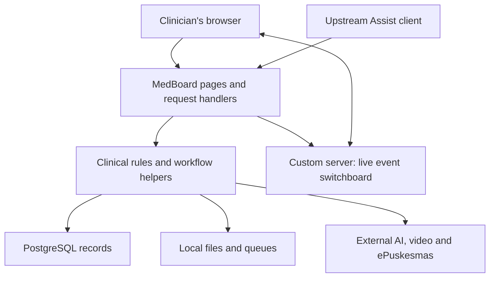

# MedBoard: a maintainer's mental model

A guide for a solo developer and a non-programmer product owner. Based on the working checkout on **7 October 2026**, including changes already present when this review began.

## How to read this guide

- **Verified from source** means three read-only investigators inspected the implementation, with important findings cross-checked during synthesis. It establishes what the code says, not that the feature works in production.
- **Inference** means an interpretation or likely consequence of that code. These statements are explicitly labelled.
- **Unknown** means this review did not establish the answer.

No installation, build, tests, database operations, server startup or browser checks were performed. No real environment files, credentials or patient records were opened. Only this document was changed. Linked paths are relative to this capsule so the guide remains usable outside the enclosing monorepo.

## 1. What the product does

**Verified from source.** MedBoard brings several clinic workflows into one web application:

| Work area | What a person does there | Main entry point |
| --- | --- | --- |
| Clinical encounter | Reviews complaints, vital signs, history, alerts, possible diagnoses and prescriptions | `/emr` |
| Video consultation | Manages consultations and joins video sessions | `/telemedicine` |
| Coding and paperwork | Looks up ICD-10 diagnosis codes and prepares reports | `/icdx`, `/report/clinical`, reporting APIs |
| Clinical references | Uses calculators, condition references and anatomy | `/calculator`, `/sentrapedia`, `/atlas` |
| Team coordination | Finds colleagues, exchanges messages and receives notices | `/hub`, `/acars`, `/chat` |
| Oversight | Views clinical intelligence, screening audits and administration | `/dashboard/intelligence`, `/audit/logbook`, `/admin` |

Sources: [navigation definitions](../src/components/shell/nav-items.ts), [EMR screen](../src/app/emr/page.tsx), [report creation route](../src/app/api/report/clinical/route.ts).

EMR means electronic medical record. CDSS means clinical decision support system. A *differential diagnosis* is a list of possible diagnoses for a clinician to review. NEWS2 is the National Early Warning Score 2, a fixed scoring method for physiological deterioration. Assist is the upstream clinical assistant that sends information to MedBoard; its own implementation was outside this review.

**Inference.** The most useful product model is a clinical workbench connected to existing systems. A page loading does not establish that its database, live events, external AI, video or ePuskesmas automation are available.

## 2. How the application is assembled

**Verified from source.** This is one Next.js application, with screens and server request handlers in the same project. It also has a custom Node.js server for live communication.

The diagram combines paths found in the source; it does not show a verified deployment.

### The two launch modes matter

| Entry point | What it starts |
| --- | --- |
| `server.ts`, through `dev` or `start` | Next.js pages/API handlers, startup authentication checks, and Socket.IO live communication |
| `start:local`, used by the standalone contract | Plain Next.js production server at `127.0.0.1:4344`; bypasses `server.ts` |

The custom server connects live bridges for EMR progress and triage, consultations, staff notices and the intelligence dashboard. Both the default live channel and the `/intelligence` channel check a signed login cookie. Ordinary web requests go to Next.js. Sources: [server.ts](../server.ts), [package scripts](../package.json), [standalone contract](../project.contract.json).

**Inference.** The local contract server can demonstrate built pages being served, but cannot prove the custom Socket.IO service works. Some workflows also poll over ordinary web requests, so bypassing Socket.IO does not necessarily remove every update path.

### Where to look

| Location | Responsibility |
| --- | --- |
| `src/app/` | URL-based screens and API handlers: `page.tsx` is a screen; `route.ts` handles requests |
| `src/app/layout.tsx` | Shared screen shell, sign-in gate, header, navigation, footer and global styles |
| `src/lib/` | Domain logic: clinical analysis, authentication, EMR transfer, reporting, video and other helpers |
| `src/components/`, `src/hooks/`, `src/types/` | Reusable screen pieces, browser behavior and data shapes |
| `prisma/` | Database structure, migration history and account-seeding code |
| `public/`, `database/` | Reference material, including disease and coding data |
| `runtime/` | Generated local state, queues, snapshots and reports; ignored by Git |
| `scripts/` | Lifecycle helpers, test orchestration and safety suites |
| `docs/` | Architecture, development, deployment and governance guides |

Sources: [shared layout](../src/app/layout.tsx), [database schema](../prisma/schema.prisma), [ignore rules](../.gitignore), [test runner](../scripts/test-suite.ts).

The enclosing monorepo provides governance. MedBoard carries its own manifest, lockfile, configuration and lifecycle contract; Next.js tracing is explicitly rooted inside the capsule. **Unknown:** this review did not perform an isolated extraction test, so it does not certify standalone operation. Sources: [contract](../project.contract.json), [Next.js configuration](../next.config.ts).

## 3. Where information lives

**Verified from source.** There are several stores, with different persistence and privacy properties:

| Store | Examples | Maintenance implication |
| --- | --- | --- |
| PostgreSQL through Prisma | Accounts, passkeys, appointments, consultations, clinical reports, audits and vital records | Database availability affects many workflows |
| Local files | Patient-sync snapshots, accepted consultations, transfer queue entries, PDFs and LB1 outputs | Backups and retention must account for disk as well as the database |
| Server process memory | Presence, rate limits, active-transfer status and some locks | A restart resets this state |
| Browser component state | Current forms and the reviewed team-chat message list | Screen state alone is not durable history |
| Reference files | Disease knowledge and diagnosis-code mappings | File availability and packaging affect clinical/reporting features |

The database has no separate `Patient` model: patient-related fields are distributed across appointment, consultation and report records. Hashing identifiers in vital records does **not** mean all other stores are anonymous.

Sources: [schema](../prisma/schema.prisma), [database client](../src/lib/prisma.ts), [patient sync](../src/app/api/emr/patient-sync/route.ts), [transfer queue](../src/lib/emr/bridge-queue.ts), [accepted-consult store](../src/lib/telemedicine/consult-accepted-impl.ts), [transfer status](../src/app/api/emr/transfer/run/route.ts), [chat screen](../src/app/chat/page.tsx).

## 4. The main journeys through the system

The steps in this section are **verified from source**. They describe available code paths, not successful live integrations.

### A. Vital signs reach the doctor

1. An authenticated upstream client sends patient information, complaints, vital signs and history to `POST /api/emr/patient-sync`.
2. MedBoard writes a JSON snapshot to local disk, maps the information into the doctor form format and computes immediate deterioration/screening alerts.
3. It broadcasts a live triage message to the staff channel. The EMR screen receives that message and fills its review form.
4. Separately, when sufficient identifiers and valid measurements exist, it computes NEWS2 and starts a database vital-record write. This write is not awaited: failure is logged, while the request can still return success.

Sources: [patient-sync route](../src/app/api/emr/patient-sync/route.ts), especially lines 408–543; [live bridge](../src/lib/emr/socket-bridge.ts); [doctor screen](../src/app/emr/page.tsx), lines 2675–2715.

For the doctor's longitudinal trend view, incoming Assist visit history takes precedence. Otherwise the screen uses previous consultation records. A trajectory panel compares current and historical visits using local deterministic functions.

A separate `/api/vitals/history` endpoint reads stored vital records, but the reviewed source search found no application caller of it. **Do not assume the doctor's trend display reads that database history.** Sources: [EMR history selection](../src/app/emr/page.tsx), lines 1816–1853; [trajectory panel](../src/app/emr/TrajectoryPanel.tsx), lines 96–122; [consult acceptance](../src/app/api/consult/accept/route.ts); [vital-history API](../src/app/api/vitals/history/route.ts).

### B. Safety alerts and diagnosis suggestions are separate

Immediate alerts, NEWS2 and trajectory analysis have deterministic code paths. An authenticated `/api/clinical/engine/evaluate` route also combines these analyses; its existence does not establish that the main EMR screen uses it for every calculation.

MedBoard receives optional MIRA diagnosis suggestions in incoming Assist consultations and displays them. This proves receipt/display code exists, not how the upstream MIRA engine reaches its conclusions.

The older MedBoard diagnosis API, `/api/cdss/diagnose`, is disabled unless `LEGACY_CDSS_ENGINE_ENABLED=true`. The EMR screen still checks and calls that route for its legacy diagnosis action. When enabled, the engine runs fixed safety checks, retrieves disease candidates, calls DeepSeek and validates the suggestions.

Fallback behavior differs by failure: missing DeepSeek configuration preserves several groups of fixed-rule flags; some retrieval/provider failures return only the vital-sign flags. It would be inaccurate to promise that every safety flag survives every AI failure.

Sources: [canonical clinical route](../src/app/api/clinical/engine/evaluate/route.ts), [consultation intake](../src/app/api/consult/route.ts), [legacy switch](../src/lib/server/legacy-cdss.ts), [diagnosis API](../src/app/api/cdss/diagnose/route.ts), [legacy engine](../src/lib/cdss/engine.ts), lines 575–660; [EMR screen](../src/app/emr/page.tsx), lines 1551–1568 and 3237–3338.

### C. An encounter is handed to ePuskesmas

The main EMR screen posts finalized encounter information to `/api/emr/bridge`. This creates a local queue entry. The bridge contract expects Assist to poll, claim and process it; status progresses through pending, claimed, processing and completed/failed.

A second route, `/api/emr/transfer/run`, starts a server-side Playwright robot and returns a transfer identifier before the work finishes. That robot opens a browser, uses a saved login session, fills the external record system and records progress/history.

These are two transfer mechanisms; the reviewed main-screen finalization action uses the queue. **Inference:** changes to the external site's login or page layout can break browser automation independently of MedBoard's own build.

Sources: [EMR screen](../src/app/emr/page.tsx), lines 2247–2303; [bridge API](../src/app/api/emr/bridge/route.ts), [queue](../src/lib/emr/bridge-queue.ts), [robot API](../src/app/api/emr/transfer/run/route.ts), [robot engine](../src/lib/emr/engine.ts).

### D. Monthly LB1 reports are assembled

LB1 is a monthly primary-care reporting output. The reporting route calls an engine that finds encounter-export spreadsheets, optionally fetches an export using browser automation, normalizes rows, maps diagnosis codes and aggregates counts.

It can produce an LB1 workbook, a REGIS workbook, a quality-control CSV and a JSON summary. The LB1 workbook is conditional on its template existing; the engine can return success while that particular workbook was not generated.

Sources: [report automation route](../src/app/api/report/automation/run/route.ts), [LB1 engine](../src/lib/lb1/engine.ts), lines 270–307 and 410–545.

### E. A consultation reaches a colleague

Consultation intake broadcasts a live payload and also attempts to save a database consultation record. The doctor screen polls pending consultations every 15 seconds as a fallback. Accepting a consultation writes a local snapshot and attempts to update database status.

Video uses database appointments/sessions and LiveKit access tokens. Missing LiveKit configuration returns service unavailable. The reviewed chat path relays messages through the server and keeps them in browser state; it does not provide durable chat history in that path.

Sources: [consult intake](../src/app/api/consult/route.ts), [pending consultations](../src/app/api/consult/pending/route.ts), [acceptance](../src/app/api/consult/accept/route.ts), [video tokens](../src/app/api/telemedicine/token/route.ts), [chat screen](../src/app/chat/page.tsx), [live server](../server.ts).

## 5. Build, test and run

**Verified definitions; execution unverified.** Run these from the MedBoard capsule root. Node 24 and pnpm 11.21.0 are pinned. The local wrapper resolves pnpm from the machine; it does not install pnpm.

| Goal | Command | What it establishes if successful |
| --- | --- | --- |
| Install locked dependencies | `node scripts/pnpm.mjs install --frozen-lockfile` | Dependencies installed; Prisma client generated; conditional Git-hook setup attempted |
| Typecheck | `node scripts/pnpm.mjs run lint` | TypeScript checks; despite its name, this is not ESLint |
| Main registered suites | `node scripts/pnpm.mjs test` | The suites explicitly listed by the main runner |
| Contract tests | `node scripts/pnpm.mjs run test:capsule` | Main suites plus CDSS-engine, NEWS2 and Symphony safety suites |
| Build | `node scripts/pnpm.mjs run build` | Prisma generation and Next.js production build; does not run tests |
| Lightweight local preview | `node scripts/pnpm.mjs run start:local` | Serves an existing build at `127.0.0.1:4344`; omits custom-server startup |
| Full development server | `node scripts/pnpm.mjs run dev` | Custom server, explicitly loading `.env.local` |
| Full production server | `node scripts/pnpm.mjs run start` | Custom server with production environment syntax |
| Deployment dry run | `node scripts/pnpm.mjs run deploy:dry-run` | Build marker exists and selected server-variable names are absent from client JavaScript |
| Combined local checks | `node scripts/pnpm.mjs run check` | Main tests, typecheck, then build; not the full `test:capsule` sequence |

Sources: [package.json](../package.json), [contract](../project.contract.json), [wrapper](../scripts/pnpm.mjs), [dry-run implementation](../scripts/deploy-dry-run.mjs).

Operational details:

- PostgreSQL is optional for limited contract operation, but required for many real workflows and authentication integration tests. Prisma client generation uses a placeholder URL if needed and does not migrate a database.
- Development requires a `.env.local` file. The supplied example selects port **7000**, while `server.ts` defaults to **3000** without that setting. On an occupied port, the custom server logs and retries once at the next port.
- The production `start` script uses POSIX-style `NODE_ENV=production` assignment. Its Windows shell portability was not tested.
- Install attempts to configure push guardrails only when `.git` exists directly inside the capsule. The hook blocks pushes unless explicitly overridden; its activation in this checkout was not checked.
- Authentication tests create/update/delete a designated test account in the configured database. Use a disposable test database. Safety tests also write local report files.
- The capsule CI definition provisions test PostgreSQL, applies migrations and runs only the security baseline. It does not define full typecheck, build or capsule-test checks. Whether that workflow runs in the enclosing repository was not checked.
- Database migration and account seeding commands exist, but are not ordinary read-only onboarding steps. The seed code creates/upserts an account; it is not a general sample-data loader.

Sources: [Prisma generator](../scripts/prisma-generate.mjs), [environment template](../.env.example), [server](../server.ts), [hook installer](../scripts/install-git-guardrails.mjs), [auth tests](../scripts/test-auth-hardening.ts), [test report writer](../scripts/test-helpers/test-runner.ts), [CI definition](../.github/workflows/ci.yml), [seed code](../prisma/seed.ts).

## 6. The five files to understand first

**Recommendation based on verified responsibilities.** Read in this order:

1. **[package.json](../package.json)** — the actual versions and commands. It explains what installation, tests and each launch mode really do.
2. **[server.ts](../server.ts)** — the application's live-event switchboard and startup checks. Read this to understand what a plain Next.js preview leaves out.
3. **[src/app/emr/page.tsx](../src/app/emr/page.tsx)** — the main clinical workflow coordinator. It connects incoming consultations, forms, safety analysis, transfer and report creation.
4. **[src/lib/server/crew-access-auth.ts](../src/lib/server/crew-access-auth.ts)** — who can enter, how passwords and signed sessions work, and where automation access differs from browser login.
5. **[prisma/schema.prisma](../prisma/schema.prisma)** — the authoritative map of database records and relationships.

Next, follow the workflow being changed: [immediate alerts](../src/lib/vitals/instant-red-alerts.ts), [trajectory analysis](../src/lib/clinical/trajectory-analyzer.ts), [legacy diagnosis](../src/lib/cdss/engine.ts), or [transfer queue](../src/lib/emr/bridge-queue.ts). Clinical logic, authentication and database changes have additional approval requirements in the capsule guidance.

## 7. Conventions observed

**Verified from source; these are observations, not claims of universal consistency.**

- **Folder ownership follows the domain.** Business helpers usually live under `src/lib/<area>/`; API handlers under `src/app/api/<area>/`.
- **Names vary predictably.** Components commonly use PascalCase, helpers use lowercase names with dashes, hooks begin with `use`, and neighboring tests use `*.test.ts` or `*.test.tsx`. Framework entry files keep names such as `page.tsx` and `route.ts`.
- **TypeScript is strict.** `@/` resolves inside `src/`. The older-looking `@abyss/types` and `@abyss/guardrails` aliases also resolve locally; their names do not establish a monorepo dependency.
- **Browser/server boundaries are explicit in many files.** Interactive components use `'use client'`; sensitive helpers such as authentication and Prisma import `server-only`.
- **Validation and errors are mixed.** Some routes use Zod, some manual checks. Responses variously use `{ok,error}`, `{success,error}` or richer envelopes. Follow the caller and handler together rather than assume one standard response shape.
- **Language is mixed by purpose.** Many identifiers are English, while clinical fields and visible text frequently use Indonesian; comments use both languages.
- **Tests have two styles.** Many colocated tests use Node's built-in test runner; safety scripts also use a custom assertion/report helper. The main runner explicitly lists suites.
- **The visual system is local.** Shared CSS defines white surfaces, Oxford Blue, red-orange accents and button/status tokens.
- **Logging is distributed.** Console logging, Prisma logging, database audit helpers and optional Sentry coexist. Sentry initialization/capture is real code, not merely a placeholder.

Sources: [TypeScript config](../tsconfig.json), [login handler](../src/app/api/auth/login/route.ts), [appointment handler](../src/app/api/telemedicine/appointments/route.ts), [test runner](../scripts/test-suite.ts), [test helper](../scripts/test-helpers/test-runner.ts), [global styles](../src/app/globals.css), [monitoring implementation](../src/lib/intelligence/runtime-observability.ts).

## 8. Fragile or surprising boundaries

### Verified observations

| Boundary | What the code shows | Why the maintainer should care |
| --- | --- | --- |
| Patient information on disk | Patient-sync and accepted-consult stores write ordinary JSON/text containing patient details. Queue expiry changes status after four hours; it does not delete the payload. | Database identifier hashing and Git ignore rules do not establish encryption or a retention policy. |
| Success versus persistence | Patient-sync vital writes run in the background. Security audit writes can be skipped without a database URL and caught on failure. | An HTTP success or an audit-helper call does not prove durable storage. |
| Live versus fallback consultation | The live payload includes MIRA suggestions and additional clinical context that the stored consultation and pending reconstruction omit. | The fallback cannot reconstruct those fields from that stored row. |
| Test discovery and skips | The main runner lists files manually. Nine source test files were absent from its explicit list at review time. It can also skip authentication tests successfully when the parent process lacks `DATABASE_URL`. | A new test file or a passing summary does not establish that every intended check ran. A URL only in `.env.local` may still be skipped by the parent runner. |
| Existing sessions | Signed-cookie verification does not re-read the user record; the source notes that deactivated users can retain their session until expiry. | Account deactivation and immediate session revocation are different behaviors here. |
| Monthly-report meaning | The LB1 summary's `rujukan` field is assigned the number of unmapped diagnosis codes, while actual referral rows are parsed separately. | Clarify this field before treating it as a referral count. |
| Clinical ownership | Immediate alerts, NEWS2, trajectory, the legacy engine and some screen code each contain clinical decisions. | Different thresholds may serve different purposes. Changes need clinician review, not automatic numerical consolidation. |
| Preview versus full runtime | The contract preview bypasses the custom server. The dry run checks a build marker and selected variable names only. | Neither establishes functioning live services, valid credentials or deployment readiness. |

Sources: [patient sync](../src/app/api/emr/patient-sync/route.ts), [accepted consultations](../src/lib/telemedicine/consult-accepted-impl.ts), [queue expiry](../src/lib/emr/bridge-queue.ts), lines 113–119; [security audits](../src/lib/server/security-audit.ts), [consult intake](../src/app/api/consult/route.ts), [pending reconstruction](../src/app/api/consult/pending/route.ts), [test runner](../scripts/test-suite.ts), lines 241–252; [auth session handling](../src/lib/server/crew-access-auth.ts), lines 292–325; [LB1 summary](../src/lib/lb1/engine.ts), lines 441–467 and 527; [dry run](../scripts/deploy-dry-run.mjs).

### Inferences to validate

- **Multiple-server operation needs design work.** Local queues, process-local locks and presence are not visibly coordinated across copies. Restart and multi-instance behavior should be tested before scaling.
- **Sending a live event is not a delivery receipt.** Emission to the shared staff room does not confirm that the intended doctor saw or acknowledged it. Some paths filter recipients in the screen.
- **Partial completion is possible.** Consultation intake emits live data, attempts persistence and then writes an audit in separate steps. A later failure can occur after an earlier side effect.
- **Media configuration may conflict with video/voice.** Global headers set `camera=()` and `microphone=()`, while video and voice code request those devices. No override appeared in the reviewed related files; actual browser behavior and deployed headers remain unknown.
- **The large EMR screen increases change risk.** Many workflow responsibilities share one file, so changing an interaction requires tracing its state, API calls and live-event handlers together.

Evidence underlying these interpretations: [transfer orchestration](../src/lib/emr/transfer-orchestrator.ts), [live consultation bridge](../src/lib/telemedicine/socket-bridge.ts), [consult intake](../src/app/api/consult/route.ts), [clinical audit writer](../src/lib/audit/clinical-case-audit.ts), [global headers](../next.config.ts), [video studio](../src/app/telemedicine/MedLinkStudio.tsx), [EMR screen](../src/app/emr/page.tsx).

## 9. Documentation gaps and remaining unknowns

**Verified documentation drift:**

- The root [ARCHITECTURE.md](../ARCHITECTURE.md) is a separate technical document. It contains older Next.js/Prisma versions, stale folder names and a database-driver version presented as the PostgreSQL version. Use `package.json` for current package pins.
- Capsule guidance still references pre-restructure document paths. Current guides are under [architecture](architecture/overview.md), [development](development/testing.md) and [governance](governance/ai-governance.md).
- The [testing guide](development/testing.md) says tests run on every build; the build script does not run tests.
- The [README](../README.md) overstates the dry-run settings check. The environment example also omits some names used in the contract/code, including Groq and Perplexity keys.
- Safety-script coverage exists for pre-filtering, validation, NEWS2 and Symphony gates. Absence of a neighboring test file alone does not prove a module is untested.
- The [VPS runbook](deployment/vps.md) includes a migration before service start. That operational deployment step is separate from the capsule's no-migration local preview contract.

**Still unknown:** whether this checkout builds or passes tests; whether isolated extraction succeeds; which switches and services are configured in production; database health; actual browser/media behavior; complete endpoint authorization coverage; external-system compatibility; filesystem encryption, access controls and backup retention; and clinician validation of the implemented rules.

This guide maps the implementation and its boundaries. It is not a production health check or a clinical validation report.
