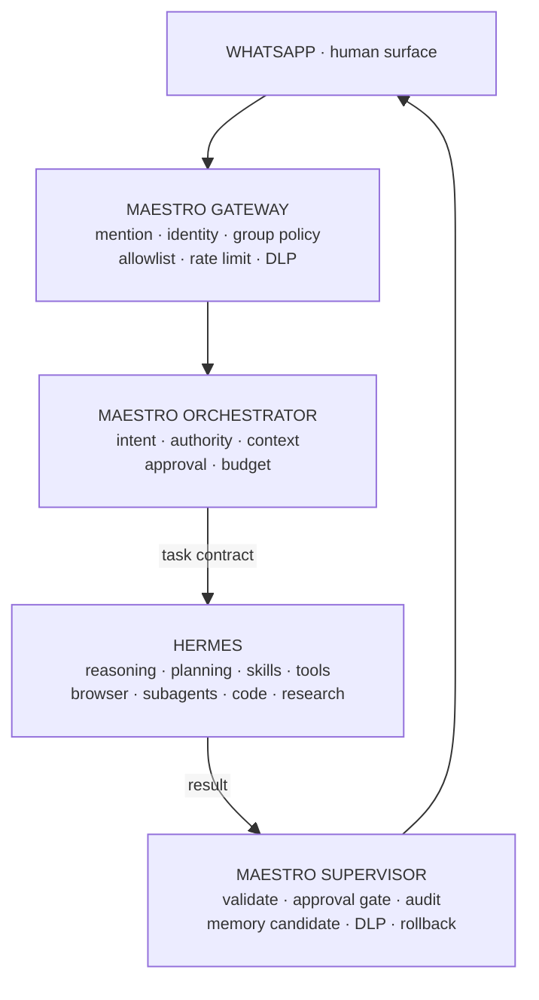

<table width="100%">
<tr>
<td width="34%" align="center" valign="top">


<br />
<b>dr. Ferdi Iskandar</b><br />
Lead Architect
<br />
<a href="https://ferdiiskandar.com">
  
</a>
<br />


</td>
<td width="66%" valign="top">

### [`AVERY EXECUTIVE`](https://sentrahai.com/)

<a href="https://ferdiiskandar.com">
  
</a>

<b>Operational signal:</b> Kediri, Indonesia · UTC+7 · executive agent under active construction

<a href="https://sentrahai.com/"><b>Sentra Artificial Intelligence</b></a><br />
One agent. One channel. One governing boundary: <b>human authority</b>.

<sub><code>MESSAGE → GATEWAY → ORCHESTRATOR → HERMES → SUPERVISOR → ACTION</code></sub>

</td>
</tr>
</table>

---

### `01 / ORIGIN SIGNAL`

**Avery** is the executive agent of [Sentra Artificial Intelligence](https://sentrahai.com/). She operates where the Founding Core actually works — inside WhatsApp — and her purpose is not to sound intelligent. It is to produce verified real-world outcomes.

This repository holds what determines *how* Avery behaves and *where* she runs: persona, skills, deployment surface, and the operational scripts that keep her alive. The runtime itself — Hermes Agent and Hermes Studio — is installed separately and never lives here.

The distinction matters. Adding a new agent should be a configuration change, not a reinstallation. Moving from a laptop to a VPS should be `git pull` and `docker compose up`, not a migration project.

---

### `02 / DOCTRINE`

> [!IMPORTANT]
> **An agent is successful only when it produces verified outcomes.** Not when it sounds intelligent, friendly, or human.

<table>
<tr>
<td width="50%" valign="top">

<b><code>LIMITS ARE A STARTING POINT</code></b>

Never "I can't." Diagnose the cause, find the indirect route, test it for real, then report what was tried. A missing tool is not a missing capability — the send engine behind `send_message` is reachable through the scheduler even though the tool itself is not agent-callable.

</td>
<td width="50%" valign="top">

<b><code>WORK THAT LEAVES NO TRACE DID NOT HAPPEN</code></b>

Multi-step work opens a kanban task, records events, closes with a real result, and is read back before it is reported. What gets reported is what was read back — not what was sent.

</td>
</tr>
<tr>
<td width="50%" valign="top">

<b><code>THE HUMAN HOLDS THE KEY</code></b>

Memory and skill writes queue for Chief's approval. Outbound messages reach only contacts Chief named. Anything touching family, clients, or partners is drafted and shown before it is sent.

</td>
<td width="50%" valign="top">

<b><code>SILENCE IS A VALID ANSWER</code></b>

In groups Avery reads every message but answers only what needs her. Greetings, acknowledgements, and conversations between humans are met with `NO_REPLY` — the gateway holds it and nothing is sent.

</td>
</tr>
</table>

---

### `03 / SYSTEM CONSTELLATION`

<p align="center">
  
  
  
  
  
</p>

<details open>
<summary><b><code>TARGET TOPOLOGY // MAESTRO CONTROL PLANE</code></b></summary>



</details>

Four layers, four separate responsibilities: **who may speak**, **how far they may go**, **the work itself**, and **whether the result may leave**.

Today all four are fused inside a single Hermes process, so there is no one place to hold, judge, or reverse an action. Full state of each layer — present, partial, absent — with build order and pass criteria: [`docs/maestro-architecture.md`](docs/maestro-architecture.md).

---

### `04 / THE ENGINE ROOM`

| Layer | Component | State |
|---|---|---|
| Runtime | Hermes Agent 0.20.4 · Hermes Studio 0.6.46 | installed outside this repository |
| Model | `google/gemini-2.5-flash` via OpenRouter | free-tier SKUs proven unusable — shared-pool 429 |
| Transport | Baileys bridge · bot mode · separate number | five groups + one DM |
| Task store | Kanban on SQLite | run-ID audit trail, proven end to end |
| Scheduler | Hermes cron | new-member watch, every 2h |
| Knowledge | 107 skills · Kediri Raya pack | 24 verified records with sources |

<details>
<summary><b><code>REPOSITORY LAYOUT</code></b></summary>

| Path | Contents |
|---|---|
| `ai/profiles/avery/` | `SOUL.md` (persona), skills, example configuration |
| `deploy/` | `Dockerfile`, `docker-compose.yml`, `.env.example` |
| `scripts/` | restart, group audit, junction repair, profile sync |
| `docs/` | architecture, operations, governance, incident history |
| `runtime/` | the real Hermes installation — **never tracked** |

</details>

---

### `05 / SIGNAL PATH`

```
message → mention gate → sender authorisation → relevance judgement
        → agent turn → secret redaction → reply
```

Two independent gates decide whether a message is even seen. **Intake** (`_should_process_message`) filters by group and by whether Avery was called. **Authorisation** (`_is_user_authorized`) filters by sender. A message must clear both.

Registered work groups flow freely. Every other group requires her name.

---

### `06 / BUILD PROTOCOL`

Hermes reads everything from one directory, `HERMES_HOME`:

- Windows — `%LOCALAPPDATA%\hermes` (junction to `%USERPROFILE%\.hermes`)
- Linux / container — `~/.hermes`

<details>
<summary><b><code>PROVISIONING A PROFILE</code></b></summary>

1. Copy `ai/profiles/avery/SOUL.md` and `ai/profiles/avery/skills/` into `<HERMES_HOME>/profiles/avery/`.
2. Copy `ai/profiles/avery/config.example.yaml` to `config.yaml` there and fill every `<...>` marker.
3. Copy `deploy/.env.example` to `.env` and fill the keys.
4. Start the gateway.

WhatsApp pairing needs one QR scan on the target machine. The resulting session stays in `<HERMES_HOME>` and never enters this repository.

</details>

<details>
<summary><b><code>DAILY OPERATIONS</code></b></summary>

| Script | Purpose |
|---|---|
| `restart-gateway.bat` / `.sh` | the only correct restart — stop, kill orphaned bridges, wait for `connected` |
| `check-unregistered-groups.ps1` | names groups the session knows but the config does not |
| `verify-runtime-junctions.ps1 -Fix` | repairs junctions after a Hermes Studio update |
| `sync-profile-to-repo.ps1` | copies skills and persona out of the runtime, refusing credentials and personal data |

> [!WARNING]
> A gateway does **not** respawn a bridge that dies under it. If the bridge falls over, Avery goes silent with no warning and the only recovery is a gateway restart. Use the restart script — never `gateway run --replace`, which orphans a bridge holding port 3000 every single time.

</details>

---

### `07 / THE SENTRA OPERATING STANDARD`

> [!CAUTION]
> Three configuration traps fail **silently** — no error, no log line, no reply. All three have bitten this system already.

<table>
<tr><td width="30%" valign="top"><b><code>PRECEDENCE</code></b></td><td valign="top">

The top-level `whatsapp:` block **overrides** `gateway.platforms.whatsapp.extra` for every bridgeable key. `group_allowed_chats` and `free_response_chats` are the exceptions — they work only inside `extra`.

</td></tr>
<tr><td valign="top"><b><code>REGEX QUOTING</code></b></td><td valign="top">

`mention_patterns` must be single-quoted YAML. In double quotes the backslash is escaped twice and the pattern never matches anything at all.

</td></tr>
<tr><td valign="top"><b><code>POLICY VALUES</code></b></td><td valign="top">

An unrecognised `group_policy` — including the template's own `none` — falls through to reject-everything. Group messages vanish without a single log line.

</td></tr>
</table>

Full incident account, root cause, and verification: [`docs/whatsapp-group-fix.md`](docs/whatsapp-group-fix.md).

---

### `08 / DATA BOUNDARY`

> [!IMPORTANT]
> Configuration is versioned. State is not. That line is not negotiable.

**Never enters this repository:** `auth.json` and any model-provider credential · the WhatsApp session directory, where `creds.json` is equivalent to the number itself · filled `.env` files · `state.db`, `kanban.db`, and every runtime database · `memories/`, which holds notes about real people · the installed Hermes Studio binary.

**Belongs here:** persona, skills, example configuration without real values, deploy files, operational scripts.

`scripts/sync-profile-to-repo.ps1` enforces this mechanically — refusing by filename, by directory, and by scanning content for phone numbers, WhatsApp JIDs, and API-key patterns. A file that trips the scanner is held back and named, never copied quietly.

---

### `09 / STATE OF PLAY`

<p align="center">
  
  
  
  
</p>

Avery today is a **conversational agent**. She answers well, judges relevance, carries local knowledge, and stays quiet where she is not wanted. She is not yet an **executive agent** — no real multi-step work has run end to end through her.

The foundation for that landed 2026-08-23: the task store is proven, the run-ID audit trail is proven, the scheduler runs. What is missing is the control plane above it.

Evidence-based inventory of every claimed capability: [`docs/gate-0-reality-audit.md`](docs/gate-0-reality-audit.md).

---

### `10 / OPEN CHANNEL`

<p>
  <a href="https://github.com/drferdii" title="GitHub"></a>&nbsp;&nbsp;
  <a href="https://ferdiiskandar.com" title="ferdiiskandar.com"></a>&nbsp;&nbsp;
  <a href="https://sentrahai.com/" title="Sentra Artificial Intelligence"></a>&nbsp;&nbsp;
  <a href="https://orcid.org/0009-0003-3788-1307" title="ORCID"></a>
</p>

<sub><code>Sentra Artificial Intelligence · Kediri, Indonesia · human authority is the boundary</code></sub>
