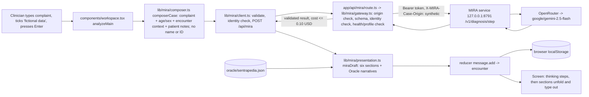

# Sentrapedia — Architecture

> Runtime snapshot superseded on 2026-10-10: MIRA is now bundled and installed
> with Sentrapedia. External MIRA repository, fixed service ports, manual token
> setup and old launcher descriptions below are historical. Current contract:
> [MIRA integration](mira-integration.md), `project.contract.json`, and
> `docs/plans/completed/2026-10-10-integrated-mira.md`. UI observations below are retained.

Date: 2026-10-09 · Commit examined: `0fa198eed9eb25a36952140bfb25aeb0f3f21203` (`0fa198ee`, "clinical workspace with MIRA diagnosis, chat flow and per-case therapy")

## How to read this document

Every section or claim carries a marker:

- **Verified** — I read the code or config file named next to it.
- **Inferred** — my conclusion from reading, with the reasoning. It may be wrong.
- **From docs** — taken from the capsule's own README, CONTEXT.md or HANDOFF, not checked against code.

Nothing was built, tested or run while writing this. Commands below are "listed in package.json, not run".

Short glossary:

| Term | Meaning |
| --- | --- |
| Capsule | A self-contained project folder inside the monorepo, with its own dependencies and config. |
| Next.js | The web framework. It serves the pages and the small server-side API. |
| API route | A server-side web address the page calls, here `/api/mira`. |
| MIRA | A separate diagnosis service (Python) that calls an AI model and returns a structured differential diagnosis. |
| OpenRouter | A paid gateway that MIRA uses to reach the AI model (`google/gemini-2.5-flash`). |
| Oracle | A local file of 144 disease records (definition, symptoms, diagnosis criteria, therapy, referral). |
| localStorage | The browser's own storage on the user's computer. No server database is involved. |
| Encounter | One visit or conversation, which holds messages (questions and drafts). |
| Draft | An assistant message. It has a review status: Draf, Ditinjau (reviewed), Final. |

---

## 1. What this product is

**Verified + From docs.** Sentrapedia is a clinical workspace web app with an Indonesian interface (`app/layout.tsx` sets `lang="id"`). A clinician types a complaint or question. For the two built-in modes "Tanya" (question) and "Diagnosis Banding" (differential diagnosis), the app sends a fictional, identity-free case to a separate local MIRA service and shows the answer in six sections: symptom summary, differential diagnosis, diagnosis, supporting tests, drug therapy and education (`lib/mira/presentation.ts`). Twelve other document modes (clinic note, referral, handoff and so on) are built locally from templates without AI (`lib/drafts.ts`). Patients, encounters and drafts are stored only in the browser (`components/workspace.tsx`, key `sentrapedia-workspace-v1` in `lib/workspace.ts`). The README and `capsule.json` state it is for fictional data only and is not a validated clinical tool.

---

## 2. Overall architecture and entry points

### 2.1 Building blocks

| Block | What it is | Where | Marker |
| --- | --- | --- | --- |
| Web page | One page; the whole app is a single client-side React component | `app/page.tsx` → `components/workspace.tsx` | **Verified** |
| Layout and loading screen | HTML shell, page title, pixel loader | `app/layout.tsx`, `app/loading.tsx` | **Verified** |
| API route | `GET /api/mira` = health check; `POST /api/mira` = run one analysis | `app/api/mira/route.ts` (8 lines) → `lib/mira/gateway.ts` | **Verified** |
| Browser-side libraries | State, drafting, workflow, typing animation, presentation | `lib/*.ts`, `lib/mira/*.ts` | **Verified** |
| Disease database | `oracle/sentrapedia.json`, loaded at build time | `lib/oracle.ts` | **Verified** |
| External MIRA service | Python service, separate repo, not part of this capsule | Launched by `scripts/run-mira-deepseek.ps1` from `D:/DEV/gafferverse/mira-system` | **Verified** (script) |
| AI model | `google/gemini-2.5-flash` via OpenRouter, called by MIRA, never by this app | `lib/mira/model-profile.ts`, launcher | **Verified** |

### 2.2 Entry points

| Entry point | Purpose | Marker |
| --- | --- | --- |
| `npm run dev` | Development server on `127.0.0.1:3101` | **Verified** `package.json` |
| `npm start` | Production server on `127.0.0.1:3101` (after `npm run build`) | **Verified** `package.json` |
| `Dockerfile` | Container image; standalone server on port 3000, `HOSTNAME=0.0.0.0` | **Verified** |
| `scripts/run-mira-deepseek.ps1` | PowerShell launcher for the MIRA service on port 8791. Despite the name it configures Gemini Flash. It writes `MIRA_SERVICE_URL` and `MIRA_SERVICE_TOKEN` into this capsule's `.env.local` | **Verified** |
| `scripts/run-mira-free.ps1` | Older launcher for a free model profile; historical | **Verified** file; "historical" is **From docs** |
| `scripts/deploy-dry-run.mjs` | Checks build output exists and that no file traced into the build lives outside the capsule. Deploys nothing | **Verified** |

### 2.3 Relation to the monorepo

- **Verified.** No monorepo shared packages are used. `package.json` has only registry dependencies (`next`, `react`, `react-dom`, `lucide-react`), and `.npmrc` sets `workspaces=false`. `capsule.json` lists `rootDependencies: []`.
- **Verified.** The design tokens are a local copy (`app/sentra-tokens.css`), per README.
- **Verified.** The MIRA contract files (`lib/mira/request.schema.json`, `response.schema.json`, `types.ts`, `validate-json.ts`) were copied from Med Assist; `lib/mira/SOURCE.md` records the copy and SHA-256 hashes. There is no runtime import from Med Assist.
- **Verified.** No code references the sibling `projects/healthcare/sentrapedia-site` (a grep of `app`, `components`, `lib`, `tests` found nothing). It is untracked in git per the session's git status.
- **Inferred.** The capsule is self-contained for the UI and local templates. The diagnosis feature is not: it needs the MIRA service, which lives outside the monorepo, plus an OpenRouter key and credit.
- **Verified.** The capsule `AGENTS.md` contains only an auto-generated Next.js notice. Real policy is in the monorepo root `AGENTS.md`.

---

## 3. How data flows

### 3.1 Diagnosis question (Tanya / Diagnosis Banding)

Step by step (all **Verified** unless marked):

1. **User action.** The clinician types in the composer, ticks the fictional-data checkbox and presses Enter. Without the tick the app shows an error and sends nothing (`components/workspace.tsx`, `analyzeMain`).
2. **Routing.** Only built-in "question" and "ddx" modes go to MIRA; personal templates and other modes stay local (`composerUsesMira` in `lib/mira/composer.ts`).
3. **Case building.** `composerCase` puts the complaint, a numeric age (if valid, ≤130), sex, the encounter context and the patient's notes into a case. Patient name and ID are not copied (`lib/mira/composer.ts`).
4. **Browser checks.** `requestMiraAnalysis` refuses unconfirmed, schema-invalid or identity-looking input, then POSTs to `/api/mira` (`lib/mira/client.ts`). Identity detection is a regex for long numbers, phone numbers, emails, "nama:", "NIK:", "Tn./Ny." and similar (`containsIdentity` in `lib/mira/contract.ts`).
5. **While waiting.** The screen shows the question bubble and eight "thinking steps" that change every 340 ms (`lib/typing.ts`, `components/thinking-card.tsx`). **Inferred + From docs:** these are timed animation, not real processing stages (HANDOFF says so).
6. **Server gateway** (`lib/mira/gateway.ts`):
   - accepts the request only from a loopback address with a matching `Origin` header (else 403);
   - limits the body to 32 KB, re-checks the schema and identity patterns;
   - refuses if URL or token is not configured (503), or another analysis is already running (429);
   - checks MIRA's `/healthz` version string: it must name OpenRouter, `synthetic-only`, and the pinned model for both stages; else it refuses before sending the case;
   - POSTs to MIRA with a bearer token and a 135-second timeout (`route.ts`);
   - rejects the answer if it fails the response schema, has the wrong model, or a missing or over-budget cost (> US$0.10);
   - maps MIRA error codes (TIMEOUT, BUDGET_EXHAUSTED, PROVIDER_POLICY …) to fixed Indonesian messages. Raw provider messages are never forwarded.
7. **Presentation.** `miraDraft` builds the six-section text. It looks up Oracle records whose ICD-10 code (or code range) covers the returned diagnoses and adds their definition, symptoms, criteria, therapy and referral text. If MIRA returned a per-case `therapy` block, that is shown first under "Terapi Farmakologi" and the Oracle therapy moves to a reference area (`lib/mira/presentation.ts`).
8. **Saving.** The question and draft are added to the current encounter. The draft keeps the full case, result, trace ID, time and Oracle hash as JSON in `sourceText`, with review status "draft" and an unchecked checklist (`miraMessage`). The whole workspace is written to localStorage on every change (`components/workspace.tsx`, `saveLocalWorkspace` in `lib/workflow.ts`).
9. **Failure or cancel.** Nothing is saved; the question goes back into the input box (`cancelAnalysis` in `components/workspace.tsx`).
10. **Re-display.** Untouched older MIRA drafts are re-rendered in the current six-section format from their saved source; edited drafts are shown as written (`diagnosisContent`).

### 3.2 Other flows

| Flow | Path | Marker |
| --- | --- | --- |
| Local document modes (12 modes + personal templates) | `lib/drafts.ts`, `lib/note-structure.ts`, `lib/workflow.ts`; no network | **Verified** (no fetch calls outside `client.ts` and `mira-case-form.tsx`) |
| Disease reference search ("Referensi penyakit") | `components/knowledge-dialog.tsx` → `lib/oracle.ts` `searchDiseases`; no network | **Verified** |
| Structured case form inside Referensi | `components/mira-case-form.tsx` calls `/api/mira` itself (its own `fetch`, not `client.ts`) | **Verified** |
| Speech dictation | Browser `SpeechRecognition` API in `components/scribe.tsx`; the browser vendor may process audio | **Verified** code; vendor behaviour **From docs** |
| Backup / clear | Export JSON or clear all from the account dialog | **From docs** |

### 3.3 Where data lives

| Data | Location | Marker |
| --- | --- | --- |
| Patients, lists, encounters, drafts, settings, templates | Browser localStorage, key `sentrapedia-workspace-v1`, unencrypted | **Verified** `lib/workspace.ts` |
| Disease reference | `oracle/sentrapedia.json` (bundled into the app) | **Verified** `lib/oracle.ts` |
| Server secrets | `.env.local` (git-ignored) — `MIRA_SERVICE_URL`, `MIRA_SERVICE_TOKEN`, `OPENROUTER_API_KEY` | **Verified** key names only |
| MIRA logs and cost audit | `.runtime/mira-deepseek/` (git-ignored) | **Verified** launcher |
| Verification evidence | `docs/verification/*` (JSON, screenshots) | **Verified** file list |

---

## 4. Build, test and run

All commands are **listed in package.json / capsule.json, not run** for this document. Run them from the capsule folder in PowerShell.

| Command | What it does | Marker |
| --- | --- | --- |
| `npm ci --workspaces=false` | Install exact dependencies from `package-lock.json`, ignoring the monorepo | **Verified** `capsule.json` |
| `npm run dev` | Development server, http://127.0.0.1:3101 | **Verified** |
| `npm run build` | Production build into `.next/standalone` and `.next/static` | **Verified** (`next.config.ts` `output: "standalone"`) |
| `npm start` | Serve the production build on 127.0.0.1:3101 | **Verified** |
| `npm run typecheck` | `tsc --noEmit` | **Verified** |
| `npm run lint` | ESLint on `app components lib tests` only (not `scripts/`, `oracle/`) | **Verified** |
| `npm test` | `vitest run` on all tests; no `vitest.config.*` exists, so defaults apply | **Verified** |
| `npm test -- tests/workspace.test.ts` | One test file | **Verified** (README) |
| `npm run deploy:dry-run` | Checks build output and dependency traces; needs a prior build | **Verified** `scripts/deploy-dry-run.mjs` |
| `./scripts/run-mira-deepseek.ps1 -MiraRoot D:/DEV/gafferverse/mira-system -ValidateOnly` | Checks OpenRouter catalogue/price and the installed MIRA runtime; no launch, no writes | **Verified** script |
| `./scripts/run-mira-deepseek.ps1 -MiraRoot D:/DEV/gafferverse/mira-system` | Starts MIRA on 8791 and rewrites `.env.local` URL/token; restart Sentrapedia afterwards | **Verified** script |

**Note — Verified.** `node_modules/.bin` in the main checkout currently has no `next`, `vitest`, `tsc` or `eslint`. CONTEXT.md and HANDOFF say verification was done in a separate copy under `C:/Users/drfer/AppData/Local/Temp/...`.

### Environment variables (names only)

| Name | Read by | Purpose | Marker |
| --- | --- | --- | --- |
| `MIRA_SERVICE_URL` | `app/api/mira/route.ts` | MIRA address; default `http://127.0.0.1:8787`; only loopback `http://` accepted | **Verified** |
| `MIRA_SERVICE_TOKEN` | `app/api/mira/route.ts` | Bearer token for MIRA; server-side only | **Verified** |
| `OPENROUTER_API_KEY` | Launcher scripts only, never the Next.js app | Passed to the MIRA process | **Verified** |
| `PORT`, `HOSTNAME`, `NODE_ENV`, `NEXT_TELEMETRY_DISABLED` | Docker image | Container runtime | **Verified** `Dockerfile` |
| `MIRA_*` (e.g. `MIRA_PLAN_MODEL`, `MIRA_STEP_DEADLINE_S`, `MIRA_DAILY_BUDGET_USD`, `MIRA_OPENROUTER_ZDR`, `MIRA_FAST_THERAPY`, `MIRA_DEV_TOKEN`) | The MIRA service, set by the launcher | Model, budget, speed and privacy settings | **Verified** `config/mira-deepseek.env.example` |

**Verified.** The two `process.env` reads happen once when the route module loads, so a restart is needed after changing them. `capsule.json` declares `requiredEnvironment: []`: the UI runs without any of them; only analysis fails (503 NOT_CONFIGURED).

---

## 5. Top 5 files to understand first

| # | File | Why | Marker |
| --- | --- | --- | --- |
| 1 | `components/workspace.tsx` | The whole app's coordinator: state, localStorage load/save, dialogs, shortcuts, and the main analyse/cancel flow. | **Verified** |
| 2 | `lib/mira/gateway.ts` | The only server-side code. All safety gates for the AI path: origin, input limits, identity check, model pinning, cost limit, timeout, single active request, safe error messages. | **Verified** |
| 3 | `lib/mira/presentation.ts` | Turns the AI result plus the disease database into the six-section answer the clinician reads. Clinical wording and what is shown or hidden live here. | **Verified** |
| 4 | `lib/workspace.ts` | Data model (Patient, Encounter, Message, Settings), the reducer that changes it, and validation when loading from the browser. | **Verified** |
| 5 | `lib/mira/contract.ts` | Defines the case and result shape, JSON-schema validation, the identity regex and the optional `therapy` block. | **Verified** |

Useful next: `lib/mira/model-profile.ts` (pinned model), `lib/oracle.ts`, `lib/workflow.ts` (review checklist, revisions), `components/diagnosis-document.tsx`, `scripts/run-mira-deepseek.ps1`.

---

## 6. Conventions observed

| Area | Convention | Marker |
| --- | --- | --- |
| Folders | `app/` routes, `components/` React UI (kebab-case files), `lib/` pure logic, `lib/mira/` AI adapter, `oracle/` data, `tests/` flat Vitest files, `docs/plans|specs|verification` | **Verified** |
| Language | Identifiers and comments in English; all user-facing text in Indonesian with English medical terms | **Verified** |
| Code style | Very dense: many statements per line, long one-line functions | **Verified** |
| State | One `useReducer` with typed action names like `"message.add"`; logic kept in pure `lib` functions | **Verified** |
| Error handling | Gateway returns `{ error: { code, message } }` with fixed safe messages; `try/catch` falls back to safe defaults; failed browser writes show a persistent warning | **Verified** |
| Imports | Relative paths (`../lib/...`) although `@/*` alias exists in `tsconfig.json` | **Verified** |
| Tests | Vitest, pure functions and the gateway with fake `fetch`; descriptive sentence names; no component/DOM tests in the repo | **Verified** |
| Contract pinning | Schema SHA-256 hashes recorded in `lib/mira/SOURCE.md` and pinned in `tests/oracle-mira.test.ts` | **Verified** |
| Commits | `type(sentrapedia): description (R-tier)`, e.g. `feat(...) ... (R3)`; git author "Codex" | **Verified** `git log` |
| Documentation | Dated plans, specs and verification reports; long running notes in `CONTEXT.md` and `.agents/HANDOFF.md` (mostly Indonesian in later entries) | **Verified** |

---

## 7. Fragile, undocumented or surprising

### 7.1 Clinical safety

- **Thinking steps describe work that does not happen. Verified + Inferred.** `lib/typing.ts` shows "Literatur dan pedoman klinis ditelusuri" (literature and guidelines searched) and "Bukti ilmiah sedang disintesis" on a timer. No literature search exists in this code. A clinician may over-trust the answer.
- **Visible disclaimers were removed. From docs + Verified.** CONTEXT.md (09:20 entry) says review disclaimers were dropped from visible text; the tests "answers directly, without disclaimers" in `tests/diagnosis-presentation.test.ts` enforce this. The "belum ditinjau" marker survives only inside the hidden `sourceText`.
- **AI drug regimens. Verified.** If MIRA returns `therapy`, the drug, dose, route, DDI and contraindications are shown as the first therapy content (`presentation.ts`). HANDOFF states accuracy is not validated, and that for complaint-only appendicitis the model often returned no regimen.
- **Supporting tests nearly always "Perlu". From docs.** HANDOFF notes MIRA now always proposes a confirming test, even for headache without red flags.
- **Privacy setting relaxed. Verified.** The launcher sets `MIRA_OPENROUTER_ZDR=false` (no zero-data-retention filter) by Chief's request, per README. Identity detection is a regex, not certified anonymisation.
- **Silent data reset. Inferred.** `restoreWorkspace` returns the demo seed if any stored record fails validation; the save effect then writes state back to localStorage. A single malformed record could replace the user's local data with the seed. Not tested by me.

### 7.2 Documentation drift

- **Verified.** README says the adapter "requires the approved pinned DeepSeek Flash model"; the code pins `google/gemini-2.5-flash` (`lib/mira/model-profile.ts`).
- **Verified.** README says US$1 daily budget, two-call limit and 120-second deadline. The launcher sets `MIRA_DAILY_BUDGET_USD=5` and `MIRA_STEP_DEADLINE_S=20`; HANDOFF mentions `max_calls` 9.
- **Verified.** File names `run-mira-deepseek.ps1`, `mira-deepseek.env.example`, `.runtime/mira-deepseek` all configure Gemini (README explains this is kept for budget history).
- **Verified.** `capsule.json` lifecycle `test` lists 8 files; `tests/diagnosis-presentation.test.ts` is missing, so a capsule-contract test run skips the six-section tests.

### 7.3 Deployment and environment

- **Docker image cannot run analysis. Inferred.** `gateway.ts` rejects any request whose host is not loopback and only accepts a loopback MIRA URL. The Docker image listens on `0.0.0.0:3000`, and `127.0.0.1` inside a container is not the host. So the container would serve the UI but `/api/mira` would fail. This matches README ("must not be published"), but the Docker target is effectively UI-only.
- **No authentication on `/api/mira`. Verified.** Protection is loopback + origin check only.
- **Single-request lock is per process. Verified.** `let active` in `createMiraGateway` lives in module memory; it resets on dev hot-reload and is not shared across processes.
- **Hard-coded values. Verified.** Ports 3101 (`package.json`), 8787 default (`gateway.ts`), 8791 (launcher), 3000 (Docker); 135 s timeout (`route.ts`); US$0.10 budget and model name (`model-profile.ts`, not env-driven); `Asia/Jakarta` in `newEncounter`; MIRA path `D:/DEV/gafferverse/mira-system` in docs; OpenRouter price thresholds in the launcher.
- **Launcher writes secrets. Verified.** `run-mira-deepseek.ps1` rewrites `.env.local` with the generated token.
- **Windows-only launcher. Verified.** PowerShell with `Get-NetTCPConnection` and a Windows venv path (`src/.venv/Scripts/python.exe`).

### 7.4 Coupling to other projects

- **Verified.** The MIRA service is in a separate repo outside the monorepo. The `therapy` block in `lib/mira/response.schema.json` is a Sentrapedia-only extension; HANDOFF says Med Assist has not adopted it, and a MIRA test comparing contracts with Med Assist will report a difference.
- **Inferred.** Any change to MIRA's version string format (`+plan=…+assess=…`) or schema will make the gateway refuse every analysis, because both are checked strictly.

### 7.5 Dead or legacy code

- **Verified.** `lib/mira/free-profile.ts` is only used when `freeModel` is passed; `route.ts` never passes it. Together with `tests/mira-free.test.ts`, `scripts/run-mira-free.ps1` and `config/mira-free.env.example` it is historical.
- **Verified.** `oracle/data.ts`, `oracle/diseases-data.ts` (3,369 lines) and `oracle/diseases.json` are not imported by `app`, `components`, `lib` or `tests`. Only `oracle/sentrapedia.json` is used. `oracle/data.ts` is still type-checked (tsconfig includes `**/*.ts`).
- **Verified.** `components/mira-case-form.tsx` duplicates the request logic of `lib/mira/client.ts`.
- **Verified.** No `TODO`/`FIXME` markers in `app`, `components`, `lib`, `tests`, `scripts`.

### 7.6 Test gaps

- **Verified.** No tests for React components, `components/workspace.tsx` flows, localStorage persistence in the browser, or the launcher scripts. Browser E2E evidence exists only as JSON/screenshots in `docs/verification/`; the Playwright script is not in this capsule.

---

## Open questions

1. Test count: I count 91 `it(...)` blocks across 9 files; CONTEXT.md and HANDOFF report 104 passing tests. Where do the other 13 come from (another copy, or an older/newer tree)?
2. Which MIRA limits are authoritative today: README (US$1/day, 120 s, two calls) or the launcher (US$5/day, 20 s step deadline, `max_calls` 9 per HANDOFF)?
3. Is the Docker image meant to be used at all, given the loopback-only gateway?
4. Should the timed "thinking steps" wording be kept, given they do not reflect real processing?
5. Are `oracle/data.ts`, `oracle/diseases-data.ts`, `oracle/diseases.json` and the free-profile files meant to be kept or removed?
6. Where does the Playwright E2E script used for `docs/verification/*-e2e.json` live, and should it move into the capsule?
7. Who owns MIRA schema changes (the `therapy` extension) between Sentrapedia, MIRA and Med Assist?
