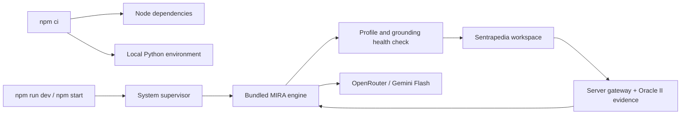

# MIRA inside Sentrapedia

Current runtime contract, 2026-10-10: MIRA is installed and launched as part of
Sentrapedia. The previous external-repository setup is superseded.

Host prerequisites: Node24+, Python3.11+. Docker includes both. Install once with
`npm ci --workspaces=false`; set `OPENROUTER_API_KEY` in the environment or capsule
`.env.local`; run `npm run dev`. For an optimized local build use `npm run build`
then `npm start`. Default workspace: http://127.0.0.1:3101. `PORT` and
`SENTRAPEDIA_HOST` override the local web listener.

`mira/service` owns model calls, contract checks, privacy checks, budget/audit and
postchecks; `mira/common` owns provider/data policy and call guards.
`scripts/install-mira.mjs` owns the capsule-local environment and pinned package
installation. `scripts/run-system.mjs` owns startup, ephemeral loopback port,
per-run token, readiness and shutdown. Windows child guardians use Job Objects
and parent monitoring; POSIX cleanup handles INT/TERM/HUP process groups.
`scripts/build-system.mjs` stages engine, launcher and static assets into the
standalone output. `src/lib/oracle-grounding.ts` owns readonly Oracle II retrieval.

The internal engine is a Python process managed by the application lifecycle.
No external `MiraRoot`, source checkout, shared service, manually supplied service
token, or another project's environment is used. Old `.env.local` service URL/token
values are overridden in memory. The provider is still an external model API.
Startup reads public model/endpoint metadata to preserve the original price and
structured-output gates (input <=USD0.50/M tokens, output <=USD2.50/M tokens).
Metadata requests carry no key or case data. No paid inference occurs during
install/startup/health checks. Unavailable metadata fails startup without a retry.

Source license and hashes are in `mira/LICENSE` and `mira/SOURCE.json`. The exact
routine prompt and planning schema snapshots avoid importing research FHIR/ML
dependencies; regression tests verify their original text hashes. Runtime engine,
prompts, privacy, postchecks and contracts retain approved source bytes. The
simulation runner is retained only as attributed text for policy regression tests,
not offered as a runtime feature.

Build output can run with `node scripts/run-system.mjs standalone` after installing
its Python lock using `node scripts/install-mira.mjs --production`. Docker performs
this installation and uses the same supervisor. Runtime secrets are injected at
launch, never built into the image. Preserve `.runtime/mira-deepseek/audit` when
moving an existing local installation so today's budget ledger is retained.

The application retains its existing synthetic-only development boundary. Local
packaging does not add production authentication or establish clinical accuracy.
Historical inference timings predate this packaging change. See the dated
verification report for fresh install/build/run evidence and remaining limits.
