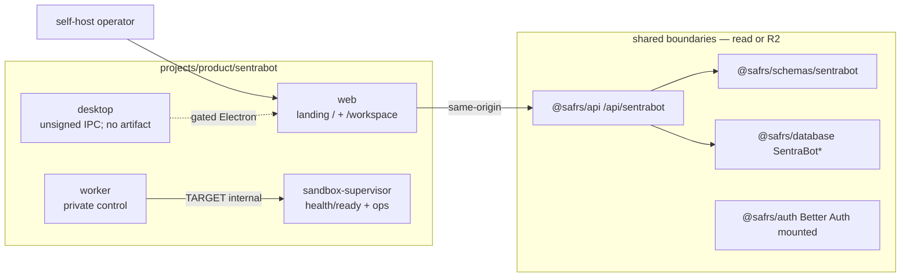

# Sentra Bot — Capsule Agent Router

This file is the machine README for `projects/product/sentrabot/`. Humans start at
[README.md](README.md). Canonical governance remains root
[AGENTS.md](../../../AGENTS.md), [SAFRS_SPEC.md](../../SAFRS_SPEC.md), and
[SECURITY.md](../../SECURITY.md). Do not duplicate or weaken them here.

## Always

- Stay inside `projects/product/sentrabot/**` unless Chief explicitly expands scope.
- Treat this capsule as inner-source: it is not a standalone GitHub repository.
- Keep signup closed, worker/supervisor private, and credentials BYOK.
- Scope every tenant query by both `workspaceId` and `userId`.
- State CURRENT vs TARGET. Do not claim release parity, hosted production,
  public signup, signed desktop, packaged Electron, real Docker daemon tests,
  SBOM generation, OpenSSF badge, or SLSA Level 3.
- Preserve intake pin `d17a138` as blocked. Provisional technical baseline is
  `7f08da5`. Never substitute `HEAD` for the pin.
- Use root toolchain only: pnpm workspace, catalogs, Turbo task names, Biome.
- Link SSOT instead of copying architecture, security, or SAFRS prose.

## Ask First

- Shared-package, Prisma, auth, lockfile, CI, or root-rule edits (R2).
- Opening signup, hosted credentials, or packaging/signing Electron.
- Connecting a Docker socket, privileged executor, or real sandbox image.
- Copying source runtime, `.env`, credentials, or nested source workspace.
- Declaring `d17a138` complete, or treating `7f08da5` as the acceptance pin.
- Production deploy, DNS, signed artifacts, or any R3 execution.

## Never

- Create `projects/product/sentrabot/packages`, a nested lockfile, Turbo, or Biome config.
- Copy `D:/DEV/Sentraverse/sentrabot` files, runtime data, or live Rakazo IDs.
- Mount `/var/run/docker.sock` or expose worker `8787` / supervisor `8788`.
- Return provider credentials from APIs, logs, or UI.
- Weaken tests, token checks, or root SAFRS gates to make a slice pass.
- Invent mobile apps, community Slack, or production URLs.
- Treat `apps/site` as the product origin, or add a new marketing origin.
  Landing CURRENT is `apps/web` `/` (`home.html`).
- Commit unless Chief asks.

## Owned scope

- Project: Sentra Bot. Human owner: **Chief**. Default risk: **R1**.
- Capsule: `projects/product/sentrabot/**` (web, worker, supervisor, desktop, site
  shell, docs, infra, emails, scripts, tests).
- Consumed, not owned: `@safrs/schemas/sentrabot`, `@safrs/api` `/api/sentrabot/*`,
  `@safrs/database` SentraBot models, `@safrs/auth` (Better Auth mounted on web;
  signup default closed).
- ADR SSOT: [docs/adrs/0004-sentrabot-public-release.md](../../docs/adrs/0004-sentrabot-public-release.md).
- Durable notes: [.agents/DECISIONS.md](../../.agents/DECISIONS.md) (do not fork).

## Exact commands

Run from the Monorepo root.

```bash
pnpm --filter @sentra/sentrabot-web lint
pnpm --filter @sentra/sentrabot-web typecheck
pnpm --filter @sentra/sentrabot-web test
pnpm --filter @sentra/sentrabot-web e2e
pnpm --filter @sentra/sentrabot-web build

pnpm --filter @sentra/sentrabot-worker lint
pnpm --filter @sentra/sentrabot-worker typecheck
pnpm --filter @sentra/sentrabot-worker test

pnpm --filter @sentra/sentrabot-sandbox-supervisor lint
pnpm --filter @sentra/sentrabot-sandbox-supervisor typecheck
pnpm --filter @sentra/sentrabot-sandbox-supervisor test

pnpm --filter @sentra/sentrabot-desktop lint
pnpm --filter @sentra/sentrabot-desktop test

node projects/product/sentrabot/scripts/inventory-source.mjs D:/DEV/Sentraverse/sentrabot d17a138

bash scripts/safrs-verify.sh
```

CURRENT: Compose files exist under `infra/compose/` and are contract-tested as
text. Images have not been built or started as a release claim. The inventory
command must fail closed when `d17a138` is missing.

## Capsule topology



## Read by task

| Task | Read |
| --- | --- |
| Any change | [README.md](README.md), this file |
| Docs map | [docs/README.md](docs/README.md) |
| Runtime shape | [docs/architecture.md](docs/architecture.md) |
| Routes | [docs/api.md](docs/api.md) |
| Models | [docs/data.md](docs/data.md) |
| Threats | [docs/threat-model.md](docs/threat-model.md), [docs/security.md](docs/security.md) |
| Tests | [docs/testing.md](docs/testing.md), [docs/release-parity.md](docs/release-parity.md) |
| Intake | [docs/provenance.md](docs/provenance.md), [docs/migration-ledger.md](docs/migration-ledger.md) |
| Operate | [docs/self-host.md](docs/self-host.md), [docs/operations.md](docs/operations.md) |
| Product | [docs/product.md](docs/product.md) |
| UI | out of scope unless Chief assigns; then `packages/token` |

## Tests Turbo does not own

These files exist but have no capsule `package.json`. Do not invent a second
workspace to run them. Record coverage honestly in [docs/testing.md](docs/testing.md):

- `src/personas/catalog.test.ts`, `src/email/*.test.ts`
- `infra/compose/compose.test.mjs`
- `tests/release-parity.test.mjs`

## Risk

Default **R1** inside this capsule. Escalate: auth, credentials, Prisma,
sandbox, Electron, release supply chain, shared APIs → **R2**. Hosted
production, public signup, signed desktop, production credentials → **R3**,
prepare only until Chief authorizes.
