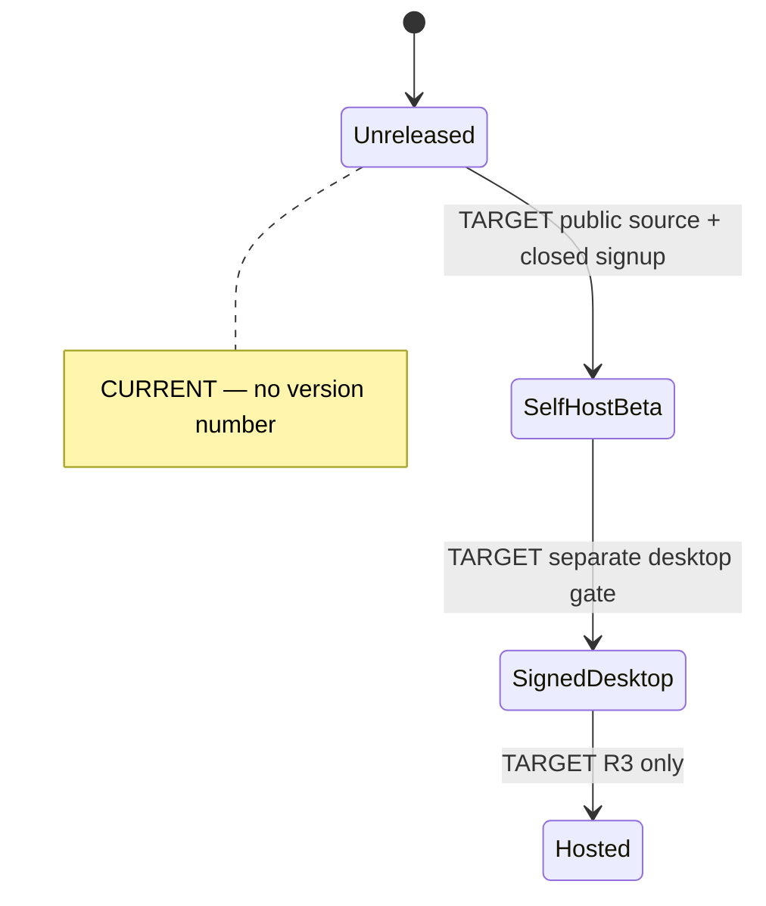

# Changelog

All notable changes to the Sentra Bot **capsule** are recorded here.
Format: [Keep a Changelog 1.1](https://keepachangelog.com/en/1.1.0/).
This project has **no published version**. Do not invent `1.0.0` or git tags.

## [Unreleased]

### Added

- Capsule at `projects/product/sentrabot/` with product apps web, worker,
  sandbox-supervisor, and desktop, plus `apps/site` (Cora Vite shell; not
  the product origin).
- Domain contracts in `@safrs/schemas/sentrabot` and Hono facade
  `/api/sentrabot/*` (shared packages; listed here as product-visible).
- Prisma models and migrations `0003`–`0005` for deployment settings, bots,
  threads, messages, memory, and routines; `0006`–`0007` Better Auth tables
  (shared database package).
- Worker: private control contract, AES-256-GCM credential envelope,
  idempotent execution helper, routine-to-execution mapping, HTTP server.
- Supervisor: health/ready split, timing-safe bearer ops, isolated Docker
  **policy** (no socket), HTTP server.
- Compose contract under `infra/compose/` (internal network, health-gated
  web/worker/postgres, supervisor hardening flags).
- Token-scoped web dashboard (local UI state; not API-wired).
- Persona catalog under `src/personas/` (twelve Indonesian assistants).
- Local-only email template and delivery helpers.
- Apache-2.0 [LICENSE](LICENSE) and Rakazo [NOTICE](NOTICE).
- Documentation scaffold (Diátaxis + capsule community files).

### Changed

- Nothing released. Capsule remains migration-foundation.

### Security

- Signup policy defaults to `closed`.
- Worker and supervisor ports are Compose `expose` only (not published).
- Supervisor rejects traversal-shaped computer IDs and undeclared payload
  fields.

### Known blockers (not removals)

- Source pin `d17a138` unavailable; `7f08da5` is provisional technical baseline
  only. See [docs/provenance.md](docs/provenance.md).
- Signup remains closed. No signed Electron artifact. Docker executor not
  run against a real daemon. Compose images not started as a release claim.
  SBOM/SLSA not generated.

