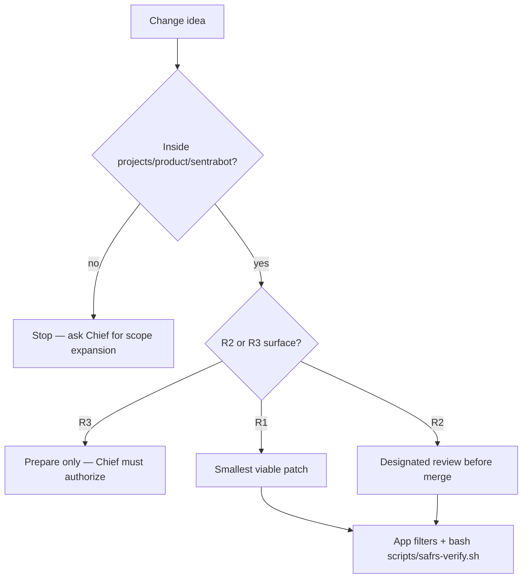

# Contributing to Sentra Bot

This capsule lives inside the Sentra Monorepo. There is no separate GitHub
repository, issue template tree, or project-local CI workflow. Root `.github/**`
and root `.cursor/rules` are **out of scope** for capsule contributors (R2
governance).

## Who this is for

- **Chief** — sole human owner and merger of sensitive work.
- **Agents** — follow [AGENTS.md](AGENTS.md) first; this file is the human
  counterpart.
- **Inner-source readers** — propose capsule-scoped documentation or tests
  without expanding into shared packages.

## Before you change anything

1. Read root [AGENTS.md](../../AGENTS.md) and this capsule [AGENTS.md](AGENTS.md).
2. Classify risk. Capsule-only docs and app-local tests are usually R1.
   Schemas, API, Prisma, auth, lockfile, and CI are R2 and need designated
   review. Hosted production and credential issuance are R3.
3. Do not copy source from `D:/DEV/Sentraverse/sentrabot`. Intake remains
   pinned to `d17a138` (blocked). Technical porting may use `7f08da5` only
   as a **provisional** baseline.



## Machine steps

Agents must use the exact commands in [AGENTS.md](AGENTS.md). Humans use the
same filters from the repository root:

```bash
pnpm --filter @sentra/sentrabot-web lint
pnpm --filter @sentra/sentrabot-web typecheck
pnpm --filter @sentra/sentrabot-web test
pnpm --filter @sentra/sentrabot-web e2e
pnpm --filter @sentra/sentrabot-worker test
pnpm --filter @sentra/sentrabot-sandbox-supervisor test
pnpm --filter @sentra/sentrabot-desktop test
bash scripts/safrs-verify.sh
```

Do not add a nested `pnpm-workspace.yaml`, lockfile, or Biome config here.

## Documentation

Follow Diátaxis: one topic, one file. Index: [docs/README.md](docs/README.md).
Every new human-facing markdown file in this capsule must be English and
include a mermaid diagram that is specific to that file. Link other topics;
do not paste architecture into every README.

## Tests

- App-local Vitest next to the code it covers.
- Cross-app contracts under [tests/](tests/README.md).
- Compose contract tests read YAML; they do **not** prove a running cluster.
- No production credentials, source `.env`, or Docker socket in tests.

## Pull requests and commits

Use the Monorepo root process. Conventional commits with scope `sentrabot`
when the change is capsule-owned. Do not commit secrets. Do not claim the
source pin is complete.

## Conduct and security

- [CODE_OF_CONDUCT.md](CODE_OF_CONDUCT.md)
- Capsule [SECURITY.md](SECURITY.md) and root [SECURITY.md](../../SECURITY.md)
