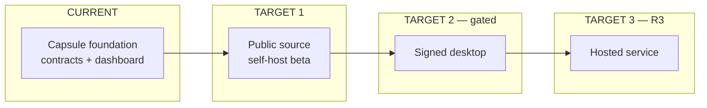

# Sentra Bot

Status: **migration foundation**. Public-source and self-hosted beta preparation
is in progress. This directory is a Monorepo **capsule**, not a standalone GitHub
repository.

| | CURRENT | TARGET |
| --- | --- | --- |
| Intake pin | `d17a138` blocked | Enumerated and dispositioned |
| Technical baseline | `7f08da5` (provisional) | Same baseline until the pin exists |
| Signup | Closed | Closed self-host beta |
| Worker / supervisor | Private contracts + HTTP servers | Private, authenticated, Compose-internal |
| Desktop | Unsigned Electron IPC boundary; no artifact | Signed Electron after a separate gate |
| Hosted production | Not authorized | Later **R3** only |

## Why this capsule exists

Sentra Bot is a bounded personal-agent workspace: bots, threads, memory, and
routines owned by one tenant (`workspaceId` + `userId`), with per-user BYOK
model credentials. The problem this capsule solves is bringing that product
into the official Monorepo **without** grafting source history, copying
runtime state, or duplicating toolchain (no nested lockfile, Turbo, or
`projects/product/sentrabot/packages`).

Product explanation: [docs/overview.md](docs/overview.md).
Architecture: [docs/architecture.md](docs/architecture.md).
Honest run path: [docs/quickstart.md](docs/quickstart.md).

## What is here

- `@sentra/sentrabot-web` — Next.js App Router: marketing `/` (`home.html`),
  product demo `/workspace` (local UI state), same-origin Hono at
  `/api/sentrabot`, Better Auth at `/api/auth/[...all]`.
- `@sentra/sentrabot-worker` — private control API, credential envelope,
  execution/routine contracts, HTTP server on port `8787`.
- `@sentra/sentrabot-sandbox-supervisor` — `/health` vs `/ready`, bearer ops,
  Docker **policy** (no socket), HTTP server on port `8788`.
- `@sentra/sentrabot-desktop` — thin Electron main/preload security boundary;
  packaging and signing remain gated.

Shared contracts live outside the capsule and must not be edited from a
capsule-only task: `@safrs/schemas/sentrabot`, `@safrs/api` `/api/sentrabot/*`,
`@safrs/database` SentraBot models, `@safrs/auth` (Better Auth **enabled**,
signup **closed** by default).

## Non-goals (this migration)

Hosted production, public signup by default, signed desktop publication,
source runtime data, production credentials, a second workspace, and invented
mobile applications. Landing CURRENT is `apps/web` `/`; `apps/site` is a
Cora Vite shell and is not the product origin.

## Release train

Recorded in [ADR 0004](../../docs/adrs/0004-sentrabot-public-release.md) and
[ROADMAP.md](ROADMAP.md):

1. Public source + closed-signup self-hosted beta.
2. Signed desktop beta after backend contract stability (separate gate).
3. Sentra-hosted service only after an authorized **R3** production gate.

## License and attribution

Apache-2.0. Rakazo attribution is retained in [LICENSE](LICENSE) and
[NOTICE](NOTICE) only. Runtime identifiers must not carry live legacy names.
See [docs/provenance.md](docs/provenance.md).

## Commands

From the Monorepo root. Exact filter names and verification:

See [AGENTS.md](AGENTS.md) (machine steps) and [CONTRIBUTING.md](CONTRIBUTING.md)
(human steps). Root gate: `bash scripts/safrs-verify.sh`.

## Documentation map

Start at [docs/README.md](docs/README.md) (Diátaxis). Security disclosure:
[SECURITY.md](SECURITY.md) plus root [SECURITY.md](../../SECURITY.md).
Support: [SUPPORT.md](SUPPORT.md). Owner: **Chief**.
