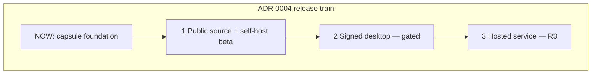

# Roadmap

Source of the release train: [ADR 0004](../../docs/adrs/0004-sentrabot-public-release.md)
(status: Proposed pending designated R2 review). This file does not fork a
second ADR store.

Owner: **Chief**. Dates are not promised. CURRENT is migration foundation.

## 1. Public source and self-hosted beta (TARGET)

**CURRENT:** contracts, migrations (through `0007`), private HTTP servers,
Compose YAML, Better Auth on web with closed signup, dashboard UI, landing
`/`, and documentation exist. Intake pin `d17a138` is blocked.

Required before this stage can be claimed:

- Source tree at `d17a138` enumerated with dispositions
  ([docs/migration-ledger.md](docs/migration-ledger.md)).
- Closed signup remains default.
- Worker and supervisor stay private on the Compose backend network.
- BYOK; no hosted deployment-level model credential.
- Fake-provider smoke journey and backup/restore **gates** documented and
  then implemented (backup/restore is not complete today).
- License + NOTICE retained; no live Rakazo runtime identifiers.

## 2. Signed desktop beta (gated)

**CURRENT:** `@sentra/sentrabot-desktop` has Electron main/preload and IPC
tests. Electron is in the root catalog. No packaged or signed artifact.

TARGET after backend contract stability: thin Electron client with
`contextIsolation`, `sandbox`, `nodeIntegration: false`, preload allowlist,
same-origin navigation, denied popups, and an unsigned local-artifact gate
until signing is separately authorized. See [apps/desktop/README.md](apps/desktop/README.md).

## 3. Sentra-hosted service (R3)

**CURRENT:** not authorized. This migration must not deploy production, change
DNS, or open public signup.

TARGET: a separately authorized hosted offering. Hosted deployment-level
credentials and public signup are **not** enabled by ADR 0004.

## Explicitly not on this train

Nested packages, a second lockfile, copying source `.env`, Docker socket
mounts, OpenSSF badge claims, and SLSA Level 3 claims.
