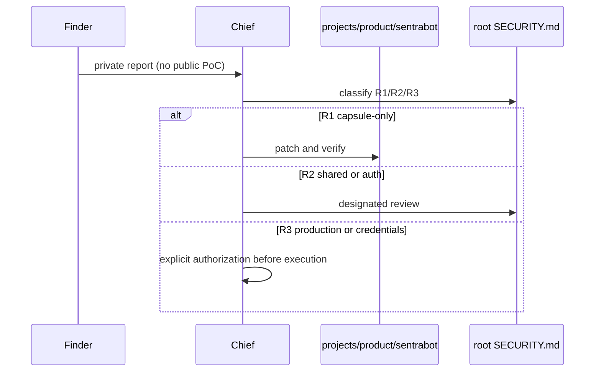

# Sentra Bot Security

Canonical repository policy is root [SECURITY.md](../../SECURITY.md) and
[SAFRS_SPEC.md](../../SAFRS_SPEC.md). This file names **capsule surfaces** and
how to disclose issues. It does not redefine R0–R3, secret handling, or
prompt-injection rules.

## Disclosure

Report findings through the organization's **private** security channel to
**Chief**. Do not file public issues with exploit detail, credentials, or
copy-paste of `.env` files.

CURRENT: there is no project-specific mailing list, bug bounty, or GitHub
private vulnerability reporting configured for this capsule (those would be
root `.github` R2 work). TARGET: keep disclosure private until triage, then
record durable outcomes in root decision logs if the control changes.

## CURRENT surfaces in this capsule

| Surface | What exists | Residual risk |
| --- | --- | --- |
| Public web UI | Marketing `/` (`home.html`); `/workspace` local state | Dashboard not wired to API |
| `/api/sentrabot/*` | Hono facade mounted on web; actor from Better Auth session | Unauthenticated callers still 401; `/deployment` hardcoded |
| Worker `POST /control/computer` | Bearer string equality | Not timing-safe; does not execute computers |
| Supervisor ops | Timing-safe bearer; path allowlist | Docker executor not injected in the HTTP server |
| Credential envelope | AES-256-GCM `v1` helper | No persistence or KMS |
| Compose | Internal network; no `docker.sock`; worker/supervisor `expose` only | Images not run as a release claim |
| Electron | Main/preload IPC tests; Electron in root catalog | No packaged or signed artifact |
| Auth | Better Auth at `/api/auth/[...all]`; signup closed | Public signup and hosted credentials remain gated |

Deep model: [docs/threat-model.md](docs/threat-model.md).
Control intent: [docs/security.md](docs/security.md).
Supply chain TARGET: [docs/supply-chain.md](docs/supply-chain.md).

## TARGET posture (not claimed)

Closed signup, exact trusted origins, private worker/supervisor networks,
BYOK (no hosted deployment keys in this migration), tenant isolation that
returns 404 rather than disclosure, redacted errors, bounded sandbox policy,
and no Docker socket.

## Prohibited without a separate gate

Public signup, hosted execution, production credentials, signed desktop
publication, and copying source runtime data.
