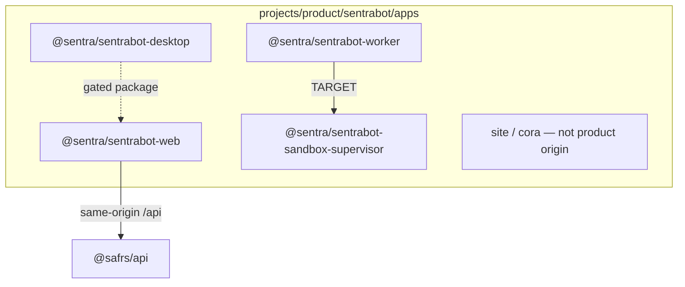

# Sentra Bot applications

Workspace packages under `projects/*/apps/*` share the root lockfile and
catalogs. This file maps **boundaries**; it does not repeat
[../docs/architecture.md](../docs/architecture.md).

| Package | CURRENT | TARGET |
| --- | --- | --- |
| `@sentra/sentrabot-web` | Landing `/`, `/workspace` local bots, Hono `/api/sentrabot`, Better Auth `/api/auth` | Dashboard wired to tenant API on a running Compose origin |
| `@sentra/sentrabot-worker` | Control HTTP + libraries | Full agent runtime |
| `@sentra/sentrabot-sandbox-supervisor` | Policy + HTTP | Injected isolated Docker executor |
| `@sentra/sentrabot-desktop` | Electron IPC sources + unit tests | Packaged unsigned artifact, then signing gate — [desktop/README.md](desktop/README.md) |
| `cora` (`apps/site`) | Vite shell on `:5173` | Not a product origin; do not add another |

Commands: [../AGENTS.md](../AGENTS.md). Do not add a nested packages folder
or a second product marketing origin.
