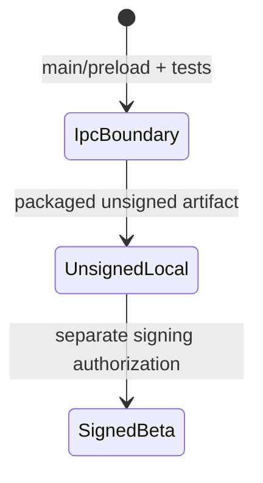

# Sentra Bot Desktop

Package: `@sentra/sentrabot-desktop`. **CURRENT:** Electron main/preload and
focused IPC security tests exist; no packaged artifact or startup smoke exists.
Electron is cataloged as an activated R2 dependency, but this is not a signed
desktop release.

## Implemented boundary

A thin client configured against a Sentra Bot origin:

- `contextIsolation: true`
- `sandbox: true`
- `nodeIntegration: false`
- Preload allowlisting
- Same-origin navigation
- Denied popup creation
- Unsigned local-artifact gate until signing is authorized

The implementation lives in `src/main.ts`, `src/preload.ts`, and
`src/security.ts`. Renderer APIs expose no provider credentials. Packaged
artifacts, clean-machine startup, signing, notarization, updates, and rollback
remain a separate release gate.

Do not ship auto-update to arbitrary URLs. IPC must use Zod-validated
payloads. Renderer must not receive provider keys.

Release train position: [../../ROADMAP.md](../../ROADMAP.md) step 2.
Threats: [../../docs/threat-model.md](../../docs/threat-model.md).
