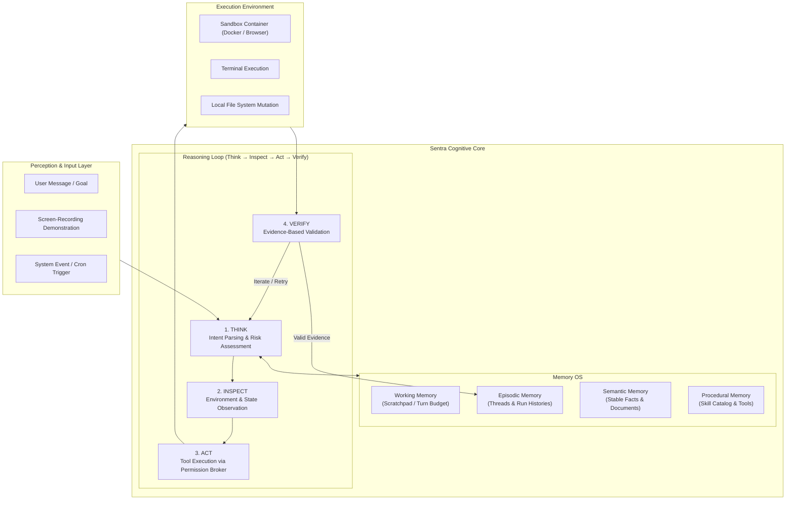
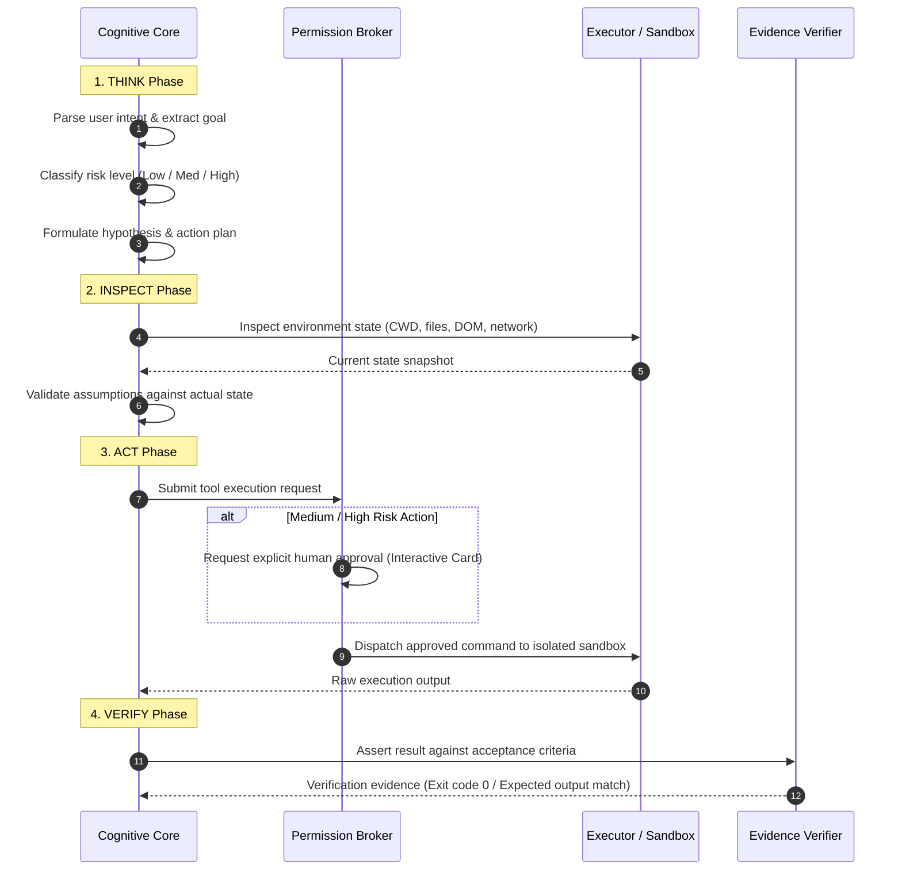
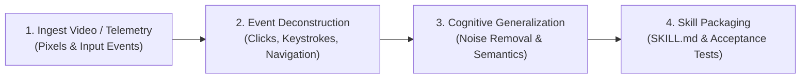

# Cognitive Architecture (Sentra AI Core)

This document formalizes the conceptual cognitive architecture of **Sentra AI Core**. It ensures agents maintain a persistent identity, modular memory structure, and disciplined reasoning loop that remain model-agnostic across varying foundation models (BYOK).

---

## 1. Memory OS Specification

Sentra's cognitive system decouples agent memory into 4 distinct quadrants with differing lifecycles, retrieval mechanisms, and persistence layers:

### A. Working Memory (Volatile Scratchpad)
- **Lifecycle**: Volatile; ephemeral throughout a single execution turn or run.
- **Function**: Serves as the agent's internal reasoning scratchpad, context-window token budget manager, temporary sub-goal accumulator, and draft response buffer before committing.
- **Token Budget**: Bound by the foundation model's context allocation (default 4,000–8,000 tokens for internal reasoning).
- **Cleanup**: Flushed and zeroized immediately after the final response or action is dispatched.

### B. Episodic Memory (Interaction History)
- **Lifecycle**: Persistent; bound to conversational threads and sequential runs.
- **Function**: Records the chronological history of real interactions: user messages, tool calls, raw terminal outputs, and human feedback.
- **Database Backing**: Prisma models `SentraBotThread` and `SentraBotThreadMessage` indexed with monotonic sequencing (`seq`).
- **Retrieval**: Leverages temporal indexing and rolling session summarization.

### C. Semantic Memory (Stable Facts & Knowledge)
- **Lifecycle**: Persistent, structured, document-based; scoped to a `bot` or `user`.
- **Function**: Stores institutional knowledge, permanent user preferences, persona definitions (`SOUL.md`), compliance rules, and domain documentation.
- **Database Backing**: Prisma model `SentraBotMemoryDocument` mapped to virtual file paths (e.g., `MEMORY.md`, `USER.md`, `KNOWLEDGE.md`) with atomic revision increments (`revision`).
- **Epistemic Discipline**: Enforces 4 epistemic states for all recorded facts: `CONFIRMED`, `IN REVIEW`, `WORKING ASSUMPTION`, and `GAP`.

### D. Procedural Memory (Skills & Verified Workflows)
- **Lifecycle**: Verified, modular, executable code assets.
- **Function**: Contains executable operational procedures (*Skills*), registered tool definitions, API contracts, and action playbooks.
- **Format**: `SKILL.md` markdown files with YAML frontmatter (metadata, dependencies, capabilities) + Zod parameter schemas + automated acceptance tests.

---

## 2. Reasoning Loop (Think → Inspect → Act → Verify)

Every action proposed by Sentra Bot must pass through four structured cognitive phases:

1. **THINK (Analysis & Risk Assessment)**:
   - Evaluates user intent, breaks down complex objectives into atomic steps, and evaluates proposed actions against the security risk matrix.
2. **INSPECT (State Observation)**:
   - Reads current environment state prior to performing mutations (e.g., verifying directory existence, inspecting open ports, querying DOM elements).
   - Eliminates blind assumptions before executing commands.
3. **ACT (Controlled Execution)**:
   - Dispatches specific tools (terminal execution, file mutation, browser navigation, API calls) through the *Permission Broker*.
   - Executes strictly inside isolated sandboxes without unmediated host socket access.
4. **VERIFY (Evidence-Based Validation)**:
   - Prohibits assuming an action succeeded solely because the command was sent.
   - Requires verification evidence (read-back verification, status checks, exit code 0, or passing test assertions) before marking any task step complete.

---

## 3. Screen-Recording Demonstration Decoder

The **Screen-Recording Demonstration Decoder** enables Sentra AI Core to learn new procedural skills directly from video recordings of human interaction across browser and desktop surfaces.

### Operational Pipeline:
1. **Visual & Telemetry Ingestion**:
   - Ingests video streams (MP4/WebM) paired with synchronized event streams: cursor coordinates, click events, keypresses, and DOM mutation logs.
2. **Action Deconstruction**:
   - Uses Vision-Language Models (VLM) to segment the recording into discrete action keyframes.
   - Correlates visual cursor clicks with underlying DOM elements or UI components.
3. **Cognitive Generalization**:
   - **Noise Filtering**: Converts absolute pixel coordinates (`x: 450, y: 312`) into layout-resilient semantic selectors (`button[data-testid="submit-btn"]` or textual anchor labels).
   - **Credential Sanitization**: Detects sensitive inputs (passwords, tokens, PII) and abstracts them into parameter placeholders (`${API_KEY}`).
4. **Skill Packaging**:
   - Compiles the generalized workflow into a new standardized skill package:
     - `SKILL.md` (step-by-step procedural prompt).
     - Input parameter Zod schema.
     - Automated acceptance tests to verify the skill in sandbox environments prior to catalog registration.
