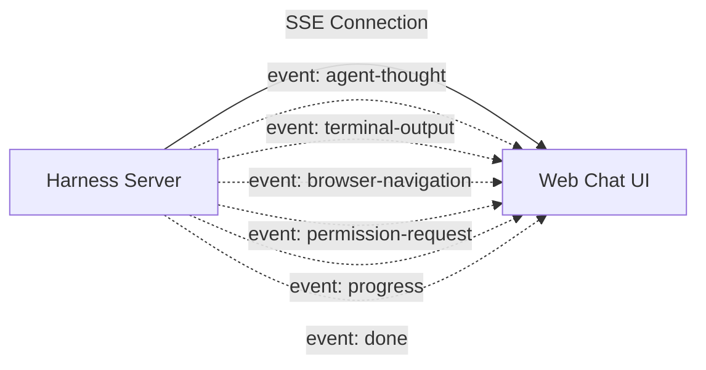

# API Communication Contracts (oRPC & SSE Specifications)

This document formalizes the real-time communication protocols between the **Sentra Bot Harness Server / API** (`@safrs/api`) and the **Chat UI** (`@sentra/sentrabot-web`). It specifies the **Server-Sent Events (SSE)** activity stream for live telemetry and **oRPC / Typed RPC** endpoints for discrete procedure invocations.

---

## 1. Real-Time Activity Streaming via SSE

### Endpoint Specification:
- **HTTP Method**: `GET`
- **Path**: `/api/sentrabot/threads/:threadId/stream`
- **Headers**:
  - `Accept: text/event-stream`
  - `Cache-Control: no-cache`
  - `Connection: keep-alive`
- **Authentication**: Requires a valid Better Auth session cookie.

### Event Types & JSON Payloads:



#### A. Event `agent-thought` (Internal Cognitive Stream)
Streams incremental reasoning tokens from the agent's internal scratchpad:
```json
{
  "event": "agent-thought",
  "data": {
    "runId": "run_9f8c12e8-4a62-421d-91b3-7649d8bc3e12",
    "stepIndex": 2,
    "thoughtDelta": "Analyzing dependencies in package.json prior to initiating installation...",
    "timestamp": 1755931200000
  }
}
```

#### B. Event `terminal-output` (Live Terminal Telemetry)
Streams stdout and stderr chunks from command executions in the sandbox:
```json
{
  "event": "terminal-output",
  "data": {
    "runId": "run_9f8c12e8-4a62-421d-91b3-7649d8bc3e12",
    "commandId": "cmd_01J9X4T5",
    "command": "pnpm test",
    "stream": "stdout",
    "chunk": "✓ tests/unit/agent-reasoning.test.ts (4 tests passed)\n",
    "exitCode": null
  }
}
```

#### C. Event `browser-navigation` (Sandbox Browser Telemetry)
Transmits navigation state and visual screenshot deltas:
```json
{
  "event": "browser-navigation",
  "data": {
    "runId": "run_9f8c12e8-4a62-421d-91b3-7649d8bc3e12",
    "url": "https://docs.github.com/en/rest",
    "actionType": "click",
    "targetSelector": "a[href='/en/rest/issues']",
    "screenshotBase64": "data:image/webp;base64,UklGR...",
    "timestamp": 1755931205000
  }
}
```

#### D. Event `permission-request` (Interactive Approval Request)
Requests explicit user confirmation for Medium or High Risk operations:
```json
{
  "event": "permission-request",
  "data": {
    "requestId": "perm_01J9X4V8Y2",
    "riskLevel": "HIGH",
    "actionKind": "terminal_exec",
    "target": "pnpm db:reset --force",
    "rationale": "Requires local database reset to apply newly defined schemas.",
    "expiresAt": 1755931500000,
    "signature": "sha256_nonce_hash_payload"
  }
}
```

#### E. Event `done` (Cycle Completion)
Signals run completion with token accounting metrics:
```json
{
  "event": "done",
  "data": {
    "runId": "run_9f8c12e8-4a62-421d-91b3-7649d8bc3e12",
    "status": "COMPLETED",
    "summary": "All dependencies were updated and verified with zero errors.",
    "durationMs": 14250,
    "tokenUsage": {
      "promptTokens": 1420,
      "completionTokens": 380,
      "totalTokens": 1800
    }
  }
}
```

---

## 2. oRPC Procedure Definitions (Type-Safe RPC)

The Web Dashboard calls typed remote procedures exported by `@safrs/api`:

### A. Namespace `bots`
- **`bots.create`**:
  - *Input*: `{ name: string (1-80), title?: string, description?: string, instructions?: string, computerMode?: "team" | "dedicated" }`
  - *Output*: `SentraBotBot` model object (HTTP 201).
- **`bots.list`**:
  - *Input*: `{ includeArchived?: boolean }`
  - *Output*: `Array<SentraBotBot>` (HTTP 200).
- **`bots.archive`**:
  - *Input*: `{ botId: UUID }`
  - *Output*: `{ ok: true }` (HTTP 200).

### B. Namespace `threads`
- **`threads.appendMessage`**:
  - *Input*: `{ threadId: UUID, role: "user" | "bot" | "system", blocks: Array<{ kind: "text" | "progress" | "meta", text: string }>, runId?: string }`
  - *Output*: `SentraBotThreadMessage` (HTTP 201).
- **`threads.getMessages`**:
  - *Input*: `{ threadId: UUID, before?: number, limit?: number }`
  - *Output*: `Array<SentraBotThreadMessage>` (HTTP 200).

### C. Namespace `permissions`
- **`permissions.respond`**:
  - *Input*: `{ requestId: string, decision: "APPROVED" | "DENIED", nonce: string }`
  - *Output*: `{ acknowledged: true, requestId: string, status: "PROCESSED" }` (HTTP 200).

### D. Namespace `agent`
- **`agent.startRun`**:
  - *Input*: `{ botId: UUID, threadId: UUID, inputMessage: string, providerOverride?: string, modelOverride?: string }`
  - *Output*: `{ runId: string, streamUrl: string }` (HTTP 202).
- **`agent.abortRun`**:
  - *Input*: `{ runId: string, reason?: string }`
  - *Output*: `{ aborted: true }` (HTTP 200).
