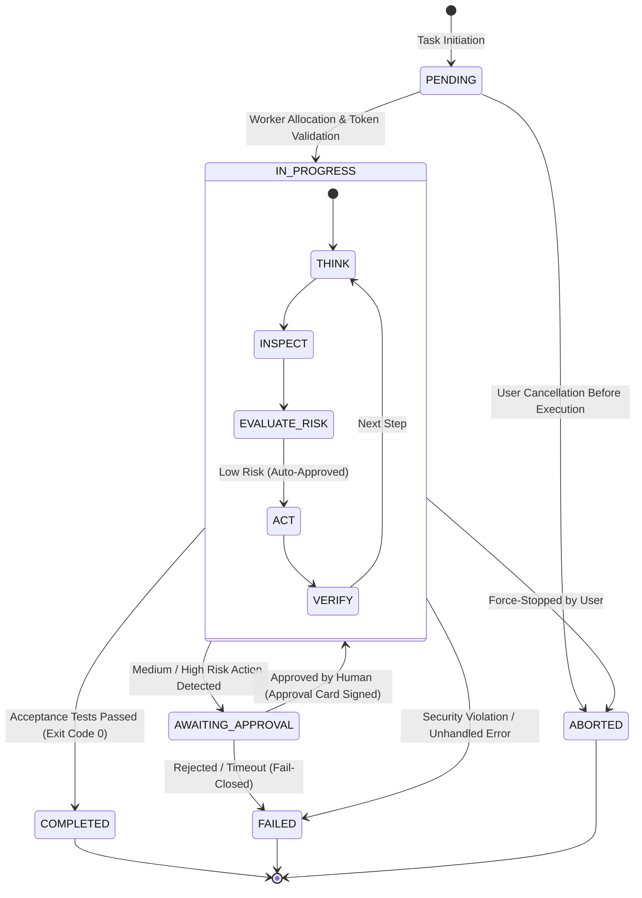
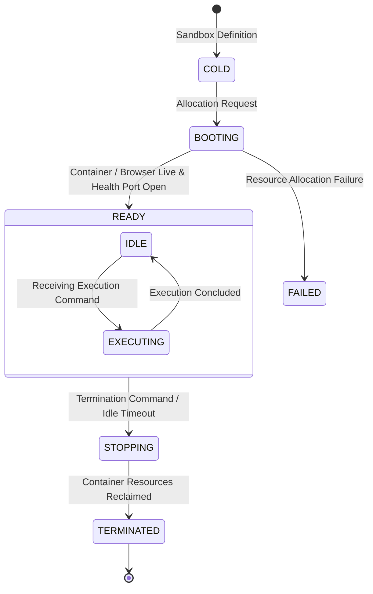

# Cognitive State Machines & Agent Lifecycles

This document mathematically and formally defines the operational states for Missions, Tasks, and Sandbox Environments. AI agents are strictly prohibited from executing state transitions outside the invariant rules specified herein.

---

## 1. Cognitive Task & Mission Lifecycle

### Task State Definitions:
- **`PENDING`**: The task has been queued and is awaiting worker thread allocation.
- **`IN_PROGRESS`**: The agent is actively executing its cognitive cycle (Think → Inspect → Act → Verify).
- **`AWAITING_APPROVAL`**: Execution is suspended pending explicit cryptographic confirmation from a human supervisor via the Permission Broker.
- **`COMPLETED`**: All steps have concluded successfully and satisfied all verification assertions.
- **`FAILED`**: An unrecoverable runtime exception, policy violation, or approval timeout occurred.
- **`ABORTED`**: Execution was manually cancelled by the user prior to completion.

---

## 2. State Invariants & Pre-Conditions

Agents and execution harnesses must strictly enforce the following mathematical state invariants:

1. **`COMPLETED` State Invariant (No Hallucinated Completion)**:
   $$\text{State} \to \text{COMPLETED} \iff \forall t \in \text{AcceptanceTests}, \text{Result}(t) = \text{PASS} \land \text{ExitCode} = 0$$
   *Rule*: A task is **STRICTLY FORBIDDEN** from transitioning to `COMPLETED` unless all acceptance tests or verification proofs defined in the mission specification have executed and returned zero exit codes.
2. **`AWAITING_APPROVAL` Invariant (Fail-Closed Timeout)**:
   $$\text{AWAITING\_APPROVAL} \to \text{IN\_PROGRESS} \iff \text{Signature}(\text{ApprovalPayload}) = \text{VALID} \land t_{\text{response}} \le t_{\text{timeout}}$$
   *Rule*: If the approval window ($t_{\text{timeout}}$, default 300 seconds) expires without an explicit user signature, the task must transition automatically to `FAILED` with reason code `APPROVAL_TIMEOUT`.
3. **Mutation Idempotency Invariant**:
   $$\text{Execute}(\text{Mutation}, \text{RequestId}) \implies \text{SingleExecutionAtState}$$
   *Rule*: Every state mutation request must contain a unique `requestId` to prevent duplicate execution during network retries.

---

## 3. Sandbox Environment Lifecycle (Computer Lifecycle)

### Sandbox Governance Rules:
1. No commands may be dispatched to a sandbox before status reaches `READY` (verified via the `/ready` HTTP endpoint).
2. If a container crashes or becomes unresponsive while in `EXECUTING`, the supervisor must terminate the running job and transition the task to `FAILED`.
