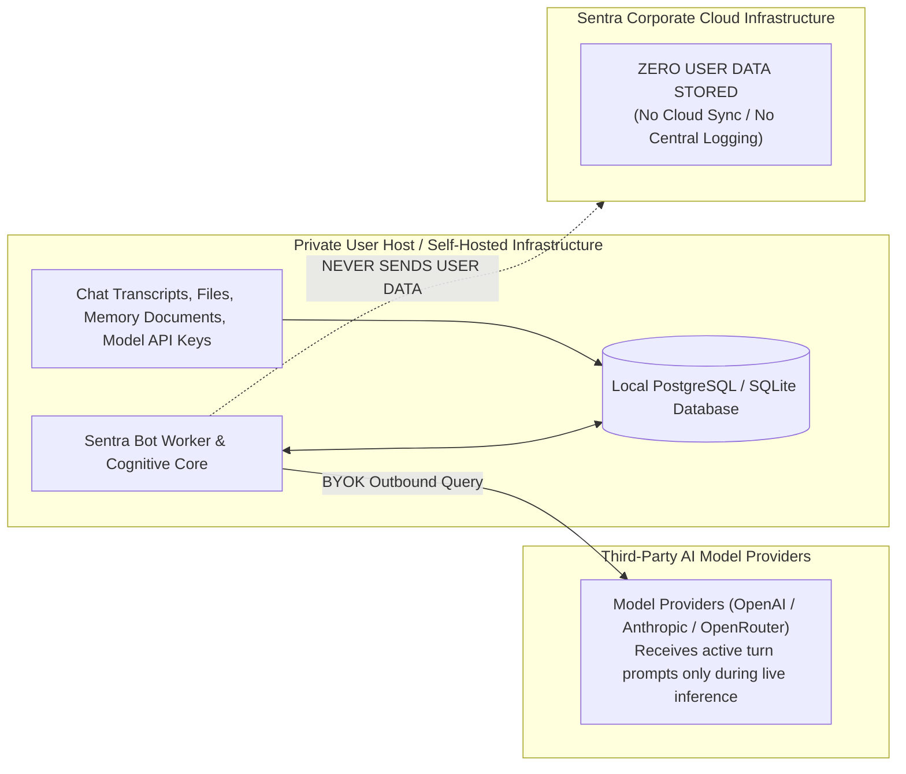
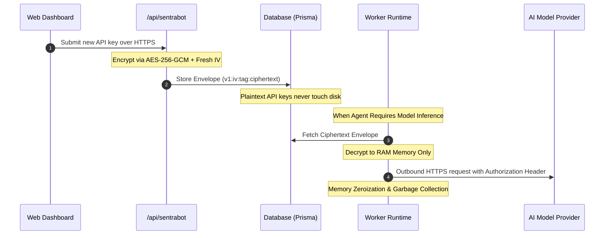

# Data Privacy by Design

This document details the data isolation architecture and cryptographic standards governing **Sentra Bot**. It provides formal guarantees for international data sovereignty, zero-cloud storage, and regulatory compliance (GDPR, EU AI Act, Indonesian PDP Law).

---

## 1. Zero-Cloud Storage Policy

Sentra Bot is engineered under a strict **Local-First & Zero-Trust** data governance paradigm:



### Core Privacy Principles:
1. **Client-Exclusive Data Persistence**:
   - Chat histories, terminal executions, episodic memories, semantic documents (`MEMORY.md`, `USER.md`), and authentication tokens remain exclusively within the user's private database.
   - Sentra operates no centralized database that ingests or inspects tenant conversational data.
2. **Non-Invasive Telemetry**:
   - The platform never collects Personally Identifiable Information (PII), prompt contents, or API credentials.
   - Any runtime telemetry is strictly opt-in, limited to anonymized error codes and performance metrics.

---

## 2. Credential Encryption Standard

All foundation model API keys (BYOK) and tenant secrets are cryptographically encrypted at the database level before being written to persistent storage.

### Cryptographic Specification:
- **Algorithm**: **AES-256-GCM** (*Galois/Counter Mode*)
- **Master Encryption Key (MEK)**: 256-bit (32 bytes), injected via the `CREDENTIAL_ENCRYPTION_KEY` environment variable or retrieved from OS Keyrings.
- **Initialization Vector (IV)**: 12-byte cryptographically secure random bytes generated uniquely for every encryption operation.
- **Authentication Tag**: 16-byte integrity verification tag preventing ciphertext tampering.

### Authenticated Envelope Format:
Encrypted data is serialized into a versioned string envelope:
```
v1:<iv_hex>:<auth_tag_hex>:<ciphertext_hex>
```
*Example*:
`v1:4a8f9c1b2d3e4f5a6b7c8d9e:1f2e3d4c5b6a798899aabbccddeeff00:98a7b6c5d4...`



### In-Memory Key Lifecycle:
- API keys are never decrypted during ordinary dashboard reads or tenant listing queries.
- Decryption occurs just-in-time within the private worker process memory immediately prior to dispatching outbound HTTPS requests to the model provider.
- Memory buffers holding plaintext credentials are zeroized and garbage-collected immediately following request completion.
