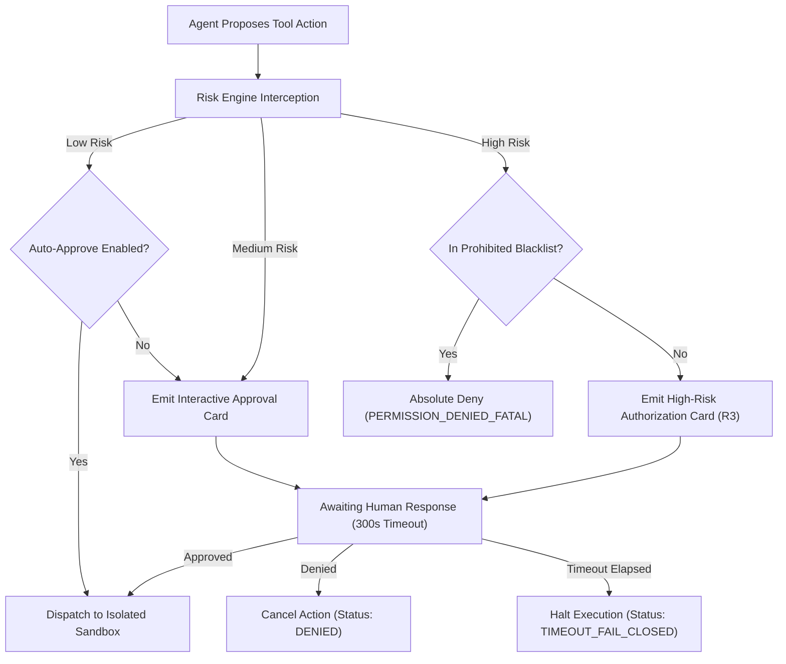

# Permission Broker Specification

This document specifies the architecture and security controls of the **Permission Broker** — the core defensive boundary that guarantees all terminal executions, filesystem mutations, and network operations proposed by agents undergo risk analysis and explicit human confirmation (*Human-in-the-Loop*).

---

## 1. Risk Categorization Matrix

Every action proposed by an agent is intercepted, evaluated, and categorized into one of 3 operational risk tiers:

| Risk Tier | Action Classification | Representative Examples | Execution Policy |
|---|---|---|---|
| **Low Risk** *(R0/R1)* | Read-Only & Inspection Operations | • Reading workspace files • Text search & *grep* queries • Inspecting process status and logs | **Auto-Approved** (if enabled in bot persona policy) |
| **Medium Risk** *(R2)* | Local Mutations & Controlled Network | • Creating or editing workspace files • Adding new npm/pnpm dependencies • Outbound read-write third-party API calls | **Interactive Approval Card** (Displays command summary & line diff in UI) |
| **High Risk** *(R3)* | Destructive & Host-Level Actions | • Executing `sudo`, `rm -rf`, or disk formatting • Mutating `/etc/hosts` or host startup scripts • Attempting to mount `/var/run/docker.sock` • Modifying root deployment credentials | **Absolute Block / Real-Time Manual Confirmation** (Strict inline manual authorization) |

---

## 2. Fail-Closed Policy & Timeout Windows

The Permission Broker enforces a strict **Fail-Closed** security posture:

1. **Approval Window Timeout**:
   - The default window for user confirmation is **300 seconds (5 minutes)** from the moment the `permission-request` event is dispatched.
2. **Behavior Upon Timeout**:
   - If no explicit signature is received within the window, the request transitions immediately to `TIMEOUT_FAIL_CLOSED`.
   - Execution is aborted immediately. Silent or unapproved fallback executions are strictly impossible.
   - The agent session is notified: *"Execution cancelled: Human approval window expired after 5 minutes."*

---

## 3. Cryptographic Nonce & Tamper-Evident Audit Trail

To mitigate replay attacks and tampering (*Man-in-the-Middle*):

1. **Permission Payload Structure**:
   - Each approval payload contains a UUID v4 (`requestId`), an epoch timestamp (`timestamp`), and a random cryptographic nonce.
   - A cryptographic signature is computed over the payload using the worker control token (HMAC-SHA256).
2. **Signature Verification**:
   - The Web UI submits both the `nonce` and `requestId` upon human approval.
   - The worker verifies signature integrity before instructing the *Sandbox Supervisor* to unblock execution.
3. **Tamper-Evident Audit Logging**:
   - All authorization requests, raw commands, actor identities (User ID), decision timestamps, and execution outcomes are written to an immutable append-only audit log.
