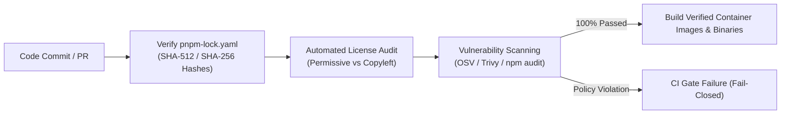

# Software Bill of Materials (SBOM & Provenance)

This document formalizes the software supply chain governance, dependency provenance verification, and open-source license compliance standards for **Sentra Bot**, fulfilling international mandates such as **US Executive Order 14028**, the **EU Cyber Resilience Act (CRA)**, and the **SLSA (Supply-chain Levels for Software Artifacts)** framework.

---

## 1. Dependency Provenance Audit

Sentra Bot mandates deterministic dependency locking and cryptographic hash verification across all third-party libraries via `pnpm-lock.yaml`.

### Supply Chain Integrity Controls:
1. **Cryptographic Hash Verification**:
   - Every package downloaded from public registries (npm) is validated against SHA-512 integrity hashes recorded in `pnpm-lock.yaml`.
   - Floating version specifiers (`*`, `latest`, `^`) are strictly prohibited in lockfiles and core package boundaries.
2. **Centralized Workspace Catalogs**:
   - Monorepo package versions are pinned in `pnpm-workspace.yaml` under the `catalog:` block, ensuring zero version divergence across workspace packages.

---

## 2. License Compliance Ledger

To protect proprietary intellectual property and prevent license contamination in commercial deployments, Sentra enforces strict license boundaries:

### Approved Permissive Licenses:
The following licenses are approved for inclusion in all core libraries and client binaries:
- **MIT License** (e.g., `next`, `react`, `hono`, `zod`, `tailwindcss`)
- **Apache License 2.0** (e.g., `@opentelemetry/*`, `prisma`)
- **BSD 2-Clause / 3-Clause**
- **ISC License**

### Prohibited Copyleft Licenses:
The following licenses are **STRICTLY PROHIBITED** from inclusion in proprietary application runtimes:
- **GPL v2 / GPL v3** (*GNU General Public License*)
- **AGPL v3** (*Affero General Public License*)
- **SSPL** (*Server Side Public License*)

> [!WARNING]
> Inclusion of viral copyleft packages can legally mandate the disclosure of proprietary application source code. All dependency additions must pass automated license scanning during CI verification.

---

## 3. SBOM Export Standards & SLSA Attestation

For every official release milestone, the build pipeline automatically exports standardized SBOM manifests:

1. **Standard Formats**:
   - Exported in **CycloneDX JSON v1.5** and **SPDX v2.3** formats.
   - Artifact path: `docs/evidence/sbom-release-<version>.json`.
2. **SBOM Manifest Contents**:
   - Full package names, semantic versions, and upstream repository source URLs.
   - Cryptographic SHA-256 checksums of all compiled executable binaries.
   - Complete transitive dependency tree and dependency relationships.
   - Validated SPDX license identifiers.
3. **Release Attestation (SLSA Level 3 Target)**:
   - Container images (`ghcr.io/sentra/sentrabot-*`) are cryptographically signed using *Cosign / Sigstore* prior to registry publication.
