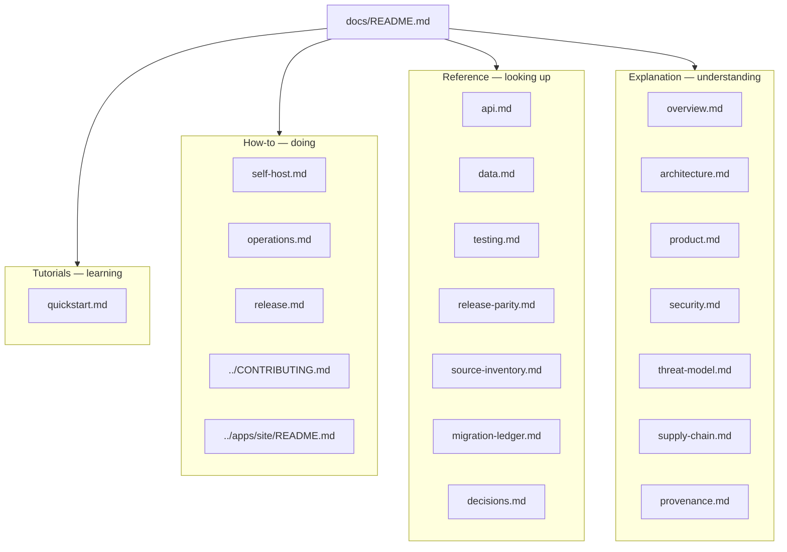
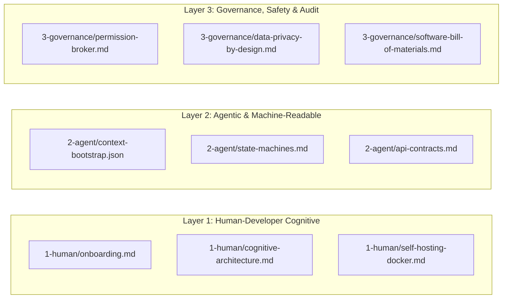

# Documentation map

Sentra Bot docs follow [Diátaxis](https://diataxis.fr/): tutorials, how-to
guides, reference, and explanation. One topic lives in one file. Architecture
prose is not copied into every page.

This capsule is inner-source. GitHub issue/PR templates stay at the Monorepo
root (out of scope R2).

## Tutorials

| File | Concern |
| --- | --- |
| [quickstart.md](quickstart.md) | What can run today vs what is blocked |

There is no fake end-to-end happy path that requires pin `d17a138`.

## How-to

| File | Concern |
| --- | --- |
| [self-host.md](self-host.md) | Intended Compose topology and operator defaults |
| [operations.md](operations.md) | Health/ready, incidents, backup/restore **gates** |
| [release.md](release.md) | Evidence required before a beta claim |
| [../CONTRIBUTING.md](../CONTRIBUTING.md) | How humans and agents contribute |
| [../apps/site/README.md](../apps/site/README.md) | Cora Vite shell — not the product origin |

## Reference

| File | Concern |
| --- | --- |
| [api.md](api.md) | `/api/sentrabot`, `/api/auth`, worker control, supervisor ops |
| [data.md](data.md) | Tenant scope, Prisma models, envelopes |
| [testing.md](testing.md) | Commands, fakes vs canaries |
| [release-parity.md](release-parity.md) | Implemented vs not accepted |
| [source-inventory.md](source-inventory.md) | Inventory command contract |
| [migration-ledger.md](migration-ledger.md) | Dispositions (none while pin missing) |
| [decisions.md](decisions.md) | Index to ADR 0004 and DECISIONS.md |

## Explanation

| File | Concern |
| --- | --- |
| [overview.md](overview.md) | What Sentra Bot is, who it is for, non-goals |
| [architecture.md](architecture.md) | C4 containers and boundaries |
| [product.md](product.md) | Personas, threads, memory, routines, BYOK |
| [security.md](security.md) | Control intent for this product |
| [threat-model.md](threat-model.md) | STRIDE on current and planned surfaces |
| [supply-chain.md](supply-chain.md) | SBOM/SLSA TARGET vs CURRENT |
| [provenance.md](provenance.md) | Pin `d17a138` vs baseline `7f08da5` |

## Layered Cognitive & Governance Documentation

| Layer | Document | Focus & Purpose |
|---|---|---|
| **Layer 1: Human-Developer** | [1-human/onboarding.md](1-human/onboarding.md) | Developer onboarding guide, `@safrs` Monorepo map, local dev loop, Git & PR rules. |
| | [1-human/cognitive-architecture.md](1-human/cognitive-architecture.md) | Memory OS (Working/Episodic/Semantic/Procedural), Reasoning Loop (Think-Inspect-Act-Verify), Demo Decoder. |
| | [1-human/self-hosting-docker.md](1-human/self-hosting-docker.md) | Docker Compose topology, `.env` management & BYOK, backup/restore procedures for database and volumes. |
| **Layer 2: Agentic & Machine** | [2-agent/context-bootstrap.json](2-agent/context-bootstrap.json) | Instant AI assistant context (Claude Projects/Custom GPT), tech stack manifesto, approved namespaces. |
| | [2-agent/state-machines.md](2-agent/state-machines.md) | Task & sandbox state transition diagrams (Mermaid.js), mathematical invariants, fail-closed timeout policy. |
| | [2-agent/api-contracts.md](2-agent/api-contracts.md) | Real-time Server-Sent Events (SSE) streaming specifications & type-safe oRPC procedure definitions. |
| **Layer 3: Governance & Safety** | [3-governance/permission-broker.md](3-governance/permission-broker.md) | Execution permission broker, risk matrix (Low/Med/High), 300s timeout, cryptographic nonce audit trail. |
| | [3-governance/data-privacy-by-design.md](3-governance/data-privacy-by-design.md) | Zero-Cloud local-first storage policy, AES-256-GCM credential encryption envelope, in-memory lifecycle. |
| | [3-governance/software-bill-of-materials.md](3-governance/software-bill-of-materials.md) | Dependency provenance audit (SHA-256), license compliance ledger (MIT/Apache vs GPL copyleft), SLSA attestation. |

## Capsule root (community)

[README.md](../README.md), [AGENTS.md](../AGENTS.md),
[SECURITY.md](../SECURITY.md), [SUPPORT.md](../SUPPORT.md),
[CHANGELOG.md](../CHANGELOG.md), [CODE_OF_CONDUCT.md](../CODE_OF_CONDUCT.md),
[ROADMAP.md](../ROADMAP.md), [LICENSE](../LICENSE), [NOTICE](../NOTICE).

