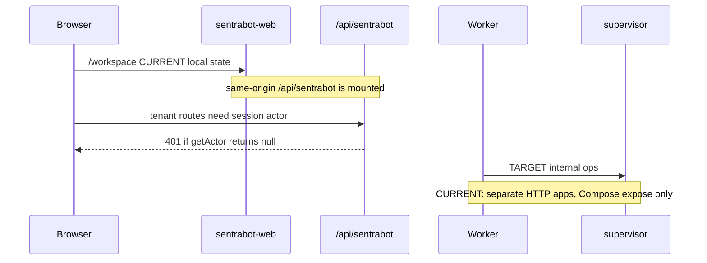

# Sentra Bot HTTP reference

Contracts are Zod in `@safrs/schemas/sentrabot`. Routes below are taken from
source, not from OpenAPI: `buildOpenApiDocument()` currently documents Golden
Path demos only and **does not** list Sentra Bot paths.

SSOT implementations:

- Public facade: `packages/api/src/sentrabot.ts` mounted at `/api/sentrabot`
  by `packages/api/src/app.ts`.
- Worker: `projects/product/sentrabot/apps/worker/src/index.ts`.
- Supervisor: `projects/product/sentrabot/apps/sandbox-supervisor/src/index.ts`.



## Authentication model (CURRENT)

`createSentraBotApi` uses `getActor(request)` and defaults to `null`.
Sentra Bot web passes `createSentraBotActorResolver(auth)` into
`createApp()`, so a valid Better Auth session cookie becomes
`{ userId, workspaceId: "user:<id>" }`. Hosts that omit the resolver
(including the default `createApp()` used by tests unless injected) stay
unauthenticated. Tests may inject `{ workspaceId, userId }`.

Better Auth is mounted at `/api/auth/[...all]`. Missing
`BETTER_AUTH_SECRET` / `BETTER_AUTH_URL` fails closed. Signup policy is
**closed** unless non-production `SENTRABOT_E2E_SEED=1`. Production origins
must be HTTPS.

Tenant-scoped handlers return `401 Unauthorized` with `{ error: "Unauthorized" }`
when no actor is present. Missing rows return `404` `{ error: "Not found" }`
rather than a cross-tenant disclosure.

## `/api/sentrabot` (Hono)

Base path on the canonical app: `/api` + `/sentrabot`.

| Method | Path | Auth | Status | Body / query | Notes |
| --- | --- | --- | --- | --- | --- |
| GET | `/health` | none | 200 | — | `{ ok: true, service: "sentrabot-api" }` |
| GET | `/deployment` | none | 200 | — | **CURRENT: hardcoded** closed signup; does not read Prisma |
| POST | `/signup/check` | none | 200 / 403 | `{ email?, emailVerified? }` | Uses `canSignup` with **empty/default** policy (`closed`) |
| GET | `/bots` | actor | 200 / 401 | `?archived=true` | Lists tenant bots |
| GET | `/bots/:botId` | actor | 200 / 401 / 404 | — | Active bot only in repository `get` |
| POST | `/bots` | actor | 201 / 400 / 401 | `sentraBotCreateBotInputSchema` | name 1–80; title/description/instructions optional |
| POST | `/bots/:botId/archive` | actor | 200 / 401 / 404 | — | `{ ok: true }` |
| GET | `/threads/:botId` | actor | 200 / 401 / 404 | — | Thread lookup **by botId** |
| GET | `/threads/:threadId/messages` | actor | 200 / 400 / 401 | `?before=` integer ≥ 0 | Newest-first, take 100 in repository |
| POST | `/threads/:threadId/messages` | actor | 201 / 400 / 401 / 404 | `sentraBotAppendMessageInputSchema` | |
| GET | `/memory` | actor | 200 / 401 | `?botId=` | |
| PUT | `/memory` | actor | 200 / 400 / 401 | memory document, id/revision/updatedAt optional | Revision conflict throws in DB layer |
| GET | `/bots/:botId/routines` | actor | 200 / 401 | — | |
| POST | `/bots/:botId/routines` | actor | 201 / 400 / 401 | create routine; `botId` taken from path | |

### Create bot JSON

`name` required. Defaults: `title` `""`, `description` `""`, `instructions` `""`,
`notifyOnFinish` `true`, `computerMode` `"team"` (`team` \| `dedicated`).

### Append message JSON

`role`: `user` \| `bot` \| `system`. `blocks`: 1–32 items, each
`{ kind: "text"|"progress"|"meta", text }` (max 20_000 chars). Optional `runId`.

### Signup check JSON (CURRENT)

Policy is `sentraBotSignupPolicySchema.parse({})` — mode **closed**. Verified
email and allowlist are irrelevant until a host passes a real policy.
Closed response: `403` `{ allowed: false, reason: "SIGNUP_CLOSED" }`.

### Deployment JSON (CURRENT)

Always:

```json
{
  "ownerUserId": null,
  "signupMode": "closed",
  "signupAllowlist": [],
  "hasDeploymentModelCredential": false,
  "defaultProvider": null,
  "defaultModel": null
}
```

TARGET: serve `getSentraBotDeploymentSettings` from Prisma. The database
helper already exists in `@safrs/database` and is **not** called by this route.

## Worker (`@sentra/sentrabot-worker`)

Listens on `PORT` default `8787`, bind `0.0.0.0`. Env: `WORKER_CONTROL_TOKEN`.

| Method | Path | Auth | Result |
| --- | --- | --- | --- |
| GET | `/health` | none | `{ ok: true, service: "worker" }` |
| POST | `/control/computer` | `Authorization: Bearer <token>` exact string match | `{ ok, requestId, operation }` or 401/400 |

Control body: `workerControlRequestSchema` — `actor.{workspaceId,userId,botId}`,
`requestId` 1–128, `operation` discriminated:

- `status` | `boot` | `stop` | `heartbeat`
- `input` with `kind` `key` \| `pointer` \| `clipboard` and a bounded payload

Undeclared fields (for example `providerApiKey`) fail Zod `.strictObject`.

CURRENT: success acknowledges the operation name; it does **not** boot a
computer. Token compare is **not** timing-safe (unlike the supervisor).

Libraries **not** exposed as HTTP:

- `encryptCredential` / `decryptCredential` / `rotateCredential` (`v1` AES-256-GCM)
- `createIdempotentExecutor` / `createRoutineScheduler`

## Supervisor (`@sentra/sentrabot-sandbox-supervisor`)

Listens on `PORT` default `8788`. Env: `SUPERVISOR_TOKEN`. HTTP server sets
`ready: true` and does **not** inject `docker`.

| Method | Path | Auth | Result |
| --- | --- | --- | --- |
| GET | `/health` | none | `{ ok: true, service: "sandbox-supervisor" }` always 200 |
| GET | `/ready` | none | 200 if `ready`, else 503 |
| POST | `/computers/:computerId/operations` | timing-safe Bearer | see below |

`computerId` must match `^[A-Za-z0-9][A-Za-z0-9_.-]{0,127}$`. Body
`supervisorRequestSchema`; `actor.computerId` must equal the path.

| Operation | CURRENT HTTP |
| --- | --- |
| `boot` | `202` with `containerId` if `docker` injected; else `503` `{ error: "Docker executor is disabled" }` |
| others | `501` `{ error: "Supervisor operation is not enabled" }` |

Boot (when executor present) uses image
`ghcr.io/sentra/sentrabot-sandbox:0.1.0` and workspace
`/srv/sentrabot/workspaces/${workspaceId}`. That image name is a policy
constant, not a published release claim. Policy: [security.md](security.md).

## Out of this reference

SSE/realtime, provider adapter HTTP, OAuth callbacks, and OpenAPI for these
routes — **TARGET**, not present as routes in the files inspected. Electron
IPC lives in `@sentra/sentrabot-desktop` (not HTTP). Auth HTTP is Better
Auth at `/api/auth/*`, not this Hono table.
