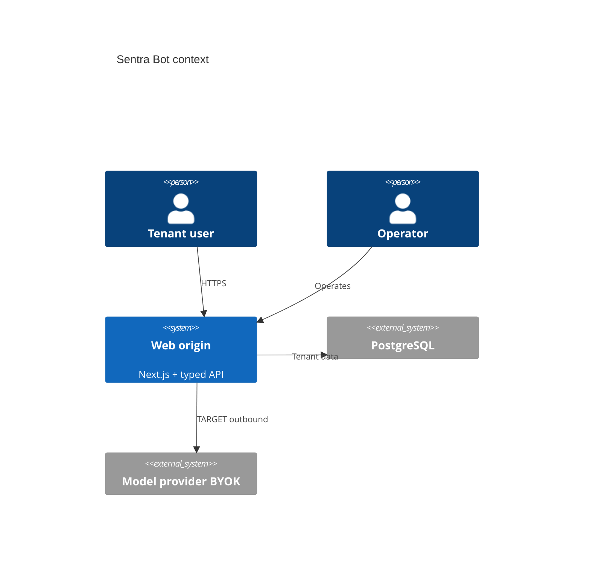
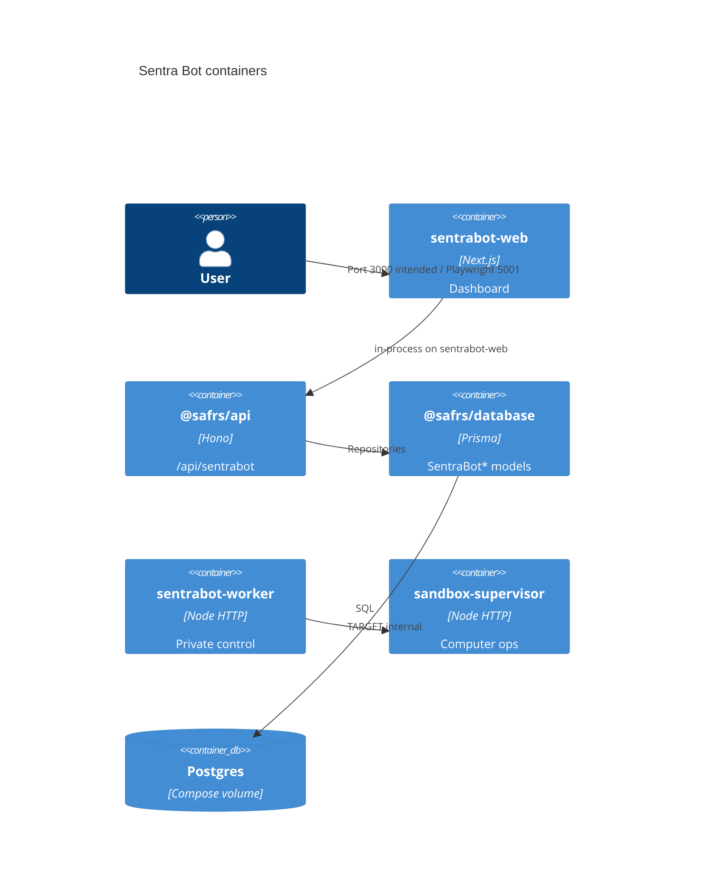

# Architecture

Sentra Bot is one official capsule with four **deployment boundaries**. Domain
types live in shared packages; product UI and private runtimes live here.
Decision: [ADR 0004](../../../docs/adrs/0004-sentrabot-public-release.md).
Routes: [api.md](api.md). Data: [data.md](data.md). Product concepts:
[product.md](product.md).

## CURRENT vs TARGET

| Boundary | CURRENT | TARGET |
| --- | --- | --- |
| `apps/web` | Next.js App Router: `/` landing (`home.html`), `/workspace` local sample bots from the first two personas, `/api/sentrabot` mounts `@safrs/api`, `/api/auth` Better Auth (signup closed) | Dashboard wired to tenant API; Compose-running origin |
| `apps/worker` | Hono control + health; envelope and executor **libraries** | Agent runtime, adapters, jobs, reconciliation; still private |
| `apps/sandbox-supervisor` | Health/ready, bearer ops, Docker **policy**, fake executor in tests | Privileged-but-bounded Docker executor, no host socket |
| `apps/desktop` | Electron main/preload + IPC unit tests; Electron in root catalog | Packaged unsigned artifact, then signed client after a separate gate |
| `apps/site` | Cora Vite shell (`cora`, `:5173`); **not** the product origin | Do not promote to a second marketing origin |

Worker control API is private, identity-bound, and must never return provider
credentials. Compose keeps worker and supervisor on an **internal** network
([self-host.md](self-host.md)).

## C4 — context (TARGET self-host)

## C4 — containers

CURRENT `/workspace` does not call `/api/sentrabot`. CURRENT API
`/deployment` does not read Prisma. CURRENT worker does not call the
supervisor. Desktop is omitted from the running Compose topology; IPC
sources exist and are unit-tested. `apps/site` is omitted from C4.

## Shared boundaries (do not duplicate inside the capsule)

- `@safrs/schemas/sentrabot` — Zod IDs, bots, threads, memory, routines,
  signup, quotas, sandbox kinds.
- `@safrs/api` — `createSentraBotApi`.
- `@safrs/database` — tenant-scoped repositories; `claimDeploymentOwner`.
- `@safrs/auth` — `createSentraBotAuth`, session actor resolver, signup
  helpers, trusted origins.
- `@sentra/token` — UI tokens (UI work is out of this documentation task).

Do not create `projects/product/sentrabot/packages`.

## Control planes

1. **Public-ish origin** — web + `/api/sentrabot` (signup check and health
   are unauthenticated; tenant CRUD is not).
2. **Worker** — `POST /control/computer` with `WORKER_CONTROL_TOKEN`.
3. **Supervisor** — `POST /computers/:id/operations` with `SUPERVISOR_TOKEN`,
   `/health` vs `/ready`.

Capabilities declared in [../capabilities.json](../capabilities.json): `ai`,
`email`, `electron`. Electron catalog + IPC tests are CURRENT; packaging is
not. Email delivery stays local outside production
([../emails/README.md](../emails/README.md)).

## Rejected shapes (ADR 0004)

Lift-and-shift of the source repo toolchain; silent `HEAD` substitution for
`d17a138`; hosted production during this migration.
