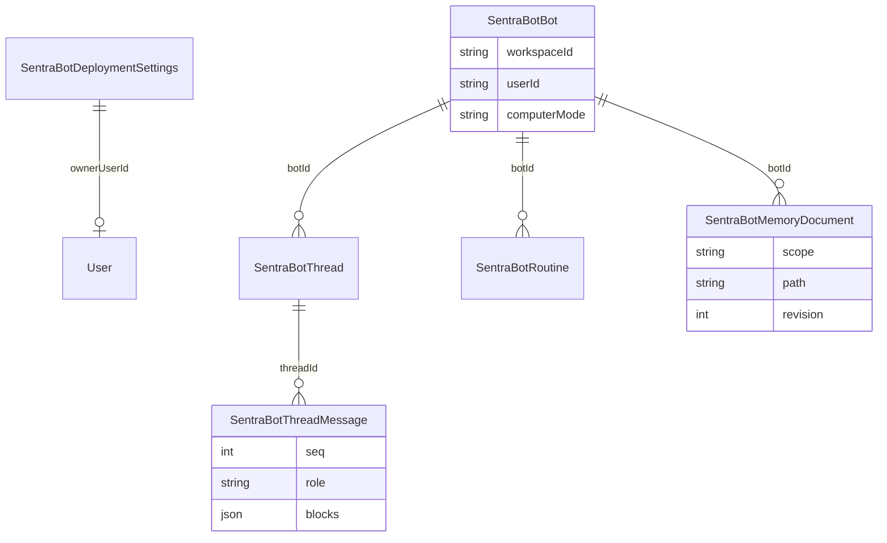

# Data

Sentra Bot data is **tenant-owned**. Every repository call requires
`workspaceId` **and** `userId` (`requireSentraBotTenantScope`). Cross-tenant
reads return the normal not-found envelope, not a disclosure that the row
exists elsewhere.

Schema SSOT: `packages/database/prisma/schema.prisma` (models `SentraBot*`).
Zod SSOT: `packages/schemas/src/sentrabot/`. This file does not copy the
full schema. HTTP mapping: [api.md](api.md).

## CURRENT vs TARGET

| Topic | CURRENT | TARGET |
| --- | --- | --- |
| Migrations | `0003`–`0005` SentraBot domain; `0006` Better Auth tables; `0007` account issuer | Append-only further slices via root Prisma wrapper |
| API `/deployment` | Hardcoded closed settings | Prisma `getSentraBotDeploymentSettings` |
| Credentials | Envelope helper in worker | Stored, rotated, never logged |
| Fixtures | Synthetic / in-memory tests | Same rule; no source runtime data |
| Retention | Not implemented as operator jobs | Operator-controlled delete and backup gates |

Source `.env`, caches, backups, and `node_modules` stay out of git. The
source migration directory is not copied into the executable chain.

Prisma does not declare SQL foreign keys between these models in the current
schema; isolation is enforced in application repositories by tenant `where`
clauses. That is CURRENT. TARGET may add stronger DB constraints after R2
review; do not assume they exist.

## Models (names as mapped)

| Model | Table | Tenant columns | Notes |
| --- | --- | --- | --- |
| `SentraBotDeploymentSettings` | `sentrabot_deployment_settings` | `ownerUserId` optional | Singleton id `"default"`; signup default `closed` |
| `SentraBotBot` | `sentrabot_bots` | `workspaceId`, `userId` | `computerMode` default `team`; archive via `archivedAt` |
| `SentraBotThread` | `sentrabot_threads` | both | `unread` flag |
| `SentraBotThreadMessage` | `sentrabot_thread_messages` | both | unique `(threadId, seq)` |
| `SentraBotMemoryDocument` | `sentrabot_memory_documents` | both | unique `(workspaceId, userId, botId, scope, path)` |
| `SentraBotRoutine` | `sentrabot_routines` | both | cron + timezone strings; `active` default true |

Owner claim: `claimDeploymentOwner` succeeds only when `ownerUserId` is still
null (first writer). That helper is not exposed on the Hono facade yet.

## Memory revisions

`upsertMemory` increments `revision`. If the client sends `revision` and it
does not match, the repository throws `Memory revision conflict`. The HTTP
layer does not currently map that error to a typed 409 (CURRENT).

## Credential envelope (not a Prisma model)

Format `v1.<iv_b64url>.<tag_b64url>.<ciphertext_b64url>`, AES-256-GCM, key
derived as SHA-256 of the operator-supplied string. Rotation decrypts with
the old key and encrypts with the new key. No envelope rows exist in schema
yet.

## Quotas and runs

Zod defines `sentraBotQuotaSchema`, `sentraBotRunSchema`, and computer
status. There are **no** Prisma models for runs, artifacts, or computers in
the inspected schema. Treat those as TARGET persistence.

## Self-host defaults

Closed signup, per-user BYOK, bounded resources, explicit operator retention.
Do not load production dumps into this database.
