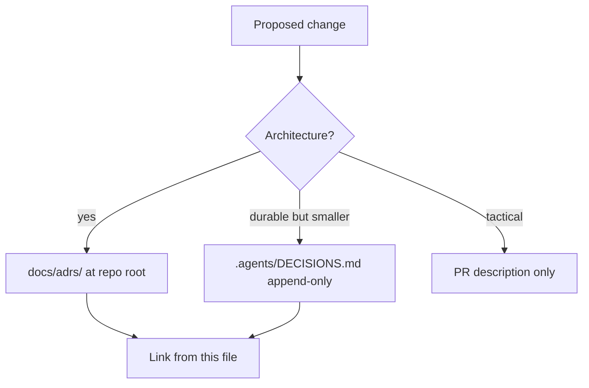

# Decision index

This capsule does **not** keep a second ADR directory. Architectural
decisions go to the Monorepo store. Capsule-local notes belong in this
index as pointers only.

## Binding ADR

| ID | Title | Status | Path |
| --- | --- | --- | --- |
| 0004 | Sentra Bot Public Release Capsule and Port Strategy | Proposed pending designated R2 review | [../../../docs/adrs/0004-sentrabot-public-release.md](../../../docs/adrs/0004-sentrabot-public-release.md) |

Summary (do not treat this as a fork): one capsule; re-express through
existing Monorepo boundaries; private worker; public source + closed
self-host beta first; per-user BYOK; Rakazo only in legal records.

Rejected there: lift-and-shift source toolchain; silent `HEAD` for
`d17a138`; hosted production in this migration.

## Durable DECISIONS.md entries (Sentra Bot)

SSOT: [../../../.agents/DECISIONS.md](../../../.agents/DECISIONS.md)
(append-only, newest first).

| Date | Title |
| --- | --- |
| 2026-08-21 | Sentra Bot intake remains pinned and blocked |
| 2026-08-21 | Sentra Bot Webflow marketing HTML is excluded from Biome |
| 2026-08-21 | Sentra Bot capsule CURRENT docs match wired auth and web host |

The intake entry records the capsule, private control plane, closed signup,
BYOK, pin `d17a138`, provisional baseline `7f08da5`, and Chief's end-to-end
continuation without substituting the pin. The CURRENT-docs entry records
that Better Auth, the web API mount, Electron IPC tests, and the web
landing are implemented facts — not a second ADR.

## Capsule-local working choices (not ADRs)

These are implementation facts documented so agents do not re-litigate them
without Chief:

- Nested `packages/`, lockfile, Turbo, and Biome config inside the capsule
  are forbidden (ADR 0004).
- Electron is in the root catalog; packaging and signing stay gated.
- Better Auth is mounted on sentrabot-web; signup remains closed by default.
- Community GitHub templates stay at the monorepo root (R2).

When a new durable choice is locked, append `.agents/DECISIONS.md` (session
protocol). Do not add `docs/adrs/` files under `projects/product/sentrabot/`.
