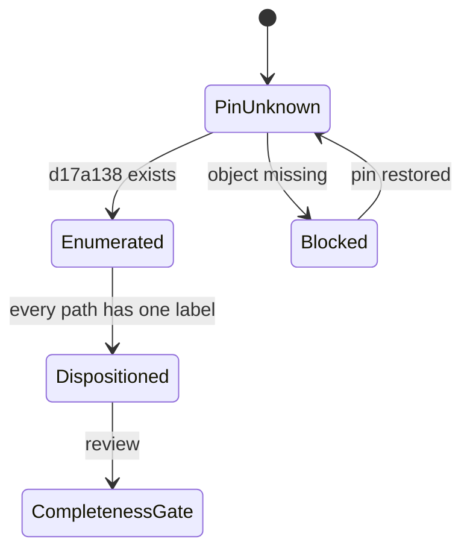

# Migration ledger

## Intake status

| Source snapshot | Status | Reason |
| --- | --- | --- |
| `D:/DEV/Sentraverse/sentrabot@d17a138` | blocked | The object is unavailable in the source repository refs observed on 2026-08-21. Re-check only via the inventory command. |
| `D:/DEV/Sentraverse/sentrabot@7f08da5` | provisional baseline | Used for continued technical porting after Chief's instruction to continue end to end; distinct from the locked acceptance snapshot. |

Provenance narrative: [provenance.md](provenance.md).
Command: [source-inventory.md](source-inventory.md).

## Disposition contract

Every tracked path in the pinned snapshot must have exactly one of:

- `ported` — behavior and source moved into the target boundary.
- `reimplemented` — behavior recreated against Monorepo primitives.
- `provenance-only` — retained only as legal or historical evidence.
- `excluded-with-proof` — intentionally excluded with a documented reason.

No path-level dispositions are asserted while the pinned tree cannot be
enumerated. The current source `HEAD` is not an acceptable substitute.

The app manifests currently in the capsule are web, worker,
sandbox-supervisor, desktop, and the non-origin `apps/site` shell, plus the
contracts listed in [release-parity.md](release-parity.md). That is not full
capability parity. No public release or complete migration claim is
permitted until runtime source and release-blocking tests are present
**and** the pin is dispositioned.

## Path table

Empty by policy until `inventory-source.mjs` emits paths for `d17a138`.
Do not fill this table from a working-tree walk of `7f08da5`.
