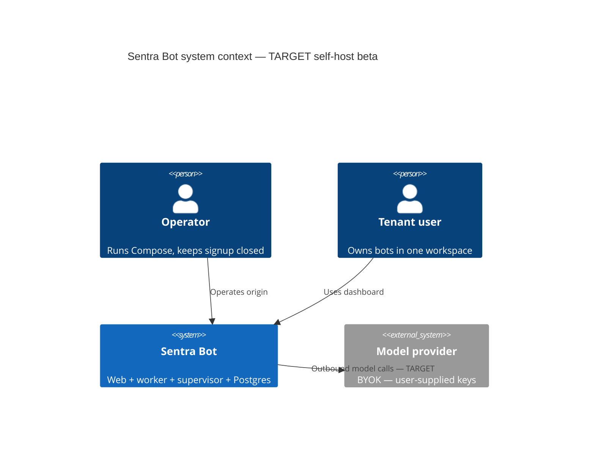

# What Sentra Bot is

Sentra Bot is a **private agent workspace**: named bots with instructions,
one conversation thread per bot, revisioned memory documents, and cron-like
routines. The operator brings their own model credentials (BYOK). The product
is for people who want bounded assistants on infrastructure they control,
starting with a closed-signup self-hosted beta.

This is explanation, not a runbook. How to try CURRENT pieces:
[quickstart.md](quickstart.md). Containers and networks:
[architecture.md](architecture.md). Personas and memory:
[product.md](product.md).

## Who it is for

- **Self-host operators** who accept closed signup and private worker/supervisor
  networks.
- **End users on that deployment** who own bots inside a tenant
  (`workspaceId` + `userId`).
- **Chief** as the only human who can authorize R2/R3 expansion.

It is not for anonymous public chat, multi-tenant SaaS in this migration, or
unattended production hosting.

## Problem it solves

Personal and small-team work in Indonesia (and similar contexts) needs
assistants that keep memory, follow routines, and can later drive a
sandboxed computer — without sending provider API keys to the browser or
opening signup to the internet by default.

## Non-goals

- Hosted Sentra production (later **R3**, not this migration).
- Public signup by default.
- Signed desktop in this slice (Electron catalog and IPC tests exist;
  packaging/signing remain gated).
- Replacing licensed medical, legal, tax, or investment advice (persona
  catalogs state those limits; see [product.md](product.md)).
- A second monorepo or nested package ecosystem.

## CURRENT vs TARGET

| Capability | CURRENT | TARGET |
| --- | --- | --- |
| Dashboard | Token-scoped `/workspace` with local sample bots | Same UI wired to `/api/sentrabot` + sessions |
| Domain API | Hono facade mounted on web; actor from Better Auth session | Same, plus `/deployment` from Prisma |
| Auth | Better Auth on `/api/auth`; signup closed | Closed self-host beta (no public signup) |
| Execution | Idempotent helper library | Worker runtime with fake then real providers |
| Sandbox | Policy + injected fake Docker in tests | Isolated executor, no host socket |
| Desktop | Electron IPC sources + unit tests | Thin packaged client after gate |
| Marketing | Web `/` serves `home.html`; other marketing paths 308 to `/` | Copy/image swap only; no second origin |

The C4 diagram is TARGET. CURRENT web does not call providers; CURRENT worker
control acknowledges computer operations without executing them.
