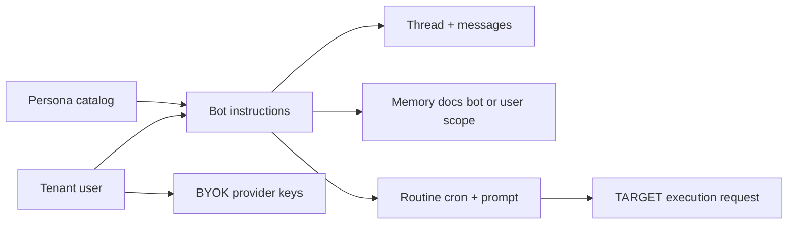

# Product model

Sentra Bot is a workspace of **bots** with instructions, a **thread** of
messages, **memory** documents, and **routines**. Credentials are BYOK.
Personas are starter instruction packs, not separate products.

Code: [../src/personas/](../src/personas/). Persistence: [data.md](data.md).
HTTP: [api.md](api.md). Conceptual “why”: [overview.md](overview.md).

## Personas (CURRENT catalog)

`SENTRABOT_PERSONAS` in `src/personas/catalog.ts` — twelve entries, timezone
`Asia/Jakarta`, instructions in Bahasa Indonesia, unique ids. Categories:
`pribadi`, `bisnis`, `profesional`, `pendidikan`, `teknis`.

| id | Name | Category |
| --- | --- | --- |
| `sekretaris-pribadi` | Sekretaris Pribadi | pribadi |
| `asisten-umkm` | Asisten UMKM | bisnis |
| `customer-service` | Customer Service | bisnis |
| `konten-sosmed` | Konten & Media Sosial | bisnis |
| `akademik-skripsi` | Akademik & Skripsi | pendidikan |
| `hr-rekrutmen` | HR & Rekrutmen | profesional |
| `keuangan-pribadi` | Keuangan Pribadi | pribadi |
| `developer-it` | Developer & IT | teknis |
| `whatsapp-bisnis` | WhatsApp Business | bisnis |
| `ecommerce` | E-commerce & Marketplace | bisnis |
| `kesehatan-informasi` | Kesehatan Informasi | profesional |
| `legal-informasi` | Legal Informasi | profesional |

Helpers: `getPersonaById`, `getPersonasByCategory`. Suggested routines are
catalog hints (`cronHint` strings). They are **not** written to
`SentraBotRoutine` automatically.

CURRENT: creating a bot via API does not attach a persona id. Web
`next.config.ts` aliases `@sentrabot/personas` to this catalog.
`/workspace` imports `SENTRABOT_PERSONAS` and seeds two local sample rows
from the first catalog entries (`sekretaris-pribadi`, `asisten-umkm`).
TARGET: optional persona seed of `instructions` and starter prompt at
create time, persisted through the API.

Health and legal personas are **information only** (not diagnosis, not legal
advice). That is product policy in the instruction text, not an API rule.

## Threads and messages

One thread row per bot lookup today (`getThread(scope, botId)`). Messages
have monotonic `seq`, roles `user` | `bot` | `system`, and block kinds
`text` | `progress` | `meta`. Runs (`sentraBotRunSchema`) are typed but not
persisted.

Dashboard CURRENT uses those two local sample bots and does not load
threads from the API.

## Memory

Scope `bot` | `user`, path string, content string, revision integer.
TARGET: files such as `MEMORY.md` as paths. CURRENT: generic documents only.

## Routines

API creates `name`, `prompt`, `cron`, `timezone`, `notify`. Worker
`createRoutineScheduler` maps a scheduled routine to an execution request
with `requestId` `routine:{id}:{iso}`. No cron daemon is running (CURRENT).

## BYOK

`/deployment` reports `hasDeploymentModelCredential: false`. Execution
request schema requires `provider` and `model` strings — the worker library
does not call a network provider. TARGET: decrypt envelope server-side only;
never send keys to the browser. Hosted shared keys are outside ADR 0004.

## Computer modes

Schema: `team` | `dedicated`. Computer status and sandbox kinds
(`docker`, `e2b`, `daytona`, `box`, `desktop`, `fake`) are typed. Runtime
computer control is acknowledge-only on the worker and 501/503 on the
supervisor except injected-fake boot in tests.
