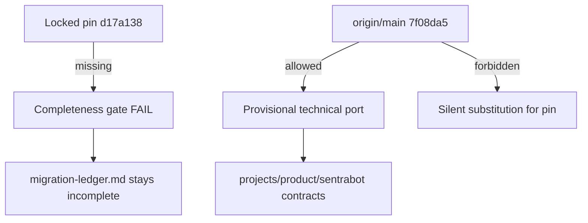

# Provenance

The requested **immutable intake** source is `D:/DEV/Sentraverse/sentrabot`
at commit `d17a138`. The migration plan requires every tracked path at that
exact commit to receive one disposition: `ported`, `reimplemented`,
`provenance-only`, or `excluded-with-proof`.

Legal attribution: [../NOTICE](../NOTICE), [../LICENSE](../LICENSE).
Ledger: [migration-ledger.md](migration-ledger.md).
Inventory command: [source-inventory.md](source-inventory.md).

## Current repository evidence

- The source repository is reachable through Git metadata commands.
- Commit `d17a138` is not present in the available refs or the remote
  advertised refs (observed 2026-08-21; treat as still blocked until proven
  otherwise by the inventory command).
- After a read-only `git fetch --prune origin`, available `origin/main`
  resolves to `7f08da5`, which is **not** the pinned intake commit and must
  not be substituted silently.
- No source files, runtime data, ignored files, credentials, lockfiles, or
  build output have been copied as intake.

This is an **intake blocker**, not an acceptance decision. The ledger remains
incomplete until `d17a138` can be verified and enumerated. A later technical
port may use a separately recorded baseline, but it cannot satisfy the
pinned-snapshot completeness gate.

Following Chief's instruction to continue end to end, the current remote
baseline `7f08da5` is used for **technical porting**. This does not authorize
copying the source repository's nested workspace, lockfile, build output, or
legacy package topology, and it does not close the locked `d17a138`
acceptance gap.

Rakazo identifiers belong in NOTICE/LICENSE/provenance only. Runtime files
are guarded by [../tests/release-parity.test.mjs](../tests/release-parity.test.mjs).
