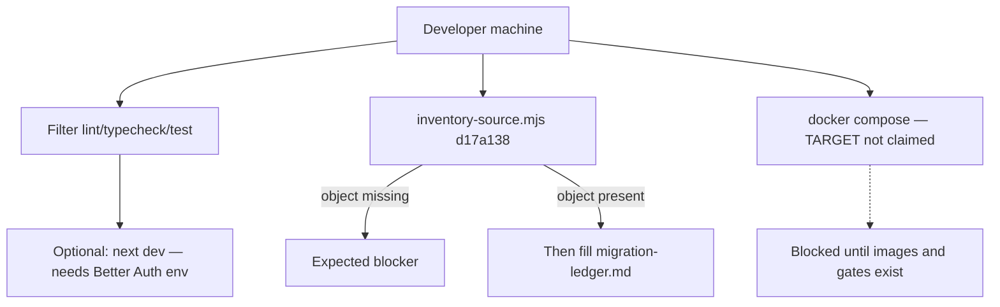

# Quickstart

This is an honest how-to for **what exists on disk today**. It is not a
happy-path tutorial that assumes source pin `d17a138`, a logged-in session,
or a running Compose cluster.

Canonical machine commands: [../AGENTS.md](../AGENTS.md).
Why the pin is blocked: [provenance.md](provenance.md).

## CURRENT — you can do this now

From the Monorepo root, with the root toolchain already installed
(`pnpm run doctor` / `pnpm run setup` at repo level if the machine is new):

```bash
pnpm --filter @sentra/sentrabot-web lint
pnpm --filter @sentra/sentrabot-web typecheck
pnpm --filter @sentra/sentrabot-web test
pnpm --filter @sentra/sentrabot-worker test
pnpm --filter @sentra/sentrabot-sandbox-supervisor test
pnpm --filter @sentra/sentrabot-desktop test
```

Web `dev` / `build` scripts exist (`next dev`, `next build`). They require
`BETTER_AUTH_SECRET` and `BETTER_AUTH_URL` (fail-closed). The app serves
marketing `/` (`home.html`), product demo `/workspace`, Better Auth at
`/api/auth/[...all]`, and same-origin Hono at `/api/sentrabot`. Compose
publishes web on **3000**. Playwright defaults to `http://localhost:5001`.
`next dev` uses Next’s default port unless `PORT` is set.

Worker and supervisor `start` scripts bind HTTP servers (`PORT` default
`8787` and `8788`). Health is public. Control/ops require bearer tokens from
the process environment. Do not copy production values; use local secrets
you generated. Empty tokens fail closed (unauthorized).

Prove the inventory gate still fails closed without the pin:

```bash
node projects/product/sentrabot/scripts/inventory-source.mjs D:/DEV/Sentraverse/sentrabot d17a138
```

That command must **not** fall back to `HEAD`. If the object is missing, the
process fails. That failure is expected until the pin exists.

## CURRENT — do not expect this to work as a product

- Public signup or a logged-in product session without
  `SENTRABOT_E2E_SEED=1` (signup stays **closed**; email delivery is a local
  sink helper only).
- Creating a persisted bot from `/workspace` (the page uses the first two
  persona catalog rows in memory and does not call the API).
- Booting a sandbox on a Docker daemon (supervisor HTTP server does not
  inject a Docker executor; boot returns `503` unless tests inject a fake).
- Opening worker `8787` or supervisor `8788` from the public internet
  (Compose TARGET keeps them internal; do not publish them).
- A packaged or signed Electron artifact (main/preload tests exist; signing
  is a later gate).

## TARGET — self-host beta (not claimed)

Compose file: [../infra/compose/docker-compose.yml](../infra/compose/docker-compose.yml).
Operator narrative: [self-host.md](self-host.md). Runbook: [operations.md](operations.md).

Images have **not** been built or started as a release claim. Do not treat
`docker compose up` as documented success.



## Shared API hosts

`createSentraBotApi()` is mounted by the canonical Hono app at
`/api/sentrabot`. Sentra Bot web supplies `createSentraBotActorResolver`
from the Better Auth session. Golden Path (or any host that mounts
`@safrs/api` without that resolver) can still hit `GET /api/sentrabot/health`;
tenant routes return `401` when `getActor` is null. See [api.md](api.md).
