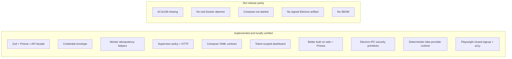

# Release parity evidence

This file is the **claim boundary**. Implemented items were verified by
colocated tests or contract tests in this repository. “Not accepted” means
do not advertise them as a beta.

Testing how: [testing.md](testing.md). Release gates: [release.md](release.md).

## Implemented and locally verified

- Strict schemas for bots, threads, messages, memory, routines, signup,
  quotas, worker execution, and supervisor operations.
- Tenant-scoped bot/content repositories with sequence and revision conflict
  protections.
- API routes for deployment, signup checks, bots, threads, memory, and
  routines.
- Versioned AES-256-GCM credential envelope with rotation helper.
- Idempotent worker execution and routine scheduling **boundaries**
  (libraries; not HTTP).
- Supervisor liveness/readiness split, timing-safe bearer validation,
  traversal checks, and isolated Docker option policy.
- Compose contract with internal backend network, health-gated dependencies,
  non-public worker/supervisor ports, read-only supervisor, dropped
  capabilities, and no Docker socket mount.
- Token-scoped responsive dashboard UI with keyboard focus, reduced motion,
  filtering, and bounded prompt submission state (local UI only).
- Better Auth is mounted at `/api/auth/[...all]`, fail-closed without env,
  Prisma adapter, closed signup by default, verified-email outside the e2e
  seed, exact trusted origins, and production HTTPS origins. Open signup is
  only the non-production `SENTRABOT_E2E_SEED=1` path.
- Electron runtime is documented. Main/preload security primitives are
  unit-tested for context isolation, sandboxing, navigation origin checks,
  denied popups, IPC allowlisting, and HTTPS external links. Packaging and
  startup smoke remain open.
- Deterministic fake-provider execution is tested through the idempotent worker
  boundary without provider credentials or network access.
- Playwright journeys in `apps/web/e2e` cover closed signup (403),
  unauthenticated 401, and accessibility landmarks. The authenticated
  workspace journey requires `SENTRABOT_E2E_SEED=1` and skips closed-signup
  assertions.

## Not yet accepted as release parity

- Source pin `d17a138` is unavailable; `7f08da5` remains provisional
  technical baseline.
- Docker executor has not run against a real Docker daemon or image.
- Compose images have not been built or started in an isolated environment.
- Electron runtime is documented but not packaged or signed; no signed
  artifact exists.
- Operator-host Compose PostgreSQL with live Better Auth, email provider
  delivery, provider adapters, SSE/realtime, full UI API wiring,
  backup/restore against a running volume, Electron packaged-startup smoke,
  image scanning, SBOM, and release workflows remain open.

A regression test requires this file to keep naming `d17a138`,
`Docker executor has not run`, and `Electron runtime is documented`.
