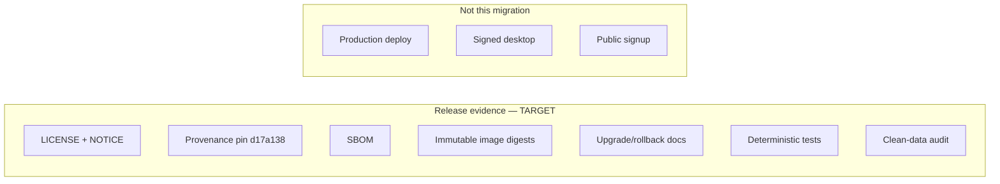

# Release

The first release target is a **public-source, self-hosted beta**. This
migration performs **no** production deployment, DNS change, credential
creation, hosted public signup, or signed desktop publication.

Roadmap: [../ROADMAP.md](../ROADMAP.md).
Evidence log: [release-parity.md](release-parity.md).
Supply chain TARGET: [supply-chain.md](supply-chain.md).
ADR: [../../../docs/adrs/0004-sentrabot-public-release.md](../../../docs/adrs/0004-sentrabot-public-release.md).

## CURRENT

- License and NOTICE files exist in the capsule.
- Provenance documents the **missing** pin and the provisional baseline.
- Tests exist as contracts and YAML assertions.
- Changelog is Unreleased only ([../CHANGELOG.md](../CHANGELOG.md)).

## TARGET evidence (must exist before a beta claim)

1. License and NOTICE.
2. Source provenance with `d17a138` enumerated.
3. SBOM (not generated today).
4. Immutable image digests (images not built as a claim).
5. Upgrade and rollback documentation (not written as run procedures).
6. Deterministic test evidence covering the [testing.md](testing.md) matrix.
7. Clean-data audit (no copied source runtime, no production dumps).

## Versioning

No semantic version has been published. Do not tag `v1` from this capsule
until Chief authorizes a release train step.
