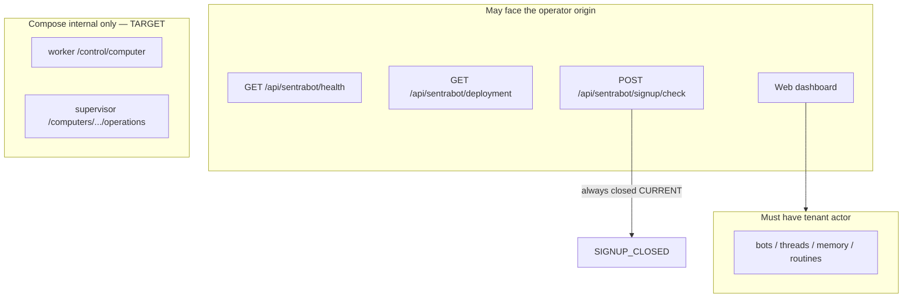

# Security controls (product intent)

Canonical policy: root [SECURITY.md](../../../SECURITY.md) and
[SAFRS_SPEC.md](../../../SAFRS_SPEC.md). Capsule disclosure:
[../SECURITY.md](../SECURITY.md). Abuse cases: [threat-model.md](threat-model.md).
This page is the **control catalog** for Sentra Bot, not a second SAFRS spec.

This project contains R2 and R3 surfaces: authentication and signup, tenant
authorization, provider credentials, OAuth callbacks (TARGET), worker
control, Docker supervision, screen proxying (TARGET), Electron IPC
(CURRENT sources, packaging TARGET), and release supply chain.

## CURRENT controls that exist in code

- Signup default **closed** (`canSignup` + API check using default policy).
- Better Auth on web: session cookies, exact trusted origins, fail-closed
  without `BETTER_AUTH_*`, production HTTPS origins.
- Tenant `where` includes `workspaceId` and `userId`.
- Worker and supervisor reject undeclared JSON fields (strict Zod).
- Supervisor bearer compare is timing-safe; computer IDs are allowlisted;
  boot policy drops caps, read-only rootfs, `noNewPrivileges`, `networkMode: none`,
  no Docker socket in binds.
- Compose: internal backend network, worker/supervisor `expose` not publish,
  supervisor `read_only`, `cap_drop: ALL`, `no-new-privileges`.
- Credential helper uses AES-256-GCM with random 12-byte IV and auth tag.
- Email `deliverEmail` requires a local sink unless production **and**
  `allowExternalDelivery`.
- API `/deployment` reports `hasDeploymentModelCredential: false`.

## CURRENT gaps (do not hide)

- Default `createApp()` actor is null (fail closed on tenant routes unless
  the host supplies a resolver). Sentra Bot web supplies the session resolver.
- Worker token compare is ordinary string equality.
- Supervisor HTTP server does not inject Docker; boot is `503`.
- `/deployment` ignores Prisma.
- Dashboard does not persist prompts or keys (good) but also does not call
  the API (incomplete product).
- OpenAPI omits these routes.

## TARGET self-host beta requirements

Closed signup by default, exact trusted origins, secure cookies, CSRF and
origin checks, verified email for open modes (open is not this migration's
default), velocity limits, quotas, kill switches, redacted errors, private
worker/supervisor networking, bounded mounts and commands, dropped container
privileges where feasible, no-new-privileges.

The supervisor route is **not** a Docker implementation until the privileged
executor, internal network, resource limits, and conformance tests are
reviewed (R2). Hosted production, public signup, production credentials, and
signed desktop publication stay prohibited without their gate.

## Identity binding

Supervisor requests must bind `computerId`, `botId`, and `workspaceId`.
Worker control requests bind `workspaceId`, `userId`, and `botId`. Do not
accept provider keys on these bodies.
