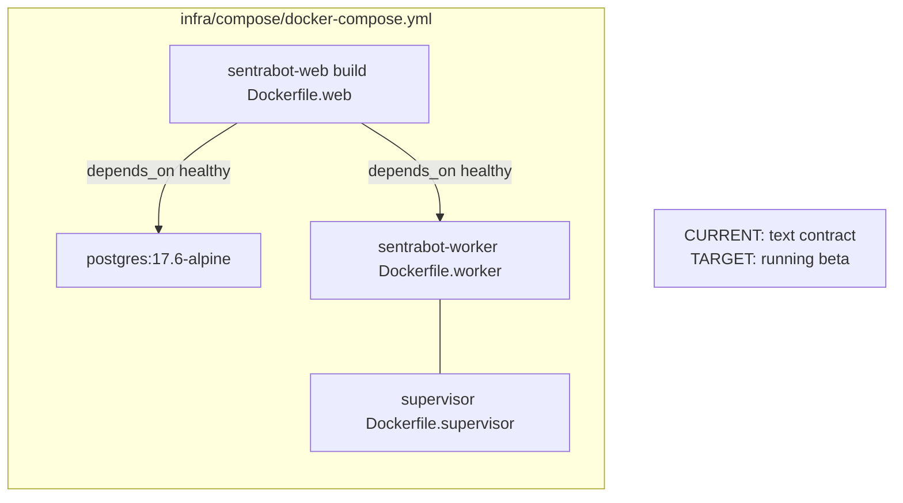

# Self-host

The self-hosted topology **will** provide web, worker, sandbox supervisor,
and PostgreSQL from the **repository root** context and **root lockfile**.
Signup is closed by default. Worker and supervisor control APIs are
internal-only and require dedicated tokens. Liveness and readiness are
separate so orchestration cannot send traffic to an uninitialized supervisor.

CURRENT: the Compose file and Dockerfiles exist under
[../infra/compose/](../infra/compose/). Contract tests assert YAML shape.
This is **not** a verified running stack. Backup, restore, destructive local
reset, migrations, health checks, graceful shutdown, and a full fake-provider
smoke journey remain **release gates**. Runtime data is created locally from
synthetic setup only.

Operator runbook: [operations.md](operations.md).
Architecture: [architecture.md](architecture.md).

## Operator defaults

| Setting | Value |
| --- | --- |
| Signup | `closed` |
| Model credentials | Per-user BYOK; deployment-level key flag false |
| Worker | `WORKER_CONTROL_TOKEN`, port 8787 exposed internally |
| Supervisor | `SUPERVISOR_TOKEN`, port 8788 exposed internally, read-only container |
| Public port | `3000` on web only (intended) |
| Docker socket | Must not be mounted |

## What operators must not do

- Copy source `.env` or production `DATABASE_URL`.
- Publish 8787/8788.
- Enable public signup to “test the UI”.
- Mount `/var/run/docker.sock` onto the supervisor.
- Treat `ghcr.io/sentra/sentrabot-sandbox:0.1.0` as a published image (it is
  a policy string in supervisor boot).

## Desktop clients

Not part of Compose. Unsigned local Electron packaging is a later gate
([../apps/desktop/README.md](../apps/desktop/README.md)).
