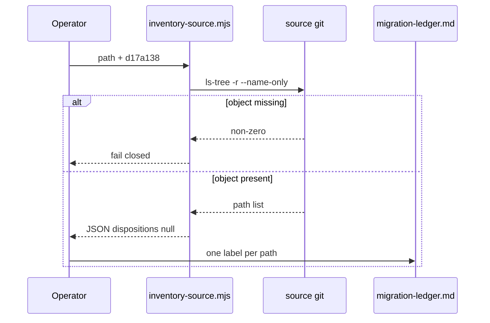

# Source inventory

The reproducible inventory command is:

```bash
node projects/product/sentrabot/scripts/inventory-source.mjs D:/DEV/Sentraverse/sentrabot d17a138
```

Implementation: [../scripts/inventory-source.mjs](../scripts/inventory-source.mjs).
It runs `git ls-tree -r --name-only <ref>` in the source path and prints JSON
with every path mapped to `null` disposition. It does **not** write the ledger.

The command intentionally fails when the pinned Git object is unavailable.
It must not fall back to `HEAD`, remote `main`, or a working-tree scan.
Every emitted path requires one disposition in
[migration-ledger.md](migration-ledger.md) or its generated evidence artifact.

Defaults in the script (if args omitted) are the same path and `d17a138`.
Omitting args does not authorize using another commit.



CURRENT: expect failure until `d17a138` exists. TARGET: JSON artifact checked
into evidence (only after the pin is real). Do not commit a fake enumeration.
