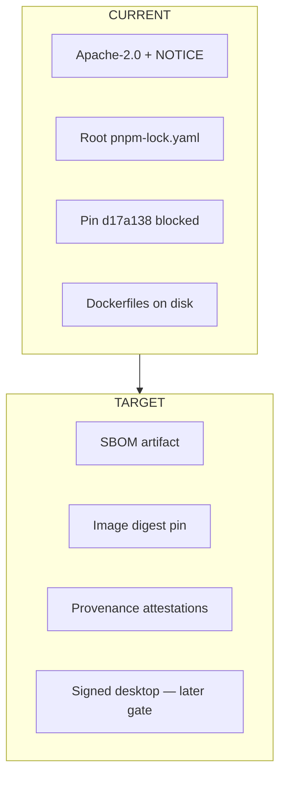

# Supply chain

TARGET is a verifiable self-host beta. CURRENT does not claim an OpenSSF
Scorecard badge, SLSA Level 3, generated SBOM, or signed images.

License: Apache-2.0 [../LICENSE](../LICENSE).
Attribution: [../NOTICE](../NOTICE).
Pin: [provenance.md](provenance.md).
Release evidence list: [release.md](release.md).

Root secret scanning, lockfile, and CI pinning are **Monorepo** controls
(root `SECURITY.md`). This capsule must not add `.github` workflows.

## CURRENT facts

- Dependencies enter through the **root** workspace and catalog. The capsule
  has no nested lockfile (forbidden).
- Dockerfiles copy `package.json`, `pnpm-lock.yaml`, `pnpm-workspace.yaml`,
  `packages/`, and `projects/product/sentrabot/` from the repo root, then
  `pnpm install --frozen-lockfile`.
- Supervisor boot **names** `ghcr.io/sentra/sentrabot-sandbox:0.1.0`. That
  is not evidence the image exists or is signed.
- Inventory of third-party licenses beyond Apache-2.0 NOTICE is Unknown —
  blocked by absence of an SBOM job.

## TARGET (do not tick these)

| Control | Intent |
| --- | --- |
| SBOM | Generate from the root lockfile at release time |
| Image digests | Pin built web/worker/supervisor images immutably |
| SLSA | Build provenance; Level 3 is **not** claimed even as TARGET for this migration |
| OpenSSF Scorecard | Root repo concern; this capsule only supplies SECURITY.md + tests + license |
| Signed desktop | Separate gate after packaging; Electron is already in the root catalog |
| Dependency review | Existing root process; do not bypass with a capsule registry |

## What not to do

- Vendor a second `node_modules` policy.
- Copy source lockfiles into this capsule.
- Publish unsigned “latest” tags as the beta channel.
- Claim a badge that was not issued.
