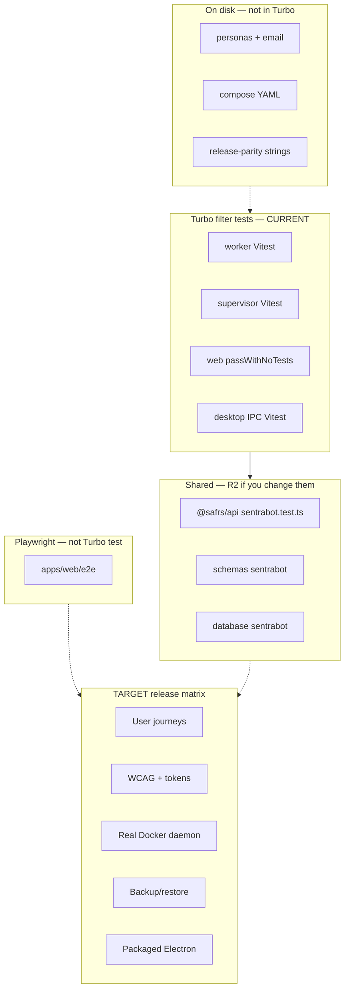

# Testing

Verification is sliced. App manifests exist and their `package.json` scripts
are the commands that exist. Do not invent a capsule-local test runner.

Parity claims: [release-parity.md](release-parity.md).
Commands: [../AGENTS.md](../AGENTS.md).

## Commands that exist

From Monorepo root:

```bash
pnpm --filter @sentra/sentrabot-web lint
pnpm --filter @sentra/sentrabot-web typecheck
pnpm --filter @sentra/sentrabot-web test
pnpm --filter @sentra/sentrabot-web e2e
pnpm --filter @sentra/sentrabot-web build
pnpm --filter @sentra/sentrabot-worker lint
pnpm --filter @sentra/sentrabot-worker typecheck
pnpm --filter @sentra/sentrabot-worker test
pnpm --filter @sentra/sentrabot-sandbox-supervisor lint
pnpm --filter @sentra/sentrabot-sandbox-supervisor typecheck
pnpm --filter @sentra/sentrabot-sandbox-supervisor test
pnpm --filter @sentra/sentrabot-desktop lint
pnpm --filter @sentra/sentrabot-desktop test
bash scripts/safrs-verify.sh
```

Web `test` is `vitest run --passWithNoTests` (no colocated web unit tests in
`apps/web` at inspection time). Desktop `test` is `vitest run` and executes
IPC security tests. Worker and supervisor have contract tests that **do**
run under their `pnpm --filter` scripts and therefore under root
`turbo run test`. Playwright is `pnpm --filter @sentra/sentrabot-web e2e`
(`apps/web/playwright.config.ts`); it is not a Turbo `test` task.

These files exist on disk but have **no** capsule `package.json` and are
**not** in `vitest.workspace.ts` or `tests/repository/*.test.mjs`:

- `src/personas/catalog.test.ts`
- `src/email/*.test.ts`
- `infra/compose/compose.test.mjs`
- `tests/release-parity.test.mjs`

Unknown — blocked by missing workspace ownership — whether any ad-hoc
invocation is used in CI besides Turbo package tests. Do not claim root
`pnpm test` covers them.

Shared package tests (`@safrs/api`, `@safrs/schemas`, `@safrs/database`,
`@safrs/auth`) are **outside** this capsule; run them only when Chief expands
scope.



## What tests prove today

- Worker health is public; control requires a bearer; extra credential
  fields are rejected by Zod.
- Supervisor health vs ready; traversal IDs rejected; boot uses injected
  fake Docker with `networkMode: none` and no socket bind.
- Compose file: `internal: true`, no `docker.sock`, worker/supervisor not
  published as `8787:8787` / `8788:8788`.
- Runtime sources must not contain `@rakazo` or `rakazo_` identifiers.
- Persona catalog: ≥10 entries, unique ids, Asia/Jakarta, Bahasa Indonesia
  instructions.
- Better Auth factory configuration and Electron IPC security primitives pass
  focused unit/type/lint checks.
- Playwright in `apps/web/e2e`: closed signup, unauthenticated 401, and
  accessibility landmarks without seed; authenticated workspace with
  `SENTRABOT_E2E_SEED=1`.
- Fake-provider execution returns deterministic output and remains idempotent
  under the worker execution contract.
- `scripts/fake-provider-journey.mjs` verifies Compose topology invariants and
  concurrent fake execution idempotency without provider credentials.
- `scripts/backup-restore-disposable.mjs` is a guarded `pg_dump`/`pg_restore`
  evidence command and refuses non-`127.0.0.1:54329` `*_test` databases.

## What tests do not prove

- A running Compose cluster or built images.
- A real Docker daemon or `ghcr.io/sentra/sentrabot-sandbox:0.1.0`.
- Canonical migration evidence is recorded in `docs/evidence/migration-0007-disposable.txt`; it contains only the disposable target identity, migration name/timestamp, and schema column, never credentials.
- Operator-host Compose PostgreSQL, production email providers, or model provider adapters.
- Source completeness at `d17a138`.

## Policy

Deterministic fakes are release-blocking when the matrix says so. Real E2B,
Daytona, Box, Composio, and similar remain **opt-in canaries** and must never
require production credentials. Do not weaken assertions to pass a slice.

## TARGET matrix (not claimed)

Schema/API drift, tenant isolation, signup verification and concurrency,
credential rotation and redaction, worker idempotency, adapter and
supervisor conformance, user journeys, WCAG and token checks, Electron IPC,
Compose health plus backup/restore, performance budgets.
