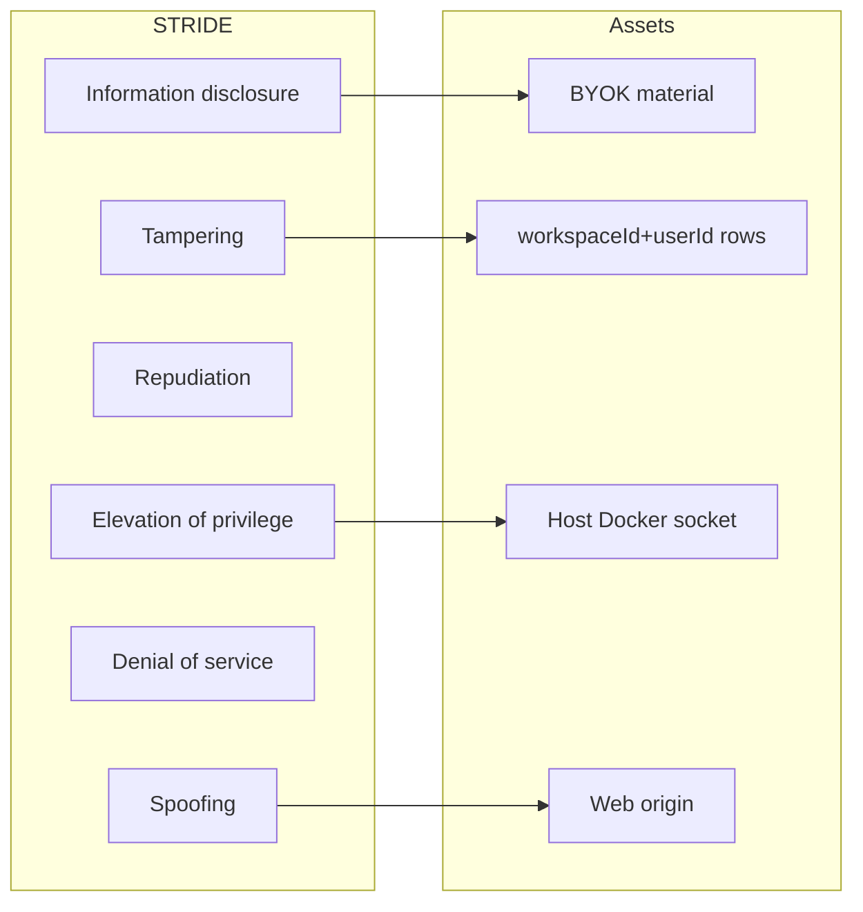

# Threat model (STRIDE)

Scope: CURRENT code plus TARGET Electron and hosted paths called out
explicitly. This is not a pentest report and not permission to write
exploits. Controls: [security.md](security.md). Routes: [api.md](api.md).

## Trust boundaries

1. Browser ↔ web origin.
2. Web/API ↔ PostgreSQL.
3. Worker ↔ supervisor (TARGET internal network).
4. Supervisor ↔ container runtime (TARGET; no host socket).
5. Worker ↔ model provider (TARGET BYOK outbound).
6. Electron renderer ↔ preload (CURRENT sources; not packaged).

## Spoofing

| Threat | CURRENT | Mitigation / gap |
| --- | --- | --- |
| Call tenant APIs as another user | Default actor null → 401; web host resolves Better Auth session to `user:<id>` | Keep signup closed; do not accept actor headers from the browser |
| Worker control without token | 401 if token empty or mismatch | Use strong local `WORKER_CONTROL_TOKEN`; compare is not timing-safe |
| Supervisor ops without token | Timing-safe 401 | Keep `SUPERVISOR_TOKEN` off the public network |
| Fake deployment owner | `claimDeploymentOwner` first-writer | Not exposed on HTTP yet |

## Tampering

| Threat | CURRENT | Mitigation / gap |
| --- | --- | --- |
| Extra JSON fields smuggle keys | Strict Zod on worker/supervisor/API bodies | Keep `.strictObject` / discriminated unions |
| Path traversal computer IDs | Supervisor regex + tests | Do not loosen the regex |
| Memory overwrite | Revision check in repository | HTTP does not map 409 yet |
| Message seq collision | Unique `(threadId, seq)` | Tenant columns also on the row |

## Repudiation

No audit-log table exists (CURRENT). TARGET: structured logs without secrets
or prompt bodies that contain credentials. Correlation IDs exist on the
canonical Hono app, not on worker/supervisor servers.

## Information disclosure

| Threat | CURRENT | Mitigation / gap |
| --- | --- | --- |
| Cross-tenant bot leak | `findFirst` with tenant where | Never switch to `findUnique` on id alone |
| Signup probing | Closed mode returns `SIGNUP_CLOSED` without listing allowlist | Keep closed default |
| Credential in logs/UI | Envelope not wired to UI | Never `NEXT_PUBLIC_` secrets; no keys in dashboard copy |
| `/deployment` | Hardcoded empty owner and no hosted key flag | Safe for now; must not later leak allowlist emails on this unauthenticated GET |

## Denial of service

Message list `take: 100`. Prompt max 20_000. Input payload JSON ≤ 16_384
bytes on worker `input` ops. No rate limiter on the facade (CURRENT).
TARGET: velocity limits and quotas from `sentraBotQuotaSchema`.

## Elevation of privilege

| Threat | CURRENT | Mitigation / gap |
| --- | --- | --- |
| Docker socket escape | Compose omits `docker.sock`; policy omits socket binds | Never add the socket to “make tests pass” |
| Privileged containers | `capDrop: ALL`, read-only rootfs, no-new-privileges | Executor not on the live HTTP server |
| Electron nodeIntegration | Main process sets `nodeIntegration: false`, sandbox, isolated preload | Packaged runtime and signing still gated |
| Hosted shared credentials | Flag forced false on `/deployment` | ADR 0004: BYOK default; hosted keys are a later gate |

## Electron (unsigned boundary)

Threats: IPC injection, navigation to untrusted origins, popup/webguest
escape, auto-update supply chain. CURRENT residual risk is the unsigned
main/preload boundary (unit-tested, not packaged). TARGET residual risk
stays high until the signed-desktop gate lands — see
[../apps/desktop/README.md](../apps/desktop/README.md).

## Out of model

Production AWS/Vercel accounts, real customer PHI stores, and public GitHub
Secret Scanning configuration belong to root operations, not this file.
