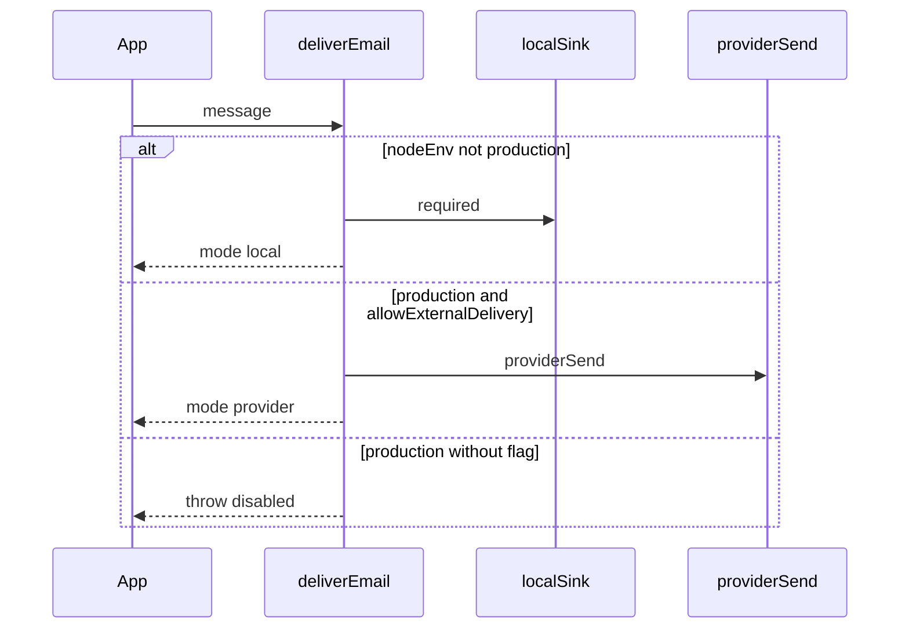

# Sentra Bot emails

Verification and password-reset templates live in
[../src/email/templates.ts](../src/email/templates.ts). Delivery lives in
[../src/email/delivery.ts](../src/email/delivery.ts) and remains **local-only**
outside production. External provider delivery requires an explicit R2
capability activation and is not enabled by this migration.

Capability `email` is declared in [../capabilities.json](../capabilities.json).
That is not Resend/SMTP wiring. Better Auth is mounted, but these templates
are unused by live auth hooks (CURRENT): `deliverEmail` is not wired into
the Better Auth factory.

Templates return `{ subject, text }` only (no HTML). Do not put tokens or
reset secrets in logs. UI work for branded HTML is out of scope here.
