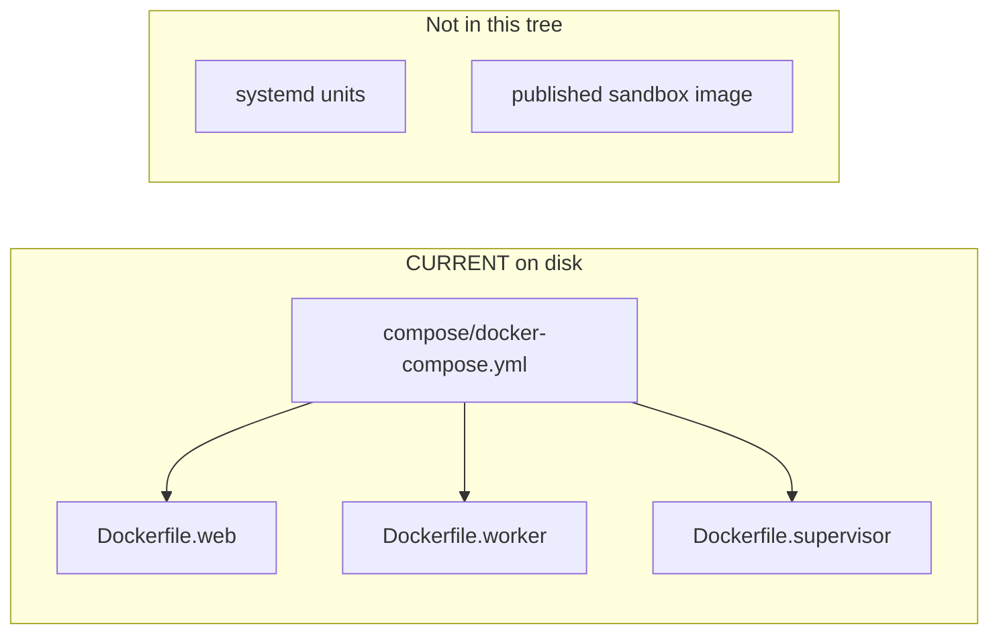

# Sentra Bot infrastructure

**CURRENT:** Compose and Dockerfiles live under [compose/](compose/).
A Vitest file [compose/compose.test.mjs](compose/compose.test.mjs) asserts
the YAML contract (internal network, no `docker.sock`, expose-not-publish,
Dockerfiles contain `CMD`). It is not owned by an app `package.json`; Turbo
`test` does not automatically run it.

This README was previously written as if Compose had not been added. That
is stale. The files exist. A **running** stack is still not a release claim.

TARGET later: sandbox VM/images and systemd units after root-context paths,
internal networking, resource limits, health checks, and release review.
None of those unit files exist in this directory now.

Build context is the **Monorepo root** (four `../` from `infra/compose`).
Operator story: [../docs/self-host.md](../docs/self-host.md).
Runbook: [../docs/operations.md](../docs/operations.md).
